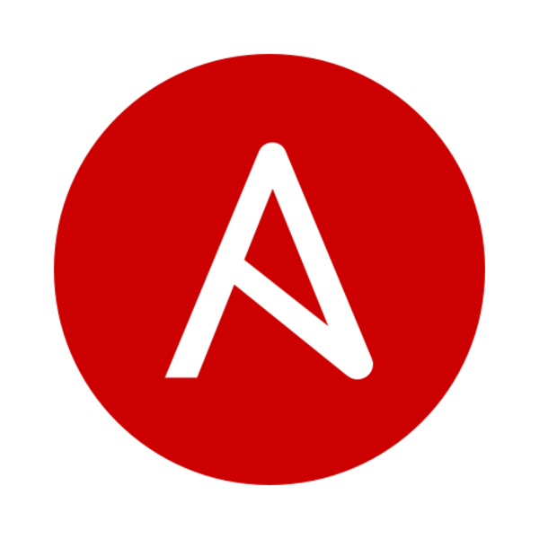

---

copyright:
  years: 2017, 2021
lastupdated: "2021-04-20"

keywords: about schematics, schematics overview, infrastructure as code, iac, differences schematics and terraform, schematics vs terraform, how does schematics work, schematics benefits, why use schematics, terraform template, schematics workspace

subcollection: schematics

---

{:DomainName: data-hd-keyref="APPDomain"}
{:DomainName: data-hd-keyref="DomainName"}
{:android: data-hd-operatingsystem="android"}
{:api: .ph data-hd-interface='api'}
{:apikey: data-credential-placeholder='apikey'}
{:app_key: data-hd-keyref="app_key"}
{:app_name: data-hd-keyref="app_name"}
{:app_secret: data-hd-keyref="app_secret"}
{:app_url: data-hd-keyref="app_url"}
{:authenticated-content: .authenticated-content}
{:beta: .beta}
{:c#: data-hd-programlang="c#"}
{:cli: .ph data-hd-interface='cli'}
{:codeblock: .codeblock}
{:curl: .ph data-hd-programlang='curl'}
{:deprecated: .deprecated}
{:dotnet-standard: .ph data-hd-programlang='dotnet-standard'}
{:download: .download}
{:external: target="_blank" .external}
{:faq: data-hd-content-type='faq'}
{:fuzzybunny: .ph data-hd-programlang='fuzzybunny'}
{:generic: data-hd-operatingsystem="generic"}
{:generic: data-hd-programlang="generic"}
{:gif: data-image-type='gif'}
{:go: .ph data-hd-programlang='go'}
{:help: data-hd-content-type='help'}
{:hide-dashboard: .hide-dashboard}
{:hide-in-docs: .hide-in-docs}
{:important: .important}
{:ios: data-hd-operatingsystem="ios"}
{:java: .ph data-hd-programlang='java'}
{:java: data-hd-programlang="java"}
{:javascript: .ph data-hd-programlang='javascript'}
{:javascript: data-hd-programlang="javascript"}
{:new_window: target="_blank"}
{:note .note}
{:note: .note}
{:objectc data-hd-programlang="objectc"}
{:org_name: data-hd-keyref="org_name"}
{:php: data-hd-programlang="php"}
{:pre: .pre}
{:preview: .preview}
{:python: .ph data-hd-programlang='python'}
{:python: data-hd-programlang="python"}
{:route: data-hd-keyref="route"}
{:row-headers: .row-headers}
{:ruby: .ph data-hd-programlang='ruby'}
{:ruby: data-hd-programlang="ruby"}
{:runtime: architecture="runtime"}
{:runtimeIcon: .runtimeIcon}
{:runtimeIconList: .runtimeIconList}
{:runtimeLink: .runtimeLink}
{:runtimeTitle: .runtimeTitle}
{:screen: .screen}
{:script: data-hd-video='script'}
{:service: architecture="service"}
{:service_instance_name: data-hd-keyref="service_instance_name"}
{:service_name: data-hd-keyref="service_name"}
{:shortdesc: .shortdesc}
{:space_name: data-hd-keyref="space_name"}
{:step: data-tutorial-type='step'}
{:subsection: outputclass="subsection"}
{:support: data-reuse='support'}
{:swift: .ph data-hd-programlang='swift'}
{:swift: data-hd-programlang="swift"}
{:table: .aria-labeledby="caption"}
{:term: .term}
{:tip: .tip}
{:tooling-url: data-tooling-url-placeholder='tooling-url'}
{:troubleshoot: data-hd-content-type='troubleshoot'}
{:tsCauses: .tsCauses}
{:tsResolve: .tsResolve}
{:tsSymptoms: .tsSymptoms}
{:tutorial: data-hd-content-type='tutorial'}
{:ui: .ph data-hd-interface='ui'}
{:unity: .ph data-hd-programlang='unity'}
{:url: data-credential-placeholder='url'}
{:user_ID: data-hd-keyref="user_ID"}
{:vbnet: .ph data-hd-programlang='vb.net'}
{:video: .video}

# About {{site.data.keyword.bplong_notm}}
{: #about-schematics} 

Learn about what {{site.data.keyword.bpshort}} is, how the service works, and the key features and benefits of using the service.
{: shortdesc}

## What is {{site.data.keyword.bpshort}}?
{: #what-is-schematics}
{: help}
{: support}

{{site.data.keyword.bplong_notm}} provides powerful tools to automate your cloud infrastructure provisioning and management process, the configuration and operation of your cloud resources, and the deployment of your app workloads. 
{: shortdesc}

To do so, {{site.data.keyword.bpshort}} leverages open source projects, such as Terraform, Ansible, OpenShift, Operators, and Helm, and delivers these capabilities to you as a managed service. Rather than installing each open source project on your machine, and learning the API or CLI, you declare the tasks that you want to run in {{site.data.keyword.cloud_notm}} and watch {{site.data.keyword.bpshort}} run these tasks for you. 

## How does {{site.data.keyword.bpshort}} work?
{: #how-it-works}
{: help}
{: support}

Choose among the following use cases to learn how {{site.data.keyword.bpshort}} automates your infrastructure, service, and app stacks in {{site.data.keyword.cloud_notm}}.
{: shortdesc}

- [Infrastructure deployments with {{site.data.keyword.bpshort}} workspaces](#how-to-workspaces)
- [Configuration management with {{site.data.keyword.bpshort}} actions](#how-to-actions)
- [Software deployments with IBM-provided templates](#how-to-software)

### Infrastructure deployment with {{site.data.keyword.bpshort}} workspaces
{: #how-to-workspaces}

{{site.data.keyword.bpshort}} workspaces deliver Terraform-as-a-Service capabilities to you so that you can automate the provisioning and management of your {{site.data.keyword.cloud_notm}} resources, and rapidly build, duplicate, and scale complex, multi-tier cloud environments. 
{: shortdesc}

To get started with infrastructure deployment in {{site.data.keyword.bpshort}}, see the [Getting started tutorial](/docs/schematics?topic=schematics-get-started-terraform). 
{: tip}

[Terraform](https://www.terraform.io/){: external} is an open source project that lets you specify your cloud infrastructure resources and services by using a high-level scripting language. Your specification is stored in a Terraform configuration file. In order to abstract the APIs and complexity of the cloud resource provisioning and management process to the user, cloud providers create a plug-in for Terraform that contains the information for how to connect to the cloud provider and what APIs to call to work with a certain cloud resource. IBM's plug-in is called the [{{site.data.keyword.cloud_notm}} Provider plug-in for Terraform](/docs/ibm-cloud-provider-for-terraform?topic=ibm-cloud-provider-for-terraform-index-of-terraform-resources-and-data-sources).  

To use the capabilities of the {{site.data.keyword.cloud_notm}} Provider plug-in for Terraform, you create a {{site.data.keyword.bpshort}} workspace that points to the Terraform configuration files that you want to run. The plug-in analyzes the resources that you specified and determines the order in which these resources must be provisioned, including any dependencies that must be considered. Review the following image to find detailed information about how to run Terraform configuration files with {{site.data.keyword.bpshort}} workspaces. 

1. **Codify your {{site.data.keyword.cloud_notm}} resources**. Use Terraform HashiCorp Configuration Language (HCL) or JSON format to specify the {{site.data.keyword.cloud_notm}} resources that you want to provision in your {{site.data.keyword.cloud_notm}} environment. If you are not familiar with Terraform, you can select one of the default Terraform templates that {{site.data.keyword.bpshort}} provides to provision the {{site.data.keyword.cloud_notm}} resources that you want. Terraform templates can be stored in a GitHub, GitLab, or Bitbucket repository to ensure source control and enable collaboration, review, and auditing in your organization. You can save usage information in `readme` files to make the template shareable and usable across multiple teams. You can also upload tape archive files (`.tar`) from your local machine to provide the template to {{site.data.keyword.bpshort}}.
2. **Create your workspace**. You can point your {{site.data.keyword.bpshort}} workspace to a GitHub, GitLab, or Bitbucket repository where you store your Terraform template, or provide your template by uploading a `.tar` file. Workspaces help to organize resources that belong to one {{site.data.keyword.cloud_notm}} environment. For example, use workspaces to separate your test, staging, and production environment. With {{site.data.keyword.cloud_notm}} Identity and Access Management, you can control who has access to your workspaces and who can run actions on your {{site.data.keyword.cloud_notm}} resources. 
3. **Create an execution plan**. Based on your configuration, Terraform creates an execution plan and describes the actions that need to be run to get to the state that is described in your Terraform configuration files. To determine the actions, {{site.data.keyword.bpshort}} analyzes the resources that are already provisioned in your {{site.data.keyword.cloud_notm}} account to give you a preview of whether resources must be added, modified, or removed. You can review the execution plan, change it, or simply execute the plan. 
4. **Provision your resources**. When you are ready to make changes to your cloud environment, you can apply your Terraform configuration files. To run the actions that are specified in your configuration files, {{site.data.keyword.bpshort}} uses the {{site.data.keyword.cloud_notm}} Provider plug-in for Terraform. 

 

### Configuration management with {{site.data.keyword.bpshort}} actions
{: #how-to-actions}

{{site.data.keyword.bpshort}} actions deliver Ansible-as-a-Service capabilities to you so that you can automate the configuration and management of your {{site.data.keyword.cloud_notm}} environment, and deploy complex multi-tier apps to your  cloud infrastructure. 
{: shortdesc}

To get started with configuration management in {{site.data.keyword.bpshort}}, see the [Getting started tutorial](/docs/schematics?topic=schematics-get-started-ansible). 
{: tip}

[Ansible](https://www.ansible.com/){: external} is a configuration management and provisioning tool, similar to Chef and Puppet, and is designed to automate the configuration, operation, and management of cloud environments, and to deploy multi-tier app workloads in the cloud. Ansible uses YAML syntax to describe the tasks that must be run against a single host or a group of hosts, and stores these tasks in an Ansible playbook. 

Ansible does not use agents or a custom security infrastructure that must be present on a target machine to work properly. Instead, Ansible securely connects to compute hosts over the public network by using SSH keys. To bring a resource to the required state, Ansible pushes modules to the managed host that run the tasks in your Ansible playbook. After the tasks are executed, the result is returned to the Ansible server and the module is removed from the managed host. Ansible modules are idempotent such that executing the same playbook or operation multiple times returns the same result as resources are changed only if required. For more information about Ansible, check out this [video](https://www.youtube.com/watch?v=fHO1X93e4WA){: external}. 

To use Ansible capabilities in {{site.data.keyword.bpshort}}, you create a {{site.data.keyword.bpshort}} action that points to the Ansible playbook that you want to run. Review the following image to find detailed information about how to run Ansible playbooks with {{site.data.keyword.bpshort}} actions. 

1. **Add tasks to your playbook**: Use Ansible YAML syntax to describe the configuration tasks that you want to run on your cloud infrastructure, such as installing software or starting, stopping, and rebooting a virtual server. You add these tasks to an Ansible playbook and store the playbook in a GitHub, GitLab, or Bitbucket repository to ensure source control and enable collaboration, review, and auditing in your organization. If you are not familiar with Ansible, you can use one of the [IBM-provided playbooks](https://github.com/Cloud-Schematics){: external}, or browse the [Ansible Galaxy library](https://galaxy.ansible.com/){: external}.
2. **Create a {{site.data.keyword.bpshort}} action**: When you create a {{site.data.keyword.bpshort}} action, you point your action to the repository that stores your Ansible playbook. Then, you select the cloud resources where you want to run the tasks that are defined in your Ansible playbook. To protect your cloud resources, you can further set up a bastion host in front of your target hosts that proxies all Ansible SSH connections to the target hosts. 
3. **Run your action**: When you are ready to configure your cloud resources, you can run your action. {{site.data.keyword.bpshort}} uses the built-in Ansible capabilities to connect to your target hosts via SSH, and execute the tasks that are defined in your Ansible playbook. You can monitor the progress by reviewing the logs.  

 

### Software deployments with IBM-provided templates
{: #how-to-software}

Browse the [IBM software solutions catalog](https://cloud.ibm.com/catalog#software){: external} and choose among a wide range of software and infrastructure templates that you can use to set up cloud resources, and to install IBM and 3rd party software in your {{site.data.keyword.containerlong_notm}} cluster, your {{site.data.keyword.openshiftlong_notm}} cluster, or a classic or VPC virtual server instance. 
{: shortdesc}

Software templates are installed by using the built-in Terraform, Ansible, Helm, OpenShift Operator, and Cloud Pak capabilities in {{site.data.keyword.bpshort}}. When you choose to install one of the provided templates, you create a {{site.data.keyword.bpshort}} workspace and choose the target service or host where you want run the installation. You can review which of the integrated technologies in {{site.data.keyword.bpshort}} is used to install your template. 

You can also create your own software and infrastructure templates and import them in to your own private catalog in {{site.data.keyword.cloud_notm}}. For more information, see [Adding products to a private catalog](/docs/account?topic=account-create-private-catalog)

To get started with software deployment in {{site.data.keyword.bpshort}}, see the [Getting started tutorial](/docs/schematics?topic=schematics-get-started-software). 
{: tip}

1. **Choose a template**: The [IBM software solutions catalog](https://cloud.ibm.com/catalog#software){: external} offers a wide variety of infrastructure and software templates that you can choose from. These templates help to quickly install software, such as IBM Cloud Paks, {{site.data.keyword.appserver_full}}, or Kibana and Grafana into the target service of your choice. 
2. **Configure your workspace and target**: When you choose one of the provided templates, you must select the target where you want to install the template. Depending on the template that you choose, the target can be an {{site.data.keyword.containerlong_notm}} cluster, a {{site.data.keyword.openshiftlong_notm}} cluster, or a classic or VPC virtual server instance. Because {{site.data.keyword.bpshort}} is used to install the software, you must configure the workspace that is automatically created for you. 
3. **Run the template**: When you run the template, {{site.data.keyword.bpshort}} uses the built-in Terraform, Ansible, Helm, OpenShift Operator, or Cloud Pak capabilities to install your software or spin up infrastructure resources. You can use your workspace to monitor the progress of your template execution. 

## What open source projects does {{site.data.keyword.bpshort}} integrate with?
{: #open-source-ov}

{{site.data.keyword.bplong_notm}} integrates with various open source projects to provide powerful automation and configuration management capabilities. 
{: shortdesc}

Review the open source projects that {{site.data.keyword.bpshort}} integrates with and the {{site.data.keyword.bpshort}} component that you can use to leverage these capabilities. 

|Logo|Open source project description|{{site.data.keyword.bpshort}} actions|{{site.data.keyword.bpshort}} workspaces|IBM software solutions catalog|
|---|---|:--:|:--:|:--:|
||[Ansible](https://www.ansible.com/){: external} is a configuration management and provisioning tool, similar to Chef and Puppet, and is designed to automate the configuration and management of cloud environments, and to deploy multi-tier app workloads in the cloud. ||||
||[Helm](https://helm.sh/){: external} is a Kubernetes package manager that uses Helm charts to define, install, and upgrade complex Kubernetes apps in an {{site.data.keyword.containerlong_notm}} cluster.||||
||[OpenShift Operators](https://www.openshift.com/learn/topics/operators){: external} are a convenient way to add and run community, 3rd party, and other services in a {{site.data.keyword.openshiftlong_notm}} cluster. ||||
||[Terraform](https://www.terraform.io/){: external} is an open source project that lets you specify your cloud infrastructure resources and services by using a high-level scripting language.||||

## What are the benefits of using {{site.data.keyword.bpshort}}?
{: #schematics-benefits}

Review the benefits of using {{site.data.keyword.bpshort}}. 
{: shortdesc}

|Feature|Description|
|--------|-------------------------------|
|Model your {{site.data.keyword.cloud_notm}} stacks| Use high-level scripting languages to declare all the resources that you want to include in your {{site.data.keyword.cloud_notm}} infrastructure, service, and app stack. Instead of learning the API or command-line to work with a specific resource, you use Ansible playbooks and Terraform configuration files to specify the required state and configuration of an {{site.data.keyword.cloud_notm}} resource. Then, you use {{site.data.keyword.bpshort}} to rapidly build, configure, and replicate the resources in your cloud environments.|
|Leverage native capabilities of integrated open source projects | Because {{site.data.keyword.bpshort}} integrates with open source projects, such as Terraform and Ansible, you can use their native capabilities to automate the provisioning, configuration, and management of your {{site.data.keyword.cloud_notm}} stacks. You do not need to install the open source projects on your machine or learn their API and CLI. Simply point {{site.data.keyword.bpshort}} to your repository and let {{site.data.keyword.bpshort}} run the specified tasks. |
|Automate infrastructure deployments|Create Terraform templates to codify and configure the {{site.data.keyword.cloud_notm}} resources that you want, and use {{site.data.keyword.bpshort}} workspaces to enable predictable and consistent resource provisioning and management across cloud environments. Terraform templates help you standardize your {{site.data.keyword.cloud_notm}} stacks, automate the lifecycle of the individual resource, and apply access and version control so that you can achieve resource compliance and troubleshoot issues faster. |
|Automate config management of cloud resources and app deployments| With {{site.data.keyword.bpshort}} actions, you can use Ansible playbooks to create complex, reliable, and consistent configurations for your {{site.data.keyword.cloud_notm}} resources. Whether you want to deploy multi-tier apps, set up firewalls rules, take down virtual server instances, or lock down users, simply specify the tasks that you want to run in your playbook, and let {{site.data.keyword.bpshort}} securely connect and complete the tasks on your {{site.data.keyword.cloud_notm}} resource. |
|Software catalog|Choose among IBM-provided software templates to easily install IBM and 3rd party software in your {{site.data.keyword.containerlong_notm}} cluster, your {{site.data.keyword.openshiftlong_notm}} cluster, or a classic or VPC virtual server instance. Software packages are installed by using the built-in Terraform, Ansible, Helm, OpenShift Operator, and Cloud Pak capabilities. |
|Automatic security and version updates |The versions of built-in open source projects, the {{site.data.keyword.bpshort}} provisioning engine, and execution platform are tested, maintained, and monitored by IBM. IBM automatically applies the latest security standards and patches to {{site.data.keyword.bpshort}} to ensure reliability and availability of the service. Other than in a traditional Ansible Tower deployment, you do not need to manually apply updates to the {{site.data.keyword.bpshort}} platform. Instead, you can leverage the built-in features of {{site.data.keyword.bpshort}} to securely run operations in the cloud. |
|Streamline version configuration|When you create {{site.data.keyword.bpshort}} workspaces and actions, you can decide on the Terraform and Ansible version that you want to use to run your Terraform templates and Ansible playbooks. {{site.data.keyword.bpshort}} concurrently supports multiple Terraform versions that you can choose from and the latest version of Ansible, version 2.9. All versions are tested by IBM. As new versions of Terraform and Ansible become available, IBM begins a process of hardening and testing these versions so that they can be supported in the {{site.data.keyword.bpshort}} platform. For more information, see [When are new Terraform and Ansible versions added to {{site.data.keyword.bpshort}}](/docs/schematics?topic=schematics-faqs#new-versions). |
|Treat your stack configuration as code| By codifying your infrastructure, service and app stacks, you can treat your Terraform templates and Ansible playbooks the same way as you treat your app code. You can author your templates and playbooks in any code editor, check them into a version control system such as GitHub, and let your team review and monitor updates before you apply these changes in your cloud environment. By applying these DevOps core practices, you can enable Infrastructure as Code (IaC) for your cloud environments.|
|Control access to cloud environments and configurations|{{site.data.keyword.bpshort}} is fully integrated with {{site.data.keyword.cloud_notm}} Identity and Access Management (IAM) so that you can use service access roles to control who can access and collaborate on your workspaces and actions, or roll out changes. You can invite {{site.data.keyword.cloud_notm}} users to your account and leverage IAM access groups to streamline the access assignment process in your organization. As a multi-tenant solution, {{site.data.keyword.bpshort}} creates all resources in your personal account. Resources are not shared or reused by other {{site.data.keyword.cloud_notm}} tenants. Because {{site.data.keyword.bpshort}} is built on Kubernetes, IAM service access roles are mapped to role-based access controls (RBAC) in Kubernetes to enforce resource isolation within your account.|  
|Full support for integrated open source projects|{{site.data.keyword.bpshort}} is fully integrated into the {{site.data.keyword.cloud_notm}} support system. If you run into an issue by using the {{site.data.keyword.cloud_notm}} Provider plug-in for Terraform or the Ansible support in {{site.data.keyword.bpshort}} actions, you can [open an {{site.data.keyword.cloud_notm}} support case](/docs/get-support?topic=get-support-using-avatar#getting-support).|

## {{site.data.keyword.bpshort}} terminology
{: #terminology}

Depending on the {{site.data.keyword.bpshort}} component that you use, specific key terms are used to describe the actions that you want to run. 
{: shortdesc}

### Key terms for {{site.data.keyword.bpshort}} workspaces
{: #tf-terms}

Because {{site.data.keyword.bpshort}} workspaces provide Terraform-as-a-Service capabilities to you, the terms that you see when you create a workspace are similar to the terminology that is used in Terraform. 
{: shortdesc}

|Term|Description|
|----------|-----------------|
|Resource| Resources are {{site.data.keyword.cloud_notm}} Platform-as-a-Service, Infrastructure-as-a-Service, and Functions-as-a-Service components that you can provision and manage in {{site.data.keyword.cloud_notm}} with {{site.data.keyword.bplong_notm}}. Resources are specified and configured by using Terraform configuration files. The resources that are supported in {{site.data.keyword.bplong_notm}} are determined by the {{site.data.keyword.cloud_notm}} Provider plug-in for Terraform. The plug-in provides the syntax to describe a supported resource, and understands the APIs of each supported {{site.data.keyword.cloud_notm}} resource and available configuration parameters.  To find a list of supported {{site.data.keyword.cloud_notm}} resources, see the [{{site.data.keyword.cloud_notm}} Provider plug-in reference](/docs/ibm-cloud-provider-for-terraform?topic=ibm-cloud-provider-for-terraform-index-of-terraform-resources-and-data-sources).|
|Terraform configuration file|A Terraform configuration file defines the {{site.data.keyword.cloud_notm}} resources that you want to create. You can configure one resource per file, or combine multiple resources in one file. Terraform configuration files can be written in HashiCorp Configuration Language (HCL) or JSON format, and are stored in a GitHub, GitLab, or Bitbucket repository or uploaded by using a `.tar` file. For more information about how to write configuration files, see [creating Terraform configurations](/docs/schematics?topic=schematics-create-tf-config). |
|Terraform template| A Terraform template includes one or a set of Terraform configuration files that combined can be used to build a specific {{site.data.keyword.cloud_notm}} solution. For example, you might have a template that creates a multizone cluster in {{site.data.keyword.containerlong_notm}}. This cluster consists of multiple {{site.data.keyword.cloud_notm}} resources in different zones, such as classic infrastructure virtual servers and VLANs. You can build your own template and import it into {{site.data.keyword.bplong_notm}} by storing all Terraform configuration files that build your template in one GitHub, GitLab, or Bitbucket repository. You can also provide your template by uploading a tape archive file (`.tar`) from your local machine or choose to use one of the [IBM-provided templates](https://github.com/IBM-Cloud/terraform-provider-ibm/tree/master/examples){: external}. Templates are designed and constructed for reuse by using variables so that you can share these templates with other teams in your organization. |
|Workspace|A workspace is used to organize your {{site.data.keyword.cloud_notm}} resources across environments. For example, use workspaces to separate your test, staging, and production environment. You can provide your Terraform template by connecting your workspace to a source repository or by uploading a tape archive file (`.tar`) from your local machine. To customize the {{site.data.keyword.cloud_notm}} resources to your needs, you specify user-defined variables in your workspace. With {{site.data.keyword.cloud_notm}} Identity and Access Management, you can control who can manage your resources and change resource configurations in your {{site.data.keyword.cloud_notm}} account. |
|Execution plan|A Terraform execution plan is a summary of actions that {{site.data.keyword.bplong_notm}} must perform to provision, modify, or remove the {{site.data.keyword.cloud_notm}} resources of your template. |
|{{site.data.keyword.cloud_notm}} Provider plug-in|To support a multi-cloud approach, Terraform works with different cloud providers. A cloud provider is responsible for understanding the resources that you can provision, their API, and the methods to expose these resources in the cloud. To make this knowledge available to users, each cloud provider must provide a command-line plug-in for Terraform. The {{site.data.keyword.cloud_notm}} Provider plug-in is IBM's command-line plug-in for Terraform. {{site.data.keyword.bplong_notm}} uses the plug-in to provision your {{site.data.keyword.cloud_notm}} resources. To find a list of supported {{site.data.keyword.cloud_notm}} resources and how to describe them, see the [{{site.data.keyword.cloud_notm}} Provider plug-in reference](/docs/ibm-cloud-provider-for-terraform?topic=ibm-cloud-provider-for-terraform-index-of-terraform-resources-and-data-sources).|

### Key terms for {{site.data.keyword.bpshort}} actions
{: #ansible-terms}

Because {{site.data.keyword.bpshort}} actions provide Ansible-as-a-Service capabilities to you, the terms that you see when you create an action are similar to the terminology that is used in Ansible. 
{: shortdesc}

|Term|Description|
|----------|-----------------|
|Ansible playbook| An Ansible playbook is a configuration `yaml` file that includes all the tasks, roles, policies, or steps that you want to run against your {{site.data.keyword.cloud_notm}} resources. The order in which you want to execute them. For example, you can include instructions for installing more software on a virtual server, or specify resource operations, such as reloading or taking down a virtual server instance. Ansible playbooks must be stored in a GitHub or GitLab repository so that you can run them in {{site.data.keyword.bpshort}}. |
|Action|An action is used to specify how you want to run your Ansible playbook in {{site.data.keyword.bpshort}}. When you create an action, you point your action to the Ansible playbook in your GitHub or GitLab repository. Then, you define the {{site.data.keyword.cloud_notm}} resource inventory where you want to run your playbook. You can also add environment variables and schedules to your action to customize when your playbook runs. |
|Resource inventory|An {{site.data.keyword.cloud_notm}} resource inventory is a set of {{site.data.keyword.cloud_notm}} resources where you want to run Ansible playbook, such as a list of virtual servers. The resources can be provisioned with {{site.data.keyword.bpshort}} or you can also select existing resources that you manually created. |

