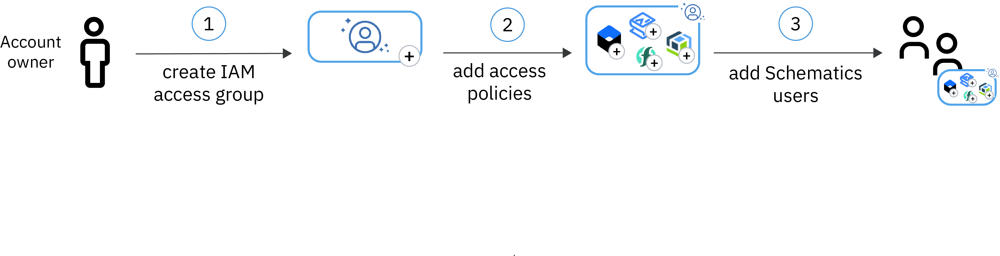

---

copyright:
  years: 2017, 2019
lastupdated: "2019-07-31"

keywords: schematics, automation, terraform

subcollection: schematics

---

{:new_window: target="_blank"}
{:shortdesc: .shortdesc}
{:screen: .screen}
{:pre: .pre}
{:table: .aria-labeledby="caption"}
{:codeblock: .codeblock}
{:tip: .tip}
{:note: .note}
{:important: .important}
{:deprecated: .deprecated}
{:download: .download}
{:preview: .preview}
{:external: target="_blank" .external}

# Managing user access
{: #access}

Use {{site.data.keyword.cloud_notm}} Identity and Access Management (IAM) to grant permissions to {{site.data.keyword.cloud_notm}} Schematics and the {{site.data.keyword.cloud_notm}} resources that you want to provision. 
{: shortdesc}

{{site.data.keyword.cloud_notm}} Schematics is designed to be used by teams that are set up by an {{site.data.keyword.cloud_notm}} account owner or an authorized account administrator. To simplify the process of assigning access to your users, consider creating an IAM access group that includes the permissions to {{site.data.keyword.cloud_notm}} Schematics and the resources that you want to work with. 

The following image shows how {{site.data.keyword.cloud_notm}} account owners can set up access to {{site.data.keyword.cloud_notm}} Schematics and other {{site.data.keyword.cloud_notm}} resources. 

## Overview of Schematics service access roles and required permissions
{: #access-roles}

Grant access to {{site.data.keyword.cloud_notm}} Schematics by assigning {{site.data.keyword.cloud_notm}} Identity and Access Management (IAM) service access roles to your users. 
{: shortdsec}

**Who must grant access to {{site.data.keyword.cloud_notm}} Schematics?**  
As the account owner or an authorized account administrator you can assign IAM service access roles to your users. The IAM service access roles determine the actions that you can perform on an {{site.data.keyword.cloud_notm}} Schematics workspace. To avoid assigning access policies to individual users, consider creating [IAM access groups](/docs/iam?topic=iam-groups). 

**If I have access to {{site.data.keyword.cloud_notm}} Schematics, can I automatically provision {{site.data.keyword.cloud_notm}} resources?**  
No. If you are assigned an {{site.data.keyword.cloud_notm}} Schematics service access role, you can view, create, update, or delete workspaces in {{site.data.keyword.cloud_notm}} Schematics. To provision the {{site.data.keyword.cloud_notm}} resources that you defined in your Terraform configuration files, you must be assigned the IAM platform or service access role that is required to provision the individual resource. For example, to provision an {{site.data.keyword.containerlong_notm}} cluster, you must have the **Administrator** platform role and the **Manager** service access role for {{site.data.keyword.containerlong_notm}}. Refer to the [documentation](https://cloud.ibm.com/docs/home/alldocs) for your resource to determine the access policies that you need to provision and work with your resource. 

**What else is required to enable users to provision {{site.data.keyword.cloud_notm}} resources?**  
To successfully provision {{site.data.keyword.cloud_notm}} resources, users must have access to a paid {{site.data.keyword.cloud_notm}} account. Charges incur when you create the resources in the {{site.data.keyword.cloud_notm}} account, which is started by clicking the **Apply plan** button from the {{site.data.keyword.cloud_notm}} Schematics console. 

Review the pricing information and account limiations for each {{site.data.keyword.cloud_notm}} resource that you want to provision before you create the resources. 
{: tip}

<table summary="The table shows user permissions by access role. Rows are to be read from the left to right, with the access role in column one, and the permission descriptions in column two.">
<caption>User permissions by service user type, account type, and access role</caption>
  <thead>
    <th>User type</th>
  <th>IAM service access role</th>
  <th>Permissions</th>
  </thead>
  <tbody>
    <tr>
      <td>Account owner</td>
      <td>N/A</td>
      <td><ul>
          <li>Create workspace</li>
          <li>Update workspace</li>
          <li>Delete workspace</li>
          <li>View workspace</li>
        <li>Freeze and unfreeze workspace</li>
          </ul></td>
    </tr>
    <tr>
      <td>Schematics user</td>
      <td>Manager</td>
      <td><ul>
          <li>Create workspace</li>
          <li>Update workspace</li>
          <li>Delete workspace</li>
          <li>View workspace</li>
        <li>Freeze and unfreeze workspace</li>
          </ul></td>
    </tr>
    <tr>
      <td>Schematics user</td>
      <td>Writer</td>
      <td><ul>
          <li>Update workspace</li>
          <li>View workspace</li>
          </ul></td>
    </tr>
    <tr>
      <td>Schematics user</td>
      <td>Reader</td>
      <td><ul>
          <li>View workspace</li>
          </ul></td>
    </tr>
  </tbody>
  </table>

## Setting up access for your users
{: #access-setup}

As the {{site.data.keyword.cloud_notm}} account owner or authorized account administrator, create an IAM access group for your users and assign access policies to {{site.data.keyword.cloud_notm}} Schematics and the resources that you want your users to work with.  
{: shortdesc}

1. [Invite users to your {{site.data.keyword.cloud_notm}} account](/docs/iam?topic=iam-iamuserinv).

2. [Create a resource group](/docs/resources?topic=resources-rgs#create_rgs).

3. [Create an access group and assign policies to {{site.data.keyword.cloud_notm}} Schematics](/docs/iam?topic=iam-groups).

   1. From the menu bar, click **Manage** > **Access (IAM)** > **Access groups**.
   2. Click **Create**. 
   3. Enter a name, and optionally, a description for your IAM access group. 
   4. Select the **Access policies** tab. 
   5. Click **Assign access**.
   6. Click **Assign access to resources**.
   7. From the **Services** drop-down list, select **Schematics**.
   8. In the **Assign service access role** section, select the IAM service access role that you want to assign to your IAM access group. Do not select an IAM platform role. IAM platform roles are not supported during the {{site.data.keyword.cloud_notm}} Schematics beta. 
   9. Click **Assign**. 

4. Assign your IAM access group permissions to [work with the resource group](/docs/iam?topic=iam-groups) that you created earlier.
   1. In the **Access policies** tab, click **Assign access** again.
   2. Click **Assign access within a resource group**.
   3. From the **Resource group** drop-down list, select the resource group that you created.
   4. In **Assign access to a resource group**, select an access role.
   5. From the **Resources** drop-down list, select **Schematics**.
   6. In the **Assign service access role** section, select the same IAM service access role that you assigned in the previous step. 
   7. Click **Assign**.
   
5. Review the [documentation](https://cloud.ibm.com/docs/home/alldocs) for each of the {{site.data.keyword.cloud_notm}} resources that you want to create, and assign the appropriate IAM access policy to your IAM access group. 

6. [Invite users to the access group](/docs/iam?topic=iam-groups#create_ag).

Next, you can [create Terraform configuration files](/docs/schematics?topic=schematics-create-tf-config), [create a workspace](/docs/schematics?topic=schematics-workspace-setup), and start [provisioning {{site.data.keyword.cloud_notm}} resources](/docs/schematics?topic=schematics-manage-lifecycle#deploy-resources) in your account.
