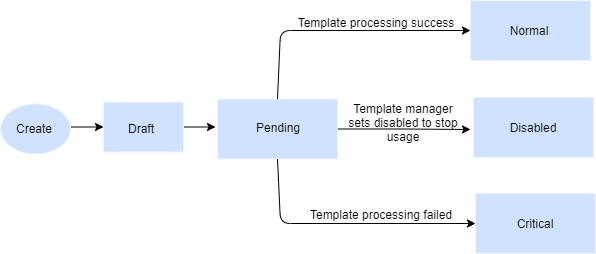
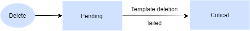
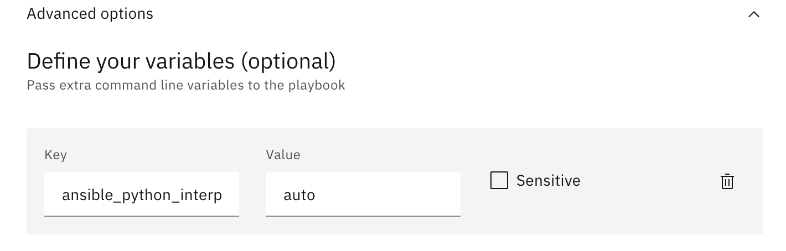

---

copyright:
  years: 2017, 2022
lastupdated: "2022-12-15"

keywords: schematics, schematics action, create schematics actions, run ansible playbooks, delete schematics action, 

subcollection: schematics

---

{{site.data.keyword.attribute-definition-list}}

# Working with {{site.data.keyword.bpshort}} Actions
{: #action-working}

{{site.data.keyword.bpshort}} Actions delivers Ansible-as-a-Service capabilities for you to automate configuration and management of your {{site.data.keyword.cloud_notm}} environment, and deploy complex multitiered apps to your cloud infrastructure. 
{: shortdesc}

Review the section [{{site.data.keyword.bpshort}} Actions](/docs/schematics?topic=schematics-sc-actions) for the background to Actions and Red Hat Ansible. 

## Creating and running a {{site.data.keyword.bpshort}} action
{: #create-action}

Create a {{site.data.keyword.bpshort}} action and specify the Ansible playbook that you want to run against your {{site.data.keyword.cloud_notm}} resources. 
{: shortdesc}

### Prerequisites
{: #action-working-prereq}

- Create an Ansible playbook and store the playbook in a GitHub or GitLab repository. Or you can try to use one of the [IBM-provided Ansible playbooks](https://github.com/Cloud-Schematics?q=topic%3Aansible-playbook){: external}. 
- Make sure that you have the [right permissions](/docs/schematics?topic=schematics-access) to create the {{site.data.keyword.bpshort}} action. 

Ensure the `location` and the `url` endpoint are pointing to the same region when you create or update the {{site.data.keyword.bpshort}} Workspaces and Actions. For more information about location and endpoint, see [Where is the information stored?](/docs/schematics?topic=schematics-secure-data#pi-location)
{: note}

### To create an action
{: #create-action-working}

1. From the [{{site.data.keyword.bpshort}} Actions dashboard](https://cloud.ibm.com/schematics/actions), click **Create action**.
2. Configure your action. 
    1. Enter an **Action name** and an **Action description** for your action. Note that the name can be up to 128 characters long and can include alphanumeric characters, spaces, dashes, and underscores.
    2. Optional, enter the **Tags** that you want to add to your action. Tags help in quick search operation of your action.
    3. Select the **Resource group** where you want to create the action. 
    4. Select the **Location** where you want to create the action. The location determines where your action runs and action data are stored. You can choose a geography, such as `North America`, or a location, such as `Frankfurt` or `London`. If you select a geography, {{site.data.keyword.bpshort}} decides on a location within this geography based on availability. Be sure that you can store your action data in this location as you cannot change the location after the action is created. For more information, see [where is the information stored?](/docs/schematics?topic=schematics-secure-data#pi-location) Note that the location of your action is independent from the location of your {{site.data.keyword.cloud_notm}} resource where you want to run your Ansible playbook.
    5. Click **Create**. Your action is created with a `Normal` state, and you are directed to the `Details` section.
3. In the **Ansible playbook** section, click **Edit icon** to import your Ansible playbook. 
    1. Enter the **GitHub or GitLab repository URL** where your Ansible playbook is stored. The URL can point to the master branch, any other branch, or a subdirectory. If your repository stores multiple playbooks, you must select the playbook that you want to run. A {{site.data.keyword.bpshort}} action can point to one playbook at a time. To run multiple playbooks, you must create a separate action for each playbook. 
        - Example for master branch - `https://github.com/myorg/myrepo`
        - Example for other branches - `https://github.com/myorg/myrepo/tree/mybranch`
        - Example for subdirectory - `https://github.com/mnorg/myrepo/tree/mybranch/mysubdirectory`

        Don't have a playbook that you can use? Try out one of your [sample playbooks](https://github.com/Cloud-Schematics?q=topic%3Aansible-playbook){: external}. 
        {: tip}

    2. Optional, if you want to use a private GitHub repository, enter your personal access token. The personal access token is used to authenticate private GitHub repository to access your Ansible playbook. For more information about how to create an access token, see [creating a personal access token for the command line](https://docs.github.com/en/authentication/keeping-your-account-and-data-secure/creating-a-personal-access-token){: external}. If you need see the [allowed and blocked file extensions](/docs/schematics?topic=schematics-workspaces-faq#clone-file-extension) for cloning from the Git repository.
    3. Review the default Ansible version that is used to run your playbook. This version cannot be changed. If you use your own Ansible playbook, make sure that your playbook uses the specified Ansible version. For example, `Ansible v2.9.23`.
    4. Click **Retrieve playbooks** to connect to your repository and retrieve all Ansible playbooks from your Git repository.
    5. Select the playbook that you want to run. A {{site.data.keyword.bpshort}} action can point to one playbook at a time. To run multiple playbooks, you must create a separate action for each playbook.
    6. Select the **Verbosity** level. The verbosity level determines the depth of information that is written to the logs when your Ansible playbook is executed. The supported values are `0 (Normal)`, `1 (verbose)`, `2 (More Verbose)`, `3 (Debug)`, `4 (Connection Debug`). For example, if you want to debug your playbook or want to include a detailed summary for each task that Ansible runs, select a high verbosity level. You can view the logs when your playbook runs. 
    7. Optional, click the **Advanced options** to define input variables that you want to pass to the playbook. Input variables must be entered in key-value pairs. If the variable contains sensitive information, enable the **Sensitive** option so that the value is hidden for the users after the action is created. If you use one of the [IBM-provided Ansible playbooks](https://github.com/Cloud-Schematics?q=topic%3Aansible-playbook){: external}, all input variables can be found in the `readme.md` file. 
    8. Click **Save** to save the action details. 
4. Configure your resource inventory. The resource inventory includes all target hosts where you want to run your Ansible playbook.
    1. In the **Choose your inventory** section, click the **Edit icon**. 
    2. From the resource inventory table, select an existing resource inventory. If you do not have a resource inventory yet, click **Create Inventory** to create one. For more information about creating resource inventories, see [Creating static inventory files](/docs/schematics?topic=schematics-inventories-setup#static-inv) or [Dynamically building resource inventories from {{site.data.keyword.bpshort}} Workspaces](/docs/schematics?topic=schematics-inventories-setup#dynamic-inv).
    3. Action supports **SSH** and **WinRM** types of inventory connection tab to connect to your remote host.
       - Select **SSH** tab to enter the **username** and **{{site.data.keyword.cloud_notm}} resource inventory private SSH key** that you want to use to connect to your target hosts. All hosts must be configured with the matching public SSH key so that {{site.data.keyword.bpshort}} can connect to your hosts and run your playbook. 
         * Select the **Bastion host access is required**, for the bastion host access. To use a different SSH key to connect to your bastion host, deselect the **Use the same key for bastion host** option. For more information about SSH keys, see [Adding an SSH key](/docs/ssh-keys?topic=ssh-keys-adding-an-ssh-key).
       - Select **WinRM** tab, for the communication between the client and the server. Currently, WinRM supports only Windows system with the public `IPs` and do not support Bastion host.
         * Provide the **Username** and the **Password** of your Windows system with the public IP.
    4. Click **Save**.

    For more information about creating inventories in for {{site.data.keyword.bpshort}} Actions, see [static inventory](/docs/schematics?topic=schematics-inventories-setup#static-inv) and [dynamic inventory](/docs/schematics?topic=schematics-inventories-setup#dynamic-inv)
    {: note}

5. Click **Check action** to verify your action details. The **Jobs** page opens automatically and you can view the results in the logs. This check verifies that your playbook can be run in {{site.data.keyword.bpshort}}. To change your action settings, return to the action's **Settings** page and click the **edit icon**. 
6. Click **Run action** to run the action. You can monitor the progress of an action by reviewing the logs on the **Jobs** page. Every `30 seconds` the job logs are automatically refreshed. 

    You cannot delete or stop a running job of your {{site.data.keyword.bpshort}} action. To  change your action, wait for the job to complete, then change your settings, and click **Check action** or **Run action** again. 
    {: note}

## Editing the {{site.data.keyword.bpshort}} Actions settings
{: #action-settings}

The **Settings** option edits the action **Details**, **Ansible action**, and **{{site.data.keyword.cloud_notm}} resource inventory** parameters. Then, you can click `Save` button to save the edited configuration. Finally, you click **Check action** and **Run action** to validate and rerun your action playbook. 

You can monitor the progress of an action by reviewing the logs on the **Jobs** page. You can use [`ibmcloud schematics job list`](/docs/schematics?topic=schematics-schematics-cli-reference#schematics-list-job) command to view the complete job logs of your action.

In the console, there is no limit set to display the job logs. Every `30 seconds` the job logs gets automatically refreshed. You can use [`ibmcloud schematics job list`](/docs/schematics?topic=schematics-schematics-cli-reference#schematics-list-job) command to view the complete job logs of your action.
{: note}

## Deleting an action
{: #delete-ansible-actions}

If you no longer need your {{site.data.keyword.bpshort}} action, you can delete it. Deleting an action removes the Ansible playbook and your action data. However, any configurations on your target hosts you made by using the action are not removed. 
{: shortdesc}

1. From the [{{site.data.keyword.bpshort}} Actions dashboard](https://cloud.ibm.com/schematics/actions), find the action that you want to delete.
2. From the Actions menu, click **Delete**. 

## Action state
{: #action-state-diagram}

Action state indicates the result of creating and processing an action that can be known to the {{site.data.keyword.bpshort}} system state. The table represents the {{site.data.keyword.bpshort}} Actions state and its description.
{: shortdesc}

|State|Description|
|------|-------|
| `Critical` | When the template is unable to download the repository, or the repository name is invalid, the template fails and changes the action state as critical. |
| `Disabled` | Disallows user execution. |
| `Locked` | After configuration is in `Normal` state. Action can be locked by an administrator to stop further change. |
| `Normal` | Administrator publishes action to enable visibility to the users execution. |
| `Pending` | When the user provides the template during create, update, or delete, your action goes into `Pending` state. |
{: caption="Action state" caption-side="top"}

### State diagram flow
{: #state-diagram-flow}

The following table represents the actions state workflow.

| Action | State diagram | Description |
| ---- | ---- | ---- |
| **Create** |  | When the user creates an action, initially the state of an action is in `Draft` state. If user provides the template during create or after create, then action goes to `Pending` state. If the template processing is success, action goes to `Normal` state. If the template manager sets disable to stop the usage, then action goes to `Disable` state. If there is an error in template processing, action goes to `Critical` state. |
| **Delete**| | When the user selects to delete an existing action, initially action goes into `Pending` state. If the template deletion fails action goes to `Critical` state.|
| **Update** |  | When the user clicks an existing action to update the template repository, immediately action goes to `pending` state. If the template processing is success, action goes to the `Normal` state. If the user tries to set the template repository to disable, action goes to the `Disabled` state. Finally, if the template processing fails, action goes to `Critical` state.|
{: caption="Action state workflow" caption-side="top"}

## Reviewing Actions job details
{: #action-jobs}

Use the {{site.data.keyword.bpshort}} Actions job details to find a history of all {{site.data.keyword.bpshort}} internal activities. Activities such as downloading your Ansible playbook or verifying your playbook, and to see the Ansible logs for the playbook that you ran on your target hosts. 
{: shortdesc}

Jobs are classified into the following categories:
- **System jobs**: These jobs represent all {{site.data.keyword.bpshort}} internal activities and checks, for example, downloading your Ansible playbook from GitHub or verifying your playbook. You can find these jobs in the **All** tab on the action's **Jobs** page. 
- **User jobs**: These jobs are created when you check or run an action. You can find a summary of all user-initiated jobs when you click the **User** tab on the action's **Jobs** page. 

Review the following status that can be assigned to a job: 

|Status|Description|
|-----|---------|
|`ok` |The total number of target hosts where the Ansible playbook ran. |
|`changed` | The total number of target hosts that were accessed and changed. |
|`failed` |The total number of target hosts where the Ansible playbook might not be successfully ran. |
|`skipped` |The total number of target hosts that were accessed but might not be updated as changes are applied to the hosts.|
|`unreachable` |The total number of target hosts that might not be found or reached. |
{: caption="Job status" caption-side="top"}

When the action job execution displays DEPRECATION WARNING message, you need to set the input variable as `ansible_python_interpreter = auto` as shown in the screen capture to avoid `DEPRECATION WARNING` message in the job.

{: caption="Configuring input variable to silence warning message" caption-side="bottom"}
