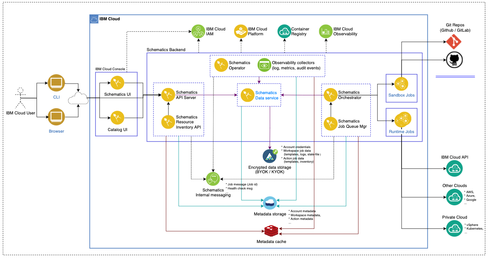

---

copyright:
  years: 2017, 2023
lastupdated: "2023-02-03"

keywords: schematics architecture, schematics compliance, schematics workload isolation, schematics dependencies

subcollection: schematics

---

{{site.data.keyword.attribute-definition-list}}

# {{site.data.keyword.bpshort}} architecture
{: #compute-isolation}

Learn about the {{site.data.keyword.bplong}} service architecture, service dependencies, and how customer workloads are isolated from each other in {{site.data.keyword.bplong_notm}}?
{: shortdesc}

## Architectural flow
{: #basic-architecture}

{{site.data.keyword.bpshort}} is a shared multi-tenant service. On initial use, a new {{site.data.keyword.bpshort}} service instance is automatically provisioned for each user account.

The following {{site.data.keyword.bpshort}} architecture image depicts:  
- Main {{site.data.keyword.bpshort}} components.
- The interaction between service components.
- Key Management services used. 
- Usage of {{site.data.keyword.cloud}} observability services.
- The role of runtime jobs to interact with {{site.data.keyword.cloud_notm}} `APIs`, private cloud such as `vSphere`, `Kubernetes`, and other public cloud providers such as `AWS`, `Google`, so on.
{: shortdesc}

{: caption="Figure 1. {{site.data.keyword.bpshort}} architecture" caption-side="bottom"}

## Workload isolation
{: #workload-isolation}

{{site.data.keyword.bplong_notm}} implements a robust multi-tenant service architecture on shared infrastructure.  
{: shortdesc}

### How are API requests to the service isolated from other API requests?
{: #workload-api-isolation}

All API requests to the {{site.data.keyword.bpshort}} api-server are handled as separate service processes. IAM requests are made to authenticate user access to Schematics, workspaces and operations. Authenticated API requests are processed and queued as {{site.data.keyword.bpshort}} internal messages. 

The {{site.data.keyword.bpshort}} job queue manager forwards the requests with the job ID and health check messages. At any particular time, a maximum of n API requests are processed by the {{site.data.keyword.bpshort}} engine. By default, n equals 20, but this number is manually adjusted by the {{site.data.keyword.bpshort}} operator based on the current API workload. 

For every queued request from a {{site.data.keyword.bpshort}} user, the {{site.data.keyword.bpshort}} engine creates a dedicated `runtime job` that runs to completion.  The request is removed from the queue when it is fully processed. The {{site.data.keyword.bpshort}} jobs are not shared between tenants or reused later.

### How is the information in {{site.data.keyword.cloudant}} and {{site.data.keyword.cos_full_notm}} isolated from other tenant data?
{: #workload-info-isolation}

{{site.data.keyword.bpshort}} does not store any personally identifiable information. Sensitive technical information for a workspace is stored as described in [What technical information is stored in {{site.data.keyword.bpshort}}?](/docs/schematics?topic=schematics-secure-data#ti-data). Data that is stored in Cloudant and {{site.data.keyword.cos_full_notm}} is encrypted in transit using TLS and at rest by using AES GCM 256 and envelope encryption. Refer to [Securing your data with encryption](/docs/schematics?topic=schematics-secure-data).

### How are cloud resources isolated from other tenants? 
{: #workload-tenant-isolation}

When you use {{site.data.keyword.bpshort}} to provision {{site.data.keyword.cloud_notm}} resources, these resources are created in your personal {{site.data.keyword.cloud_notm}} account. You are responsible to manage these resources and to keep them up-to-date to avoid security vulnerabilities or downtime for your workloads. {{site.data.keyword.cloud_notm}} resources are provisioned, updated, and deleted as defined in the Terraform template and requested by the user. 

Because all resources are created in your personal account, resources are not shared with or reused by other {{site.data.keyword.cloud_notm}} tenants.

