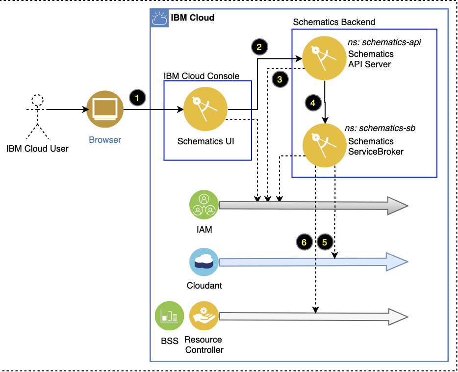

---

copyright:
  years: 2017, 2022
lastupdated: "2022-02-24"

keywords: schematics architecture, schematics compliance, schematics workload isolation, schematics depdendencies

subcollection: schematics

---

{{site.data.keyword.attribute-definition-list}}

# {{site.data.keyword.bpshort}} architecture
{: #compute-isolation}

Learn about the {{site.data.keyword.bplong}} service architecture, the service dependencies, and how customer workloads are isolated from each other in {{site.data.keyword.bplong_notm}}?
{: shortdesc}

## Service basic architecture
{: #basic-architecture}

{{site.data.keyword.bplong_notm}} is a shared service. On the initial use, a new service instance is automatically provisioned for each user account by using the following provisioning method.
{: shortdesc}

{: caption="Figure 1. Schematics architecture" caption-side="bottom"}

1. **User**. Open the {{site.data.keyword.bpshort}} user interface in the {{site.data.keyword.cloud_notm}} console with the user's {{site.data.keyword.iamshort}} credentials.
2. **{{site.data.keyword.bpshort}} user interface**. Sends request to the {{site.data.keyword.bpshort}} API server.
3. **API server**. Authenticates the user with {{site.data.keyword.iamshort}} credentials.
4. **API server**. Gets the {{site.data.keyword.bpshort}} service instance for the user account from the ServiceBroker.
5. **Servicebroker**. Lookup for the user's service instance / CRN in Cloudant. If user is not found in Cloudant, ServiceBroker creates a new service instance for that new user.
6. **Servicebroker**. Registers the new service instance for the user account with the resource controller. On successful registration, you can continue to process the API request to provision the your configured resource.

## Workload isolation
{: #workload-isolation}

Review how your workloads are isolated in {{site.data.keyword.bplong_notm}}.
{: shortdesc}

### How are API requests to the service isolated from other API requests?
{: #workload-api-isolation}

All API requests to the {{site.data.keyword.bpshort}} API server are queued in Messages for RabbitMQ. RabbitMQ forwards these requests to the {{site.data.keyword.bpshort}} engine that processes these requests. At any given time, a maximum of n API requests are processed by the Schematics engine. By default, n equals 20, but this number is manually adjusted by the {{site.data.keyword.bpshort}} operator based on the current API workload. For every API request from a {{site.data.keyword.bpshort}} tenant, the {{site.data.keyword.bpshort}} engine creates a dedicated job that runs to completion and is then removed when the API request is fully processed. The {{site.data.keyword.bpshort}} jobs are not shared between tenants or reused later.

### How is the information in {{site.data.keyword.cloudant}} and {{site.data.keyword.cos_full_notm}} isolated from other tenant data?
{: #workload-info-isolation}

{{site.data.keyword.bpshort}} does not store any personal information, but stores sensitive technical information for a workspace as described in [What information is stored in {{site.data.keyword.bpshort}}?](/docs/schematics?topic=schematics-secure-data#pi-data). All data that is stored in Cloudant and IBM Cloud Object Storage is encrypted in transit and at rest by using the encryption mechanism that are described in the [service architecture](#architecture). 

### How are the workloads isolated from other tenants? 
{: #workload-tenant-isolation}

When you use {{site.data.keyword.bpshort}} to provision {{site.data.keyword.cloud}} resources, these resources are created in your personal {{site.data.keyword.cloud_notm}} account. You are responsible to manage these resources and to keep them up-to-date to avoid security vulnerabilities or downtime for your workloads. {{site.data.keyword.cloud_notm}} resources are provisioned, updated, and deleted as defined in the Terraform template and requested by the user. Because all resources are created in your personal account, resources are not shared with or reused by other {{site.data.keyword.cloud_notm}} tenants.
