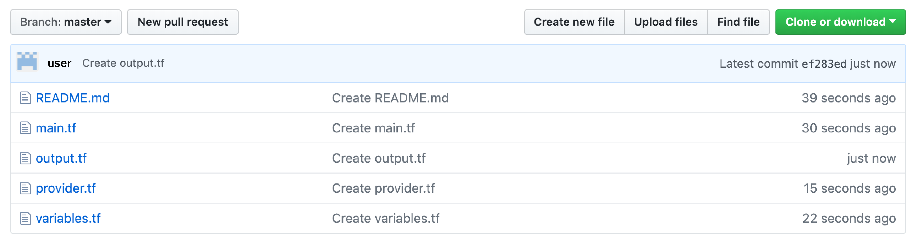

---

copyright:
  years: 2017, 2019
lastupdated: "2019-07-26"

keywords: schematics, automation, terraform

subcollection: schematics

---
{:new_window: target="_blank"}
{:shortdesc: .shortdesc}
{:screen: .screen}
{:pre: .pre}
{:table: .aria-labeledby="caption"}
{:codeblock: .codeblock}
{:tip: .tip}
{:note: .note}
{:important: .important}
{:deprecated: .deprecated}
{:download: .download}
{:preview: .preview}
{:external: target="_blank" .external}

# Creating a Terraform configuration
{: #create-tf-config}

Learn how to create Terraform configuration files that are well-structured, reusable, and comprehensive.
{: shortdesc}

**How is a Terraform configuration structured?** </br>
A Terraform configuration consists of one or more Terraform files that declare the state that you want to achieve for your {{site.data.keyword.cloud_notm}} resources. To successfully work with your resources, you must [configure IBM as your cloud provider](#configure-provider) and [add resources to your Terraform configuration file](#configure-resources). Optionally, you can use [variables](#configure-variables) to hold your credentials and dynamic configuration settings, or specify [output values](#configure-output-values) to share information between Terraform runs. 

**What language do I use to develop my infrastructure code?** </br>
You can write your Terraform configuration by using HashiCorp Configuration Language (HCL) or JSON syntax. For more information, see [Configuration language](https://www.terraform.io/docs/configuration/index.html){: external}.  

**Where do I store my Terraform configuration files?** </br>
A Terraform configuration is infrastructure code that you must treat as regular code. To support collaboration, source and version control, store your files in a GitHub or GitLab repository. Version control allows you to revert to previous configurations, audit changes to configurations, and share code with multiple teams. You can also set up your own continuous integration pipeline to automatically apply your configuration changes in {{site.data.keyword.cloud_notm}}. 

The following image shows an example of how your Terraform configuration files could look like in a GitHub repository. 



## Configuring IBM as your cloud provider 
{: #configure-provider}

Specify the cloud provider that you want to use to provision your resources in the `provider` block of your Terraform configuration file. 
{: shortdesc}

The `provider` block includes all the credentials and input variables the cloud provider plug-in requires to authenticate and authorize with the cloud provider back-end. 

You can choose between the following options to configure the `provider` block: 
- **Create a separate `provider.tf` file.** The information in this file is loaded by Terraform and {{site.data.keyword.cloud_notm}} Schematics, and applied to all Terraform configuration files that exist in the same directory. This approach is useful if you split out your infrastructure code across multiple files. 
- **Add a `provider` block to your Terraform configuration file.** You might choose this option if you prefer to specify the provider alongside with your variables and resources in one Terraform configuration file. 

To configure your `provider` block: 

1. [Retrieve the required credentials for your resources](/docs/terraform?topic=terraform-setup_cli#retrieve_credentials). The credentials that you need depend on the type of resource that you want to provision. For example, to provision classic infrastructure resources, you must provide your {{site.data.keyword.cloud_notm}} classic infrastructure user name and API key. 
2. Create a `provider.tf` file with the following code, or add the following code to your existing Terraform configuration file. In the following example, you declare the input variables that are required by the {{site.data.keyword.cloud_notm}} Provider plug-in to provision your resources, and reference these input variables in the `provider` block. If you use {{site.data.keyword.cloud_notm}} Schematics, these variables are automatically loaded into your workspace when you create the workspace, and you can add the values for your variables by using the {{site.data.keyword.cloud_notm}} Schematics console. If you use the Terraform CLI directly, use a local `terraform.tfvars` file to store the values for these variables on your local machine. 
   ```
   variable "softlayer_username" {
     type        = "string"
     description = "Enter your {{site.data.keyword.cloud_notm}} classic infrastructure user name."
   }
   
   variable "softlayer_api_key" {
     type        = "string"
     description = "Enter your {{site.data.keyword.cloud_notm}} classic infrastructure API key."
   }
   
   provider "ibm" {
     generation = 1
     softlayer_username = "${var.softlayer_username}"
     softlayer_api_key  = "${var.softlayer_api_key}"
   }
   ```
   {: codeblock}
   
   <table>
   <caption>Understanding the configuration file components</caption>
   <thead>
   <th colspan=2> Understanding the configuration file components</th>
   </thead>
   <tbody>
   <tr>
   <td><code>provider.generation</code></td>
   <td>Enter <strong>1</strong> to configure the {{site.data.keyword.cloud_notm}} provider plug-in to provision your VPC resources on {{site.data.keyword.cloud_notm}} classic infrastructure (VPC on Classic). You can remove this parameter if you want to provision only classic infrastructure resources that are not in a VPC. </td>
   </tr>
   <tr>
   <td><code>provider.softlayer_username</code></td>
   <td>Reference the {{site.data.keyword.cloud_notm}} classic infrastructure user name variable. This user name is required to provision {{site.data.keyword.cloud_notm}} classic infrastructure resources. You can remove this credential if you want to provision {{site.data.keyword.cloud_notm}} platform or VPC infrastructure resources only. </td>
   </tr>
   <tr>
   <td><code>provider.softlayer_api_key</code></td>
   <td>Reference the {{site.data.keyword.cloud_notm}} classic infrastructure API key variable. This API key is required to provision {{site.data.keyword.cloud_notm}} classic infrastructure resources. You can remove this credential if you want to provision {{site.data.keyword.cloud_notm}} platform or VPC infrastructure resources only.   </td>
   </tr>
   </tbody>
   </table>

## Adding {{site.data.keyword.cloud_notm}} resources to your Terraform configuration file
{: #configure-resources}

Use `resource` blocks to define the {{site.data.keyword.cloud_notm}} resource that you want to manage with Terraform or {{site.data.keyword.cloud_notm}} Schematics. 
{: shortdesc}

To support a multi-cloud approach, Terraform works with multiple cloud providers. A cloud provider is responsible for understanding the resources that you can provision, their API, and the methods to expose these resources in the cloud. To make this knowledge available to users, every supported cloud provider must provide a CLI plug-in for Terraform that users can use to work with the resources. To find an overview of the resources that you can provision in {{site.data.keyword.cloud_notm}}, see the [{{site.data.keyword.cloud_notm}} Provider plug-in for Terraform reference](https://ibm-cloud.github.io/tf-ibm-docs/){: external}. 

Example infrastructure code for provisioning a VPC: 
```
resource ibm_is_vpc "vpc" {
  name = "myvpc"
}
```
{: codeblock}

### Referencing resources in other resource blocks
{: #reference-resource-info}

Review the options that you have to reference existing resources in other resource blocks of your Terraform configuration file. 
{: shortdesc}

The {{site.data.keyword.cloud_notm}} Provider plug-in reference includes two types of objects, data sources and resources. You can use both objects to reference resources in other resource blocks.  

- **Resources**: To create a resource, you use the resource definitions in the {{site.data.keyword.cloud_notm}} Provider plug-in reference. The resource definitions includes the syntax for configuring your {{site.data.keyword.cloud_notm}} resources and an **Attributes reference** that shows the properties that you can reference as input parameters in other resource blocks. For example, when you create a VPC, the ID of the VPC is made available after the creation. You can use the ID as an input parameter when you create a subnet for your VPC. Use this option if you combine multiple resources in one Terraform configuration file.  </br>

  Example infrastructure code: 
  ```
  resource ibm_is_vpc "vpc" {
    name = "myvpc"
  }

  resource ibm_is_security_group "sg1" {
    name = "mysecuritygroup"
    vpc  = "${ibm_is_vpc.vpc.id}"
  }
  ```
  {: codeblock}

- **Data sources**: You can also use the data sources from the {{site.data.keyword.cloud_notm}} Provider plug-in reference to retrieve information about an existing {{site.data.keyword.cloud_notm}} resource. Review the **Argument reference** section in the {{site.data.keyword.cloud_notm}} Provider plug-in reference to see what input parameters you must provide to retrieve an existing resource. Then, review the **Attributes reference** section to find an overview of parameters that are made available to you and that you can reference in your `resource` blocks. Use this option if you want to access the details of a resource that is configured in another Terraform configuration file. 
  
  Example infrastructure code: 
  ```
  data ibm_is_image "ubuntu" {
    name = "ubuntu-18.04-amd64"
  }
  
  resource ibm_is_instance "vsi1" {
    name    = "$mysi"
    vpc     = "${ibm_is_vpc.vpc.id}"
    zone    = "us-south1"
    keys    = ["${data.ibm_is_ssh_key.ssh_key_id.id}"]
    image   = "${data.ibm_is_image.ubuntu.id}"
    profile = "cc1-2x4"

    primary_network_interface = {
      subnet          = "${ibm_is_subnet.subnet1.id}"
      security_groups = ["${ibm_is_security_group.sg1.id}"]
    }
  }
  ```
  {: codeblock}


## Using input variables to store credentials and dynamic resource settings
{: #configure-variables}

### Deciding where to store variables
Use a dedicated file to store output declarations, and if your configuration is highly modularized, a dedicated file to store variable declarations
It is common practice to use a dedicated file, often called outputs.tf, to store your output variable declarations. It is common practice to also use a dedicated file to store variable declarations, especially if your configuration is simple and your components are highly modularized. For example, the NGINX Auto Scale Group template External link icon is fairly modularized, and declares variables in output.tf and variables.tf files. But for more complex configurations, store your variable declarations with the resource file that calls it so that it's easier for anyone who reads your configuration to map the variables to the resources.

### Declaring variables in a configuration file

You can use `variable` blocks to identify dynamic values. For example, if you want to use a configuration to deploy Kubernetes clusters in multiple data centers, you can create one configuration to use as a template. You can then turn any values that would vary by deployments into variable blocks.

Provide a default value to make a variable optional
You can use the default parameter to set a default value for a variable. However, providing a default value automatically makes the variable optional. If no default value is provided, then the variable is required.

Example variable without a default:
```
variable "datacenter" {
  type        = "string"
  description = "The data center that you want to deploy your Kubernetes cluster in."
}
```
{:codeblock}


Example variable with a default:
```
variable "datacenter" {
  type        = "string"
  description = "The data center that you want to deploy your Kubernetes cluster in."
  default = "dal10"

}
```
{:codeblock}

### Referencing variables 

You can then call the variable with the syntax `${var.<variable_name>}` in other blocks. The `type` argument defines the variable as a string so that you can pass the value in a simple key-value pair.

In the following example, the Kubernetes resource block is referencing the data center variable with `${var.datacenter}`.

```
resource "ibm_container_cluster" "test_cluster" {
  name         = "test"
  datacenter   = "${var.datacenter}"
}
```
{:screen}

See the [Terraform documentation](https://www.terraform.io/docs/configuration/variables.html){: external} for more information about variable configuration


