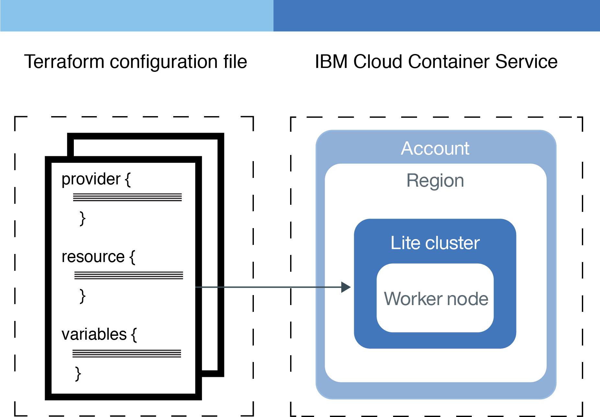

---

copyright:
  years: 2017, 2019
lastupdated: "2019-07-10"

keywords: schematics, automation, terraform

subcollection: schematics

---
{:new_window: target="_blank"}
{:shortdesc: .shortdesc}
{:screen: .screen}
{:pre: .pre}
{:table: .aria-labeledby="caption"}
{:codeblock: .codeblock}
{:tip: .tip}
{:note: .note}
{:important: .important}
{:deprecated: .deprecated}
{:download: .download}
{:preview: .preview}

# Creating a Terraform configuration
{: #create-tf-config}


To support a multi-cloud approach, Terraform works with multiple cloud providers. A cloud provider is responsible for understanding the resources that you can provision, their API, and the methods to expose these resources in the cloud. To make this knowledge available to users, every supported cloud provider must provide a CLI plug-in for Terraform that users can install and use to provision the resources.  

The {{site.data.keyword.cloud_notm}} Provider plug-in for Terraform is IBM's plug-in for Terraform. The plug-in is aware of the {{site.data.keyword.cloud_notm}} resources that you can provision with Terraform and {{site.data.keyword.cloud_notm}} Schematics, and the syntax that you must use in your Terraform configuration files to describe them. When you create a Terraform configuration file, you must include all the pieces that are required by the plug-in, and assemble them in the right order so that your file can be interpreted by the plug-in. 

## Basics 


**What do I specify in the Terraform configuration files?** </br>
When you work with {{site.data.keyword.bpshort}}, you write Terraform configurations for your environment in declarative syntax. You state how you want your environment to look, such as scaling an [{{site.data.keyword.containershort}}](../../containers/container_index.html) cluster to have 10 worker nodes in production. The service compares your configuration to the number of worker nodes that Terraform previously created and adds or removes worker nodes as necessary.

Blocks are containers for other content and usually represent the configuration of some kind of object, like a resource. Blocks have a block type, can have zero or more labels, and have a body that contains any number of arguments and nested blocks. Most of Terraform's features are controlled by top-level blocks in a configuration file.
Arguments assign a value to a name. They appear within blocks.
Expressions represent a value, either literally or by referencing and combining other values. They appear as values for arguments, or within other expressions.

**What language do I use to develop my infrastructure code?** </br>
Terraform supports HashiCorp Configuration Language (HCL) or JSON syntax.  See the <a href="https://www.terraform.io/docs/configuration/index.html">Terraform configuration docs </a> for HCL syntax and guidelines on how to write configurations.

**Where do I store my Terraform configuration files?** </br>

## Configuring IBM as your cloud provider 
{: #configure-provider}

Specify the cloud provider that you want to use to provision your resources by using the `provider` block. 
{: shortdesc}

The `provider` block includes information about what cloud provider you want to use, and the credentials and input variables the cloud provider plug-in requires to authenticate and authorize with the cloud provider back-end. 

**What options do I have to configure the `provider` block?** </br>
You can choose between the following options to configure the `provider` block: 
- Create a separate `provider.tf` file. The information in this file is loaded by Terraform and {{site.data.keyword.cloud_notm}} Schematics, and applied to all Terraform configuration files that exist in the same directory. This approach is useful if you split out your infrastructure code across multiple files. 
- Add a `provider` block to your Terraform configuration file. You might choose this option if you prefer to specify the provider alongside with your variables and resources in one Terraform configuration file. 

**What credentials and input variables do I need to configure the {{site.data.keyword.cloud_notm}} Provider plug-in?**
The credentials that you need depend on the type of resource that you want to provision. For example, to provision classic infrastructure resources, you must provide your {{site.data.keyword.cloud_notm}} classic infrastructure user name and API key. To provision VPC infrastructure, you need an {{site.data.keyword.cloud_notm}} API key. For more information about what credentials you need for a specific IBM Cloud resource, see [Retrieving required credentials for your resources](/docs/terraform?topic=terraform-setup_cli#retrieve_credentials).

To configure your `provider` block: 

1. [Retrieve the required credentials for your resources](/docs/terraform?topic=terraform-setup_cli#retrieve_credentials). 
2. Create a `provider.tf` file with the following code, or add the following code to your existing Terraform configuration file. In the following example, you declare the input variables that are required by the {{site.data.keyword.cloud_notm}} plug-in to provision your resources, and reference these input variables in the `provider` block. If you use {{site.data.keyword.cloud_notm}} Schematics, these variables are automatically loaded into your workspace when you create the workspace, and you can add the values for your variables by using the {{site.data.keyword.cloud_notm}} Schematics console. If you use the Terraform CLI directly, use a local `terraform.tfvars` file to store the values for these variables on your local machine. 
   ```
   variable "ibmcloud_api_key" { 
     type        = "string"
     description = "Enter your {{site.data.keyword.cloud_notm}} API key."
   }
   
   variable "softlayer_username" {
     type        = "string"
     description = "Enter your {{site.data.keyword.cloud_notm}} classic infrastructure user name."
   }
   
   variable "softlayer_api_key" {
     type        = "string"
     description = "Enter your {{site.data.keyword.cloud_notm}} classic infrastructure API key."
   }
   
   provider "ibm" {
   ibmcloud_api_key    = "${var.ibmcloud_api_key}"
   generation = 1
   softlayer_username = "${var.softlayer_username}"
   softlayer_api_key  = "${var.softlayer_api_key}"
   }
   ```
   {: codeblock}
   
   <table>
   <caption>Understanding the configuration file components</caption>
   <thead>
   <th colspan=2> Understanding the configuration file components</th>
   </thead>
   <tbody>
   <tr>
   <td><code>provider.ibmcloud_api_key</code></td>
   <td>Reference the {{site.data.keyword.cloud_notm}} API key variable. The API key is required to provision {{site.data.keyword.cloud_notm}} platform and VPC infrastructure resources. You can remove this credential if you want to provision classic infrastructure resources only.  </td>
   </tr>
   <tr>
   <td><code>provider.generation</code></td>
   <td>Enter <strong>1</strong> to configure the {{site.data.keyword.cloud_notm}} provider plug-in to provision your VPC resources on {{site.data.keyword.cloud_notm}} classic infrastructure (VPC on Classic). You can remove this parameter if you want to provision only classic infrastructure resources that are not in a VPC. </td>
   </tr>
   <tr>
   <td><code>provider.softlayer_username</code></td>
   <td>Reference the {{site.data.keyword.cloud_notm}} classic infrastructure user name variable. This user name is required to provision {{site.data.keyword.cloud_notm}} classic infrastructure resources. You can remove this credential if you want to provision {{site.data.keyword.cloud_notm}} platform or VPC infrastructure resources only. </td>
   </tr>
   <tr>
   <td><code>provider.softlayer_api_key</code></td>
   <td>Reference the {{site.data.keyword.cloud_notm}} classic infrastructure API key variable. This API key is required to provision {{site.data.keyword.cloud_notm}} classic infrastructure resources. You can remove this credential if you want to provision {{site.data.keyword.cloud_notm}} platform or VPC infrastructure resources only.   </td>
   </tr>
   </tbody>
   </table>

## Adding {{site.data.keyword.cloud_notm}} resources to your Terraform configuration file
{: #configure-resources}

Use `resource` blocks to define the {{site.data.keyword.cloud_notm}} resource that you want to manage with Terraform or {{site.data.keyword.cloud_notm}} Schematics. 
{: shortdesc}

**What resources can I provision with Terraform and {{site.data.keyword.cloud_notm}} Schematics?** </br>
You can provision all resources that are specified by the {{site.data.keyword.cloud_notm}} Provider plug-in. Review the [{{site.data.keyword.cloud_notm}} Provider plug-in reference ](https://ibm-cloud.github.io/tf-ibm-docs/) to find information about how to configure each resource. 

### Referencing resources in other resource blocks
{: #reference-resource-info}

Review the options that you have to reference existing resources in other resource blocks of your Terraform configuration file. 
{: shortdesc}

The [{{site.data.keyword.cloud_notm}} Provider plug-in reference ](https://ibm-cloud.github.io/tf-ibm-docs/) describes two types of data, data sources and resources. 

- **Resource definitions**: You use resource definitions to find the syntax for configuring your {{site.data.keyword.cloud_notm}} resources. Every resource definition includes an **Attributes reference** that shows the properties that you can reference as input parameters in other resource blocks. For example, when you create a VPC, the ID of the VPC is exported after the creation. You can use the ID as an input parameter when you create a subnet for your VPC. Use this option if you combine multiple resources in one Terraform configuration file.  </br>

  Example infrastructure code: 
  ```
  resource ibm_is_vpc "vpc" {
    name = "myvpc"
  }

  resource ibm_is_security_group "sg1" {
    name = "mysecuritygroup"
    vpc  = "${ibm_is_vpc.vpc.id}"
  }

  ```
  {: codeblock}

- **Data sources**: You can also use data sources to retrieve information about an existing {{site.data.keyword.cloud_notm}} resource. Review the **Argument reference** section in the {{site.data.keyword.cloud_notm}} Provider plug-in reference to see what input parameters you must provide to retrieve an existing resource. Then, review the **Attributes reference** section to find an overview of parameters that are made available to you and that you can reference in your `resource` blocks. Use this option if you want to access the details of a resource that is configured in another Terraform configuration file. 
  
  Example infrastructure code: 
  ```
  data ibm_is_image "ubuntu" {
    name = "ubuntu-18.04-amd64"
  }
  
  resource ibm_is_instance "vsi1" {
    name    = "$mysi"
    vpc     = "${ibm_is_vpc.vpc.id}"
    zone    = "us-south1"
    keys    = ["${data.ibm_is_ssh_key.ssh_key_id.id}"]
    image   = "${data.ibm_is_image.ubuntu.id}"
    profile = "cc1-2x4"

    primary_network_interface = {
      subnet          = "${ibm_is_subnet.subnet1.id}"
      security_groups = ["${ibm_is_security_group.sg1.id}"]
    }
  }
  ```
  {: codeblock}


for the resource that you create. After your resource is created, When you provision the resource, you can then retrieve information about your resource resource can be referenced 

```
resource "ibm_container_cluster" "test_cluster" {
  name         = "test"
  datacenter   = "${var.datacenter}"
  account_guid = "${var.account_guid}"
  machine_type = "free"

  workers = [{
    name   = "worker1"
    action = "add"
  }]
}

```
{:screen}

## Variables
{: #variables}

You can use `variable` blocks to identify dynamic values. For example, if you want to use a configuration to deploy Kubernetes clusters in multiple data centers, you can create one configuration to use as a template. You can then turn any values that would vary by deployments into variable blocks.

Example:

```
variable "datacenter" {
  type        = "string"
  description = "The data center that you want to deploy your Kubernetes cluster in."
}
```
{:codeblock}

You can then call the variable with the syntax `${var.<variable_name>}` in other blocks. The `type` argument defines the variable as a string so that you can pass the value in a simple key-value pair.

In the following example, the Kubernetes resource block is referencing the data center variable with `${var.datacenter}`.

```
resource "ibm_container_cluster" "test_cluster" {
  name         = "test"
  datacenter   = "${var.datacenter}"
}
```
{:screen}

See the <a href="https://www.terraform.io/docs/configuration/variables.html">Terraform docs </a> for more information about variable configuration.

### Other types of variables
{: #variables_other}

In addition to strings, you can pass lists and maps in the `type` argument.

* Lists define multiple values as an array. For example, you can set the data center variable to deploy the cluster to a selection of data centers in the US south region.

  Example:

  ```
  variable "datacenter" {
    type        = "list"
    default     = ["dal10", "dal12", "dal13"]
  }
  ```
  {:codeblock}

  You can then call the variable with the syntax `${var.list_name[list_item]}`. For the example, you can call the dal10 data center with `${var.datacenter[0]}`.

* Maps define nested values from string to string. For example, you can create a variable to set the name of multiple worker nodes in your cluster.

  Example:

  ```
  variable "workers" {
    type        = "map"
    default     = {
      "worker1  = "HTTP server",
      "worker2" = "API server",
      "worker3" = "Firewall"
    }
  }
  ```
  {:codeblock}

  You can then call the variable with the syntax `${var.map_name[key]}`. For the example, calling `${var.workers["worker1]}` would return "HTTP server".


### Advanced variable attributes in the {{site.data.keyword.bpshort}} GUI
{: #variables_advanced}

You can add annotations to your Terraform configuration files to handle variables in different ways, such as defining the range of numbers that are accepted as valid inputs or sorting the variables into a second tier in the {{site.data.keyword.bpshort}} GUI.

Variable annotations can be written in HCL files as single or multi-line comments, or as a dedicated JSON file in your repository with the name `varinfo.json`.

**NOTE:** The `varinfo.json` file takes higher precedence over HCL files with inline comments. If you have both the JSON file and HCL inline comments, the comments in the HCL files are ignored.

The following table lists advanced variable attributes and example code snippets.

<table summary="Advanced variable attributes with HCL and JSON code examples.">
<caption>Table 2. Advanced variable attributes with HCL and JSON code examples.
</caption>
<thead>
<th colspan="1">Attribute</th>
<th colspan="1">Code example</th>
</thead>
<tbody>
<tr>
<td>
Define acceptable numerical values with the `range` attributes.
</td>
<td>
HCL:
<pre class="codeblock">
<code>
variable "number_of_servers"
/&#42;
  {
     "range" : {
         "start" : 1,
         "end" : 5
      }
  }
&#42;/
{
  description = "Number of servers to deploy"
  default     = 1
}
</code>
</pre>
JSON:
<pre class="codeblock">
<code>
[
  {
     "name" : "number_of_servers",
     "range" : {
         "start" : 1,
         "end" : 5
      }
  }
]
</code>
</pre>
</td>
</tr>
<tr>
<td>
Control display of variables with the `visible` attribute. If set to `false`, this attribute separates variables into a second tier, which appears as an expanded variable section in the GUI. Default value: `false`.
</td>
<td>
HCL single comment:
<pre class="codeblock">
<code>
variable "account_number"
&#35; { "hidden: true }
{
  description = "Account number for invoicing"
}
</code>
</pre>
HCL multi-line comment:
<pre class="codeblock">
<code>
variable "account_number"
/&#42;
   {
      "hidden: true
   }
&#42;/
{
  description = "Account number for invoicing"
}
</code>
</pre>
JSON:
<pre class="codeblock">
<code>
[
   {
      "name" : "account_number",
      "hidden" : true
   }
]
</code>
</pre>
</td>
</tr>
<tr>
<td>
Provide a drop-down menu of predefined value options for the user to choose from in the GUI. You can specify a default value either in the variable definition (higher precedence) or as part of the annotation inside the option itself.
</td>
<td>
HCL with a default specified in the variable definition:
<pre class="codeblock">
<code>
variable "disksize"
/&#42;
   {
      "options" : [
          {
             "value" : 250,
             "label" : "250 GB"     
          },
          {
             "value" : 500,
             "label" : "500 GB"     
          }
      ]
   }
&#42;/
{
  description = "Disk size in GB"
  default     = 250
}
</code>
</pre>
JSON with a default specified in the annotation for an option:
<pre class="codeblock">
<code>
[
   {
      "name"    : "disksize"
      "options" : [
          {
             "value"   : 250,
             "label"   : "250 GB",
             "default" : true
          },
          {
             "value" : 500,
             "label" : "500 GB"     
          }
      ]
   }
]
</code>
</pre>
</td>
</tr>
</tbody></table>

### What's next
{: #next}

* After you store your Terraform configuration in source control, you can create an environment in {{site.data.keyword.bpshort}} and [deploy your resources](schematics_deploying.html).
* Try building up the sample Kubernetes configuration to work with other <a href="https://ibm-cloud.github.io/tf-ibm-docs/">{{site.data.keyword.cloud_notm}} resources </a>.


Writing configurations
If you bring your own Terraform configuration to Schematics, the following recommendations can help you better write configurations that are well-structured, reusable, and comprehensive. For more information about configuration anatomy, see Creating a configuration.

Use input variables to pass credentials instead of embedding credentials in configurations
Because configurations are reusable, do not embed your personal credentials into configurations. Instead, use input variables to pass credentials into configurations. When you use the GUI to pass these variable values, you can mask these sensitive values from other users in the organization by clicking the eye icon.

Provide a default value to make a variable optional
You can use the default parameter to set a default value for a variable. However, providing a default value automatically makes the variable optional. If no default value is provided, then the variable is required.

For example, the following API key variable declaration has no default value, requiring a user-input value.

"softlayer-api-key" {
  description = "Your IBM Cloud Infrastructure (SoftLayer) API key."
}
However, the following variable declaration for a load balancer service group port has a default value of 80.

variable "lb-service-group-port" {
default = 80
description = "The port for the local load balancer service group."
}
Use a dedicated file to store output declarations, and if your configuration is highly modularized, a dedicated file to store variable declarations
It is common practice to use a dedicated file, often called outputs.tf, to store your output variable declarations. It is common practice to also use a dedicated file to store variable declarations, especially if your configuration is simple and your components are highly modularized. For example, the NGINX Auto Scale Group template External link icon is fairly modularized, and declares variables in output.tf and variables.tf files. But for more complex configurations, store your variable declarations with the resource file that calls it so that it's easier for anyone who reads your configuration to map the variables to the resources.


Collaborate in version control
Because you treat your infrastructure as code with Terraform, a version control system is imperative as part of the deployment development process. Version control allows you to revert to previous configurations, audit changes to configurations, and share code with multiple teams. Version control also allows you to use a master branch that serves as the single source of truth for your infrastructure. Team members can then plan changes in branches before they merge those changes into the master branch.


Use tags and notes to provide information about your resources
If the resource you are defining supports tags, use them to label your resource. Labels can help you organize your resources according to dimensions like which environment the resource is in. Currently, tags are managed locally and are not stored on the IBM Cloud service endpoint.

If the resource you are defining supports notes, use them to add comments to the resource. Notes can help other contributors understand the purpose of the resource, how it interacts with other resources in the environment, or other related considerations.


As you start describing your infrastructure-as-code, it is critical to treat files you create as regular code, thus storing them in a source control management system. Overtime this will bring good properties such as using the source control review workflow to validate changes before applying them, adding a continuous integration pipeline to automatically deploy infrastructure changes.


## Example
{: #example}



_Figure 1. Use a Terraform configuration to deploy a lite cluster with one worker node._

The following configuration can be used to provision a single Kubernetes cluster with one worker node in the {{site.data.keyword.containershort}}. To use the configuration, save the code in a source control repository (GitHub or GitLab) with the Terraform file extension `.tf` .

```
provider "ibm" {
  platform_api_key    = "${var.platform_api_key}"
}

resource "ibm_container_cluster" "test_cluster" {
  name         = "test"
  datacenter   = "${var.datacenter}"
  org_guid     = "${var.org_guid}"
  space_guid   = "${var.space_guid}"
  account_guid = "${var.account_guid}"
  machine_type = "free"

  workers = [{
    name   = "worker1"
    action = "add"
  }]
}

variable "platform_api_key" {
  type        = "string"
  description = "Your platform API key. You can run bx iam api-key-create <key name> to create a key."
}

variable "datacenter" {
  type        = "string"
  description = "The data center that you want to deploy your Kubernetes cluster in."
}

variable "org_guid" {
  type        = "string"
  description = "Your {{site.data.keyword.cloud_notm}} org GUID. Run bx iam org <org name> --guid to get the value."
}

variable "space_guid" {
  type        = "string"
  description = "Your {{site.data.keyword.cloud_notm}} space GUID. Run bx iam space <space name> --guid to get the value."
}

variable "account_guid" {
  type        = "string"
  description = "Your {{site.data.keyword.cloud_notm}} account GUID. Run bx iam accounts to get the value."
}
```
{:codeblock}


