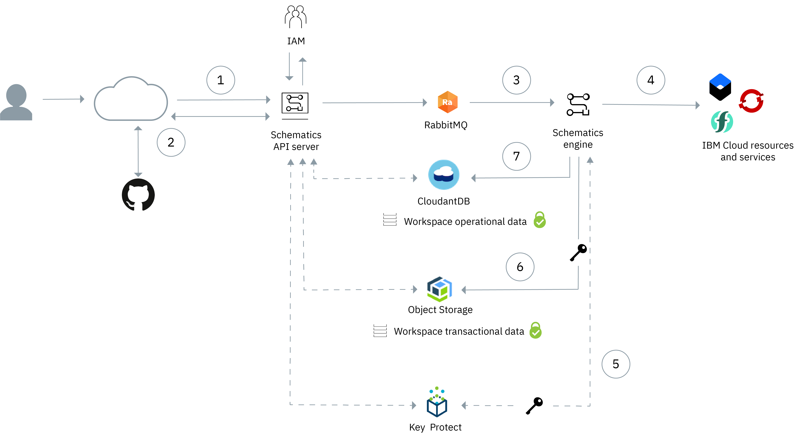

---

copyright:
  years: 2017, 2023
lastupdated: "2023-02-03"

keywords: byok and kyok, schematics byok, schematics kyok, key management service 

subcollection: schematics

---

{{site.data.keyword.attribute-definition-list}}

# Securing your data with encryption
{: #secure-data}

Review what data is stored and encrypted when you use {{site.data.keyword.bplong_notm}}, and how you can delete any stored user data. 
{: shortdesc}

To ensure that you can securely manage your data when you use {{site.data.keyword.bpshort}}, it is important to know what data is stored and encrypted and how you can delete any stored data. Data encryption is performed with keys managed by {{site.data.keyword.keymanagementserviceshort}} or {{site.data.keyword.hscrypto}}. 
{: shortdesc}

## How your data is stored and encrypted in {{site.data.keyword.bpshort}}
{: #data-storage}

All data, user inputs and the data generated at runtime during execution of Terraform or Ansible automation code is stored in {{site.data.keyword.cos_full_notm}}. Data is encrypted at rest with AES GCM 256 encryption using an [envelope encryption](/docs/key-protect?topic=key-protect-envelope-encryption) technique with {{site.data.keyword.cloud_notm}} managed root keys. {{site.data.keyword.keymanagementserviceshort}} managed root keys are secured by `FIPS 140-2 Level 3` certified cloud-based [hardware security modules (HSMs)](#x6704988){: term}. 

{{site.data.keyword.bpshort}} supports three types of root key management:

1. {{site.data.keyword.bpshort}} owned root key managed by {{site.data.keyword.keymanagementserviceshort}}. (The default)
2. Bring your own key (BYOK), managed by Key Protect.
3. Keep your own key (KYOK), managed by {{site.data.keyword.hscrypto}} (HPCS)

Refer to [KMS integration for BYOK or KYOK](/docs/schematics?topic=schematics-kms-integration) for details on using user managed keys.  

Key protect offers manual and automatic key rotation. When you rotate a root key, the registered key is used to re-encrypted {{site.data.keyword.bpshort}} resources with a new key version. You can access the {{site.data.keyword.bpshort}} resources metadata such as details until the rotation completes.
{: shortdesc}

### Key deletion or disable
{: #key-delete}

Key Deletion is a destructive action. When you disable or delete a root key that is used to encrypt your {{site.data.keyword.bpshort}} resources, you cannot access transactional data such as activity or job logs, resource list, variable store. However, you can access the metadata details. Furthermore any subsequent deployment or configuration operation through {{site.data.keyword.bpshort}} result in failure. Key deletion or disable events are sent to the {{site.data.keyword.la_full_notm}} {{site.data.keyword.at_short}}.
{: shortdesc}

### Key enable or restore
{: #key-enable}

When you can [enable or restore a root key](/docs/schematics?topic=schematics-kms-integration#key-mgt-ui), the {{site.data.keyword.bpshort}} resources transactional data that is inaccessible due to disabled or deleted root key is now accessible. You can also use {{site.data.keyword.bpshort}} resources for deployment or configuration operations. Key enable or restore events are sent to the {{site.data.keyword.la_full_notm}} {{site.data.keyword.at_short}}. 
{: shortdesc}

## What technical information is stored in {{site.data.keyword.bpshort}}?
{: #ti-data}

The following technical data is encrypted and stored when you create and use an {{site.data.keyword.bpshort}} Workspace: 
- Workspace details
- Workspace variables
- Terraform configuration files that your workspace points to
- Terraform state files
- Terraform log files
- User activity logs

## Where is my information stored?
{: #pi-location}

By default, all information that is stored in {{site.data.keyword.bpshort}} is encrypted in transit and at rest. To make your data highly available, all data is stored in one location and replicated to another location in the same geography. Before you start, make sure that your data can be stored in these locations. 
{: shortdesc} 

|Geography/ location| API endpoint|Data stored|Data replicated|
|------------|----------------|------|--------|
|North America|**Public**  `https://us.schematics.cloud.ibm.com`   `https://cloud.ibm.com/schematics/overview`    **Private**   `https://private-us.schematics.cloud.ibm.com` (Deprecated) |Workspaces that are created with this endpoint and all associated data are stored in the US. | Data is replicated between two locations in the US.|
|Dallas|**Public**  `https://us-south.schematics.cloud.ibm.com`    **Private**   `https://private-us-south.schematics.cloud.ibm.com` |Workspaces that are created with this endpoint and all associated data are stored in the Dallas location.|Data is replicated between two locations in the US.|
|Washington|**Public**  `https://us-east.schematics.cloud.ibm.com`    **Private**   `https://private-us-east.schematics.cloud.ibm.com` |Workspaces that are created with this endpoint and all associated data are stored in the Washington location.|Data is replicated between two locations in the US.|
|Europe|**Public**   `https://eu.schematics.cloud.ibm.com`    **Private**   `https://private-eu.schematics.cloud.ibm.com` (Deprecated) | Workspaces that are created with this endpoint and all associated data are stored in Europe. | Data is replicated between two locations in Europe. |
|Frankfurt|**Public**   `https://eu-de.schematics.cloud.ibm.com`    **Private**   `https://private-eu-de.schematics.cloud.ibm.com`| Workspaces that are created with this endpoint and all associated data are stored in Frankfurt. | Data is replicated between two locations in Europe. |
|London|**Public**   `https://eu-gb.schematics.cloud.ibm.com`     **Private**   `https://private-eu-gb.schematics.cloud.ibm.com` | Workspaces that are created with this endpoint and all associated data are stored in London. | Data is replicated between two locations in Europe. |
{: caption="Location information" caption-side="bottom"}

## How is my information encrypted?
{: #pi-encrypt}

The following image shows the main {{site.data.keyword.bplong_notm}} components and operational data flows. The interactions for encrypting user data using customer-managed Key Protect and {{site.data.keyword.hscrypto}}, and storage in {{site.data.keyword.cos_full_notm}} are depicted.  
{: shortdesc}

{: caption="{{site.data.keyword.bplong_notm}} architecture and data encryption process" caption-side="bottom"}

1. A user sends a request to create a {{site.data.keyword.bpshort}} workspace to the {{site.data.keyword.bpshort}} API server. An IAM request is made to check if the user is authorized to perform Schematics operations for the workspace. 
2. The API server retrieves the Terraform template and input variables from your GitHub or GitLab source repository, or a tape archive file (`.tar`) that you uploaded from your local machine. User data in transit is protected with TLS.  
3. All user-initiated actions, creating a workspace, generating a Terraform execution plan, or applying a plan are sent to RabbitMQ and added to the internal queue. The {{site.data.keyword.bpshort}} engine retrieves requests from RabbitMQ and executes the actions. User data in transit is protected with TLS.  
4. The {{site.data.keyword.bpshort}} engine runs the tasks to provision, modify, or delete {{site.data.keyword.cloud_notm}} resources.
5. To protect user data at rest, {{site.data.keyword.bplong_notm}} encrypts data with AES GCM 256 encryption. Envelope encryption with root keys managed with {{site.data.keyword.keymanagementserviceshort}} and {{site.data.keyword.hscrypto}} is used to generate and encrypt unique data encryption keys (DEK) for the data objects. 
6. Workspace transactional data is encrypted using the DEKs, including logs and the Terraform `tf.state` file at rest. The encrypted data stored in an {{site.data.keyword.cos_full_notm}} bucket .
7. Workspace operational data, workspace and job names, pointers to user data in {{site.data.keyword.cos_full_notm}} and search keys, are stored in {{site.data.keyword.cloudant}}. All information stored in Cloudant is encrypted with AES 256. For more information on Cloudant data security and encryption, see [Cloudant Security](/docs/Cloudant?topic=Cloudant-security).

## How can I delete my information?
{: #delete-data}

To remove your data from {{site.data.keyword.bplong_notm}}, choose among the following options: 
- **Delete the workspace**: When you delete your workspace, all the data related to the workspace is permanently deleted. 
- **Open an {{site.data.keyword.cloud_notm}} support case**: Contact IBM Support to remove your workspaces and any associated data by opening a support case. For more information, see [Getting support](/docs/get-support?topic=get-support-using-avatar). 
- **End your {{site.data.keyword.cloud_notm}} subscription**: A {{site.data.keyword.bpshort}} cleanup job runs multiple times a day to verify that all workspaces that are stored by IBM belong to an active {{site.data.keyword.cloud_notm}} account. If no active account is found, the workspace and all associated stored data is deleted. 
