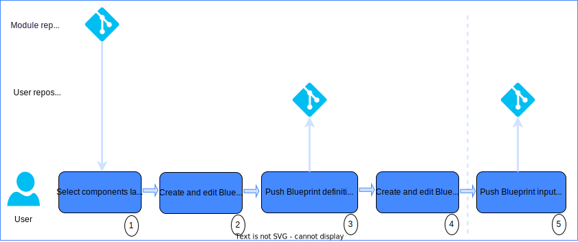

---

copyright:
  years: 2017, 2022
lastupdated: "2022-11-18"

keywords: schematics blueprints, define blueprint, managed environments

subcollection: schematics

---

{{site.data.keyword.attribute-definition-list}}

{{site.data.keyword.bpshort}} Blueprints is a [Beta feature](/docs/schematics?topic=schematics-bp-beta-limitations) that is available for evaluation and testing purposes. It is not intended for production usage. Refer to the list of [limitations](/docs/schematics?topic=schematics-bp-beta-limitations#sc-bp-beta-limitation) for the beta release.
{: beta}

# Defining blueprints
{: #define-blueprints}

{{site.data.keyword.bplong}} Blueprints utilizes the analogy of building a house from a blueprint drawing. Where a blueprint defines the architecture, layout, major building blocks and customizations to be applied.  

[Templates](/docs/schematics?topic=schematics-glossary#bpb2) determine the architecture, specifying the modules required for the implementation and infrastructure topology. Reusable [modules](/docs/schematics?topic=schematics-glossary#bpb5) implement the layers and components of an infrastructure architecture from well designed, tested and compliant Terraform code. 

Reuse is at the heart of {{site.data.keyword.bpshort}} Blueprints. {{site.data.keyword.IBM_notm}} published Terraform modules designed for {{site.data.keyword.IBM_notm}} Cloud can be combined with third-party and user developed modules to create customized solutions. 

As illustrated, templates are reusable across environments with separately maintained [input configurations](/docs/schematics?topic=schematics-glossary#bpi1), supporting dev, stage and prod pipelines and reuse across organizations. 
{: shortdesc} 

{: caption="Environments deployed from reusable blueprints" caption-side="bottom"}

A blueprint, the environment and cloud resources to be deployed are defined by three versioned elements:
1. A reusable `blueprint template` to represent the reference infrastructure architecture, the IaC automation modules to be used and the cloud resources that are to be deployed.
2. Versioned `blueprint inputs` to customize a blueprint template for the specific environment to be deployed.
3. Reusable `modules` written in Terraform to implement the infrastructure architecture and deploy the desired cloud resources. 

## Creating templates, inputs and configuration
{: #define-templates-input}

Blueprint environments are be created from reusable user or {{site.data.keyword.IBM_notm}} authored blueprint templates. New templates can be authored to address specific application requirements. Either by creating a new template from scratch or modification of an existing template. 

Templates are reusable across multiple environments, with the customizable input values maintained separately from the template as [inputs](/docs/schematics?topic=schematics-glossary#bpi1). In cookie cutter fashion, several environments can be created from the same blueprint template. Each environment has its own [blueprint configuration](/docs/schematics?topic=schematics-glossary#bpb3) and inputs. This separation of template from its runtime configuration allows a single template to be reused many times to deploy a range of environments such as `dev`, `stage`, and `production` with multiple target regions. Each environment being customized with its own input values. See the section [Understanding blueprint templates and configuration](/docs/schematics?topic=schematics-blueprint-templates) for more details. 

For examples of blueprint templates and inputs, see the [{{site.data.keyword.bplong_notm}} repository](https://github.com/orgs/Cloud-Schematics/repositories?q=blueprint){: external}. Guidance to create or modify an existing template, will be found in the sections [understanding blueprint templates and configurations](/docs/schematics?topic=schematics-blueprint-templates) and [blueprint template reference](/docs/schematics?topic=schematics-bp-template-schema-yaml).  

Change in blueprint environments is explicitly managed through version control. Template and input documents are all sourced from a version control system such as GitHub, GitLab or {{site.data.keyword.IBM_notm}} Catalog. 

## Steps to define a blueprint
{: #define-blueprint-steps}

The steps to create a blueprint template and define the versioned the inputs are illustrated in the diagram.

{: caption="Blueprint template and inputs" caption-side="bottom"}

1. Defining a cloud environment starts with a high-level reference architecture for the environment. Using the reference architecture as a guide, select the automation modules to implement the infrastructure layers of the architecture. Publicly available modules can be combined with private modules to create a custom architecture. Modules can be sourced from the public repositories containing {{site.data.keyword.IBM_notm}} and third-party authored modules, along with any custom developed modules from private repositories. Refer to the section [using Terraform modules with blueprint templates](/docs/schematics?topic=schematics-blueprint-terraform) for details of how to work with Terraform root and child modules.
    - {{site.data.keyword.IBM_notm}} authored modules can be found in the [Terraform IBM Modules](https://github.com/terraform-ibm-modules){: external} GitHub repository.
2. Create and edit a blueprint template to implement the desired reference architecture from the selected modules. Review the sections [Understanding blueprint templates and configuration](/docs/schematics?topic=schematics-blueprint-templates) and [blueprint template YAML schema](/docs/schematics?topic=schematics-bp-template-schema-yaml) for guidance on creating blueprint templates. 
    - Create and name a new blueprint template YAML file in your favorite editor. Alternatively follow the instructions for [editing templates in VSCode](/docs/schematics?topic=schematics-edit-blueprints). 
    - Example blueprint template YAML files can be found in the [Cloud-{{site.data.keyword.bpshort}}](https://github.com/orgs/Cloud-Schematics/repositories?q=blueprint) GitHub repository. Alternatively, download one of the existing template YAML files and use it as a basis for a new template.  
    - Review the module metadata and readme file information for the selected [modules](https://github.com/terraform-ibm-modules){: external} to guide writing the template blueprint [module definitions](/docs/schematics?topic=schematics-bp-template-schema-yaml#bp-modules-schema). 
    - Define the variable dependencies between modules to pass the resource dependency data for provisioned resources.
    - Specify the [inputs](/docs/schematics?topic=schematics-bp-template-schema-yaml#bp-inputs) the template accepts. The input values are specified in step 4. 
    - Specify the [outputs](/docs/schematics?topic=schematics-bp-template-schema-yaml#bp-outputs) that are to be returned when the environment is deployed. This is typically an application URL or the IDs of provisioned resources.  
    - Optional: Create a readme file to document the template, inputs, and outputs. Best practice is to include an image of the reference architecture. 
3. Push the completed blueprint template to a Git repo. If needed, create a Git version release tag for blueprint version management. [Semantic versioning](https://semver.org/){: external} is strongly recommended. 
4. Customize your template with a versioned blueprint input file to configure it for your use case. Review the sections [Understanding blueprint templates and configuration](/docs/schematics?topic=schematics-blueprint-templates) and [blueprint input YAML schema](/docs/schematics?topic=schematics-bp-input-schema-yaml) for guidance on creating blueprint input files.  
    - Again in your favorite editor, create and name a new blueprint input YAML file. Alternatively follow the instructions for [editing templates in VSCode](/docs/schematics?topic=schematics-edit-blueprints). 
    - Using the template inputs as a guide, populate the input file with environment-specific input key-value pairs. The variable type of the input value matches that defined in the template YAML file.
    - Inputs defining secrets or sensitive values are left with null-values. Sensitive values are specified when the blueprint configuration is created in {{site.data.keyword.bpshort}}.
5. Push the blueprint input YAML file to a Git repo. As required, create a Git version release tag for version management. If the template is intended for reuse across multiple environments, the blueprint input file should be versioned in a separate repo to the template.  

## Next steps
{: #define-nextsteps}

The next stage of working with blueprints is [deploying blueprints](/docs/schematics?topic=schematics-deploy-blueprints). 
