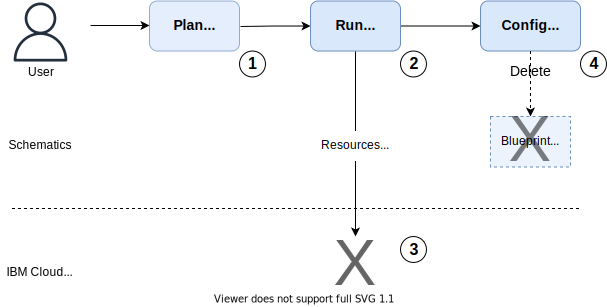

---

copyright:
  years: 2017, 2022
lastupdated: "2022-09-08"

keywords: schematics blueprints, delete blueprint, managed environments

subcollection: schematics

---

{{site.data.keyword.attribute-definition-list}}

# Deleting Blueprint environments
{: #delete-blueprints}

When the application that is hosted on the Blueprint managed infrastructure is no longer needed or been migrated into a new environment. The Blueprint managed environment is deleted by destroying the cloud resources, which stop billing for any chargeable resources. 
{: shortdesc}

Deleting a Blueprint environment is a two-stage process of first destroy all cloud resources and then delete the Blueprint in {{site.data.keyword.bpshort}} as illustrated in a diagram.

{: caption="Deleting a Blueprint environment" caption-side="bottom"}

1. The user initiates a destroy of the cloud resources that are associated with the Blueprint. Blueprint destroys iterates through all modules, destroying resources in reverse dependency order to ensure that all cloud resources are cleanly removed. On resource destroy, all modules are returned to an `Inactive` state. For more information, see [Destroy Blueprint](/docs/schematics?topic=schematics-schematics-cli-reference&interface=cli#schematics-blueprint-destroy). When the resources are destroyed, billing is terminated.  
    - Optional, a fresh copy of the environment can be created from the saved Blueprint configuration by running [Blueprint Apply](/docs/schematics?topic=schematics-schematics-cli-reference&interface=cli#schematics-blueprint-install) to re-create the cloud resources. 
2. Once all the resources are destroyed, the modules returns to an `Inactive` stage. The modules and Blueprint definition are deleted from {{site.data.keyword.bpshort}} by using the Blueprint delete command or UI delete operation. For more information, see [Delete Blueprint](/docs/schematics?topic=schematics-schematics-cli-reference&interface=cli#schematics-blueprint-delete). 

The {{site.data.keyword.bpshort}} Blueprint and cloud resources are now deleted. 

## Next steps
{: #delete-nextsteps}

- You can explore more by using [Blueprint tutorials](/docs/schematics?topic=schematics-deploy-schematics-blueprint-cli&interface=cli).
- [FAQs](/docs/schematics?topic=schematics-blueprints-faq) and [troubleshoot guide](/docs/schematics?topic=schematics-bp-create-fails) for any challenges and questions on Blueprints.

