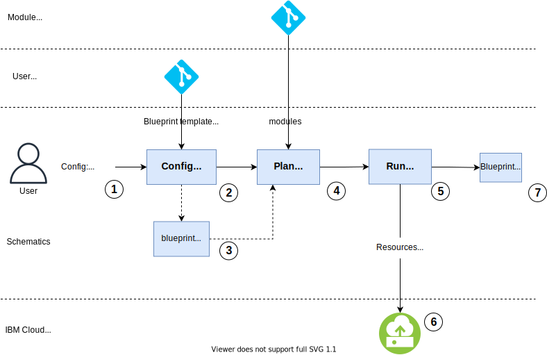

---

copyright:
  years: 2017, 2022
lastupdated: "2022-09-12"

keywords: schematics blueprints, deploy blueprint, managed environments

subcollection: schematics

---

{{site.data.keyword.attribute-definition-list}}

{{site.data.keyword.bpshort}} Blueprints is a [Beta feature](/docs/schematics?topic=schematics-bp-beta-limitations) that is available for evaluation and testing purposes. It is not intended for production usage. Refer to the list of [limitations](/docs/schematics?topic=schematics-bp-beta-limitations) for the Beta release.
{: beta}

# Deploying Blueprint environments
{: #deploy-blueprints}

Deploying a Blueprint environment from a Blueprint definition and custom input values is performed as a two-step operation in {{site.data.keyword.bpshort}}. The two-step process ensures controlled application of change first to the {{site.data.keyword.bpshort}} Blueprint configuration and definitions, then second to the cloud resources.  
{: shortdesc} 

- `Create the Blueprint in {{site.data.keyword.bpshort}}:` This first step creates the Blueprint with its desired configuration in {{site.data.keyword.bpshort}}. This retrieves the user specified Blueprint definition from Git, input values and registers the desired configuration for the environment in {{site.data.keyword.bpshort}}. The supplied Blueprint definition and the inputs are validated. All the Terraform IaC automation modules are imported from their source repositories and any required {{site.data.keyword.bpshort}} linked Workspaces are initialised to manage deployment of the IaC modules and creation of cloud resources in the next step.
- `Apply the Blueprint:` {{site.data.keyword.bpshort}} runs the IaC module automation code in dependency order to create the solution environment and cloud resources. This step performs a Terraform Apply operation against each linked Workspace to create the resources specified by the Terraform IaC modules.       

The deployment process is illustrated in the diagram.

{: caption="Blueprint definition and input value application deployment" caption-side="bottom"}

1. Prepare the input config for the Blueprint. This config specifies the source of the Blueprint definition in Git, the input values to customize the environment instance and version information.  
2. Create your Blueprint in {{site.data.keyword.bpshort}}. For more information, see the section [Creating a Blueprint](/docs/schematics?topic=schematics-schematics-cli-reference#schematics-blueprint-create).
    - This step retrieves the YAML definition and input values files from Git. 
    - After successful validation the Blueprint moves to a `created` state.  
3. On successful Blueprint creation, {{site.data.keyword.bpshort}} automatically initializes its definitions and creates the set of dependent linked Workspaces to manage the cloud resources of the environment. Each Workspace represents a single IaC automation module in the Blueprint definition. 
    - The saved Blueprint configuration can be reviewed at this point prior to enviromment and resource deployment.     
4. Deploy the Blueprint environment with the `blueprint apply` command or UI Apply operation. For more information, see the section [Apply Blueprint](/docs/schematics?topic=schematics-schematics-cli-reference#schematics-blueprint-apply). 
    - Based on your saved Blueprint configuration and definition, {{site.data.keyword.bpshort}} creates a deployment plan and runs the IaC module code in dependency order to create the environment instance. 
    - For each module, it runs a Terraform Apply to create cloud resources. 
5. After all the modules are applied, {{site.data.keyword.bpshort}} returns the defined Blueprint output values. 
    - These can be used as input to further configuration steps or used directly to access resources in the application environment.   

## Next steps
{: #deploy-nextsteps}

The next stage of working with Blueprints is [Operating Blueprint environments](/docs/schematics?topic=schematics-operate-blueprints).

