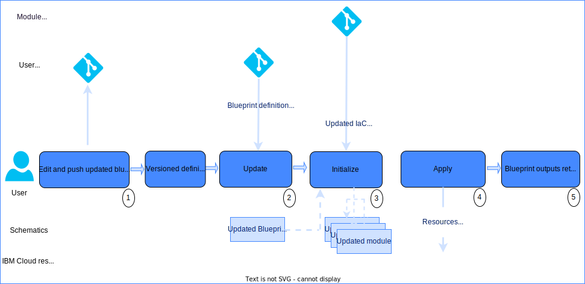

---

copyright:
  years: 2017, 2022
lastupdated: "2022-10-11"

keywords: schematics blueprints, operate blueprint, managed environments

subcollection: schematics

---

{{site.data.keyword.attribute-definition-list}}

{{site.data.keyword.bpshort}} Blueprints is a [beta feature](/docs/schematics?topic=schematics-bp-beta-limitations) that is available for evaluation and testing purposes. It is not intended for production usage. Refer to the list of [limitations](/docs/schematics?topic=schematics-bp-beta-limitations) for the beta release.
{: beta}

# Updating and operating blueprint environments
{: #update-blueprints}

Updating and operating a cloud environment is about managing continual change. Cloud environments are not static. User infrastructure requirements change and the {{site.data.keyword.cloud}} platform are constantly evolving. Without maintenance and updates of the blueprint templates, inputs and automation module code, a deployed environment loses currency and compliance, and will cease to be manageable through {{site.data.keyword.bpshort}} automation. 
{: shortdesc}

Change occurs for many reasons:
- The {{site.data.keyword.cloud}} platform is constantly adding features, and depreciating end-of-life services. It also maintains the currency of services, for example {{site.data.keyword.containerlong}} and the databases {{site.data.keyword.databases-for-redis_full}} and {{site.data.keyword.databases-for-mongodb_full}} continually move to new versions. 
- Alongside, the open source IaC tools that are used by {{side.data.keyword.bpshort}} evolve, with the new versions of Terraform and Helm, and the supporting Terraform providers.
- As the platform evolves, {{site.data.keyword.IBM}} authored automation modules are refreshed to support new service features, maintain currency and to address evolving security compliance requirements.
- Changes are also expected in the application environment to reflect new user requirements, scaling up or down, rotation of API keys, certificates and more. 

Operation of a blueprint environment is an iterative cycle of applying changes to the deployed environment to maintain currency and compliance.   

## Updating blueprint environments
{: #operate-multistep}

After deployment, blueprint environments will continue to evolve through managed change, implemented as updates to the blueprint template, IaC modules, and inputs.
{: shortdesc}

Changes to the environment are first prepared as versioned updates to the blueprint template and input files. The blueprint configuration is updated in {{site.data.keyword.bpshort}} with the updated templae and input versions. These changes are then applied to the blueprint environment. This two-step process ensures controlled application of change first to the {{site.data.keyword.bpshort}} blueprint configuration and template, then second to the cloud resources. In a future release the deployment plan will be presented for review in a separate step before it can be applied.

During this lifecycle stage, the blueprint environment might be updated many times. Changes are applied to the cloud resources to satisfy changing application requirements. Or to maintain platform currency and compliance as security policies evolve. Additionally scheduled operations can run compliance checks, and run drift detection on the environment. 

As noted earlier, {{site.data.keyword.IBM}} authored automation modules are maintained and refreshed by {{site.data.keyword.IBM}} to support new service features, maintain {{site.data.keyword.cloud}} currency and to address evolving security compliance requirements. It is suggested that blueprint configurations, and templates are regularly updated to use the current version of modules and these updates are applied to blueprint environments. The risk of not performing regular updates is that environments lose currency, compliance, and cease to be manageable through {{site.data.keyword.bpshort}} automation. 

Review the section on blueprint version management to understand how to manage change to blueprint templates and input YAML files by using Git tags and branches.

The two-step process flow to update a blueprint environment is illustrated in the diagram.

{: caption="Blueprint config update flow" caption-side="bottom"}

1. Edit the blueprint template, and the input value YAML files to implement your changes to the environment. 
    - Push the updated blueprint template and input files to your Git repositories. If needed, create a new Git version release tag for version management. 
2. Update your blueprint configuration for the environment in {{site.data.keyword.bpshort}}. 
    - When using versioning, the new Git release tag or branch must be specified for the modified blueprint template and input value YAML files.
    - If no version or branch is specified, {{site.data.keyword.bpshort}} automatically checks the Git repository for a recent commit, and runs a `pull latest` to pull in any updates. 
    - For more information, see [Update blueprint](/docs/schematics?topic=schematics-schematics-cli-reference#schematics-blueprint-update).
3. On a successful configuration update, {{site.data.keyword.bpshort}} automatically reinitializes the modules with any updated input values and updates to the module IaC code.  
4. Apply the updated configuration and templates. The modules that have pending IaC code changes, or inputs are highlighted by {{site.data.keyword.bpshort}}. The changes to the blueprint environment are applied with the `blueprint run apply` command or UI Run Apply operation.
    - Based on your updated blueprint configuration, {{site.data.keyword.bpshort}} creates an internal deployment plan and runs the IaC modules in dependency order to update the environment. In a future release the plan will be presented for review prior to apply. 
    - For each module, it runs a Terraform apply to create, modify, or delete cloud resources as determined by the configuration changes from the update. For more information, see [blueprint run](/docs/schematics?topic=schematics-apply-blueprint).  
5. On successful deployment of the updates, the blueprint output values are updated with any changed outputs.

## Next steps
{: #operate-nextsteps}

The final next stage of working with blueprints is [Deleting blueprint environments](/docs/schematics?topic=schematics-delete-blueprints). 
