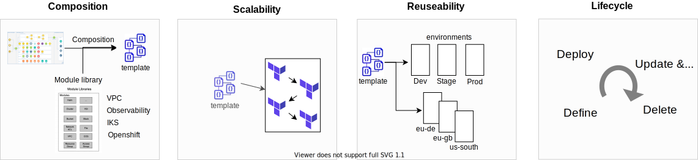

---

copyright:
  years: 2017, 2022
lastupdated: "2022-10-12"

keywords: schematics blueprints, work with blueprint, schematics

subcollection: schematics

---

{{site.data.keyword.attribute-definition-list}}

{{site.data.keyword.bpshort}} blueprints is a [Beta feature](/docs/schematics?topic=schematics-bp-beta-limitations) that is available for evaluation and testing purposes. It is not intended for production usage. Refer to the list of [limitations](/docs/schematics?topic=schematics-bp-beta-limitations) for the Beta release.
{: beta}

# Overview
{: #work-with-blueprints}

{{site.data.keyword.bplong}} blueprints is an [Infrastructure as Code](https://www.redhat.com/en/topics/automation/what-is-infrastructure-as-code-iac) (IaC) deployment and lifecycle management service for large-scale cloud environments. It utilises the analogy of building a house from a blueprint drawing. Where a blueprint defines the architecture, layout and the major building blocks. A craftsman builts the house from well defined components using the blueprint for guidance.      

In a similar fashion, {{site.data.keyword.bpshort}} blueprints enables users to rapidly define and deploy cloud environments from reusable and well defined building blocks of [Terraform](https://www.terraform.io) automation code. Reusable modules implement the layers and components of an infrastructure architecture from well designed, tested and compliant Terraform code. Templates determine the architecture, specifing the modules required for the implementation and infrastructure topology. Reuse is at the heart of {{site.data.keyword.bpshort}} blueprints. Publically available modules designed for IBM Cloud can be mixed with third-party and user developed modules to create customized solutions. Templates are reusable across environments with separately maintained configurations, supporting dev, stage and prod pipelines and reuse across organisations. 
{: shortdesc} 

{{site.data.keyword.bpshort}} blueprints complements Terrform's IaC automation capabilities with:
- Composition: Build from an eco-system of reusable and maintained IBM Cloud architecture components written in Terraform
- Reusability: Reuse templates (architectures) across environments, pipelines and teams
- Scalability: Structure large environments by linking modules and Terraform workspaces  
- Lifecycle: Cradle-to-grave. Future: scheduled ops, drift detection, cost estimation, policy compliance  
- Extensability (future): Provisioning and configuration with RedHat Ansible              

IAC best practices, support the lifecycle of blueprint environments, cradle-to-grave. Versioning and configuration, support controlled change as requirements evolve, while templates and modules are maintained and updated to remain current and compliant.   

{: caption="{{site.data.keyword.bpshort}} blueprints overview" caption-side="bottom"}

## Managing blueprint environments
{: #lifecycle-of-iac}

When you work with cloud environments, hosted applications or services they all follow a lifecycle from creation to end-of-life. An environemnt starts with the initial definition of a configuration and a set of inputs. Then, onto deployment of its' infrastructure and resources. It is upated and maintained through its operational life, which might be hours to years. Finally, to end-of-life when it is torn down, the cloud resources are destroyed, billing gets terminated and the configuration is removed.  
{: shortdesc}

Thes tasks of working with a blueprint over its lifecycle can be grouped under four headings, `define`, `deploy`, `update and operate`, and `delete`. Each breaks down into several blueprint operations. For example, composing and editing the blueprint template, running {{site.data.keyword.bpshort}} blueprint operations, monitoring job execution and reviewing the results. 

Change in blueprint environments follows a controlled sequence of steps:
- Creating or updating the blueprint configuration with changes to the inputs, template or module versions
- Planning the change to identify resource changes, additions or deletions. 
- Running the plan to apply the changes 

[Defining blueprints](/docs/schematics?topic=schematics-define-blueprints): The reference architecture is specified as a reusable blueprint template YAML file using an editor or IDE. The resulting template and inputs are saved in a version-controlled source code repository.

[Deploying blueprints](/docs/schematics?topic=schematics-deploy-blueprints): A blueprint configuration is created in {{site.data.keyword.bpshort}}. The configuration specifies the blueprint template YAML and input files, versions, and the source Git repositories to be used. The blueprint and its cloud resources are deployed by {{site.data.keyword.bpshort}} running the Terraform automation module code to create the resources. 

[Updating and operating blueprints](/docs/schematics?topic=schematics-update-blueprints): The operational life of a deployed environment and its cloud resources might range from hours to years depends on its usage. During this time, the environment, templates, and inputs may be updated many times to satisfy changing application requirements. Changes are applied to the environment to maintain platform currency or compliance as security policies evolve. Scheduled operations are run for compliance checks and drift detection. 

[Deleting blueprints](/docs/schematics?topic=schematics-delete-blueprints): Finally the application or service that is hosted in the environment gets retired or rehosted into a new environment. Now, the environment is deleted by destroying the deployed resources, stopping billing for any chargeable resources and deleting the blueprint configuration from {{site.data.keyword.bpshort}}. |

  
## Next steps
{: #working-bp-nextsteps}

Start your journey of working with blueprints with the section on [defining blueprints](/docs/schematics?topic=schematics-define-blueprints). 

Follow this up with:
- See [blueprints permissions](/docs/schematics?topic=schematics-access#blueprint-permissions) to set access permissions to deploy blueprints.
- Explore [deploying {{site.data.keyword.bpshort}} blueprints by using the command-line](/docs/schematics?topic=schematics-deploy-schematics-blueprint-cli) tutorial to create cloud resources with a blueprint.
- [FAQs](/docs/schematics?topic=schematics-blueprints-faq) and [troubleshooting guide](/docs/schematics?topic=schematics-bp-create-fails) for any challenges and questions on blueprints.
- [Beta code for {{site.data.keyword.bpshort}} blueprints](/docs/schematics?topic=schematics-bp-beta-limitations) to provide your feedback and understand Beta limitations.