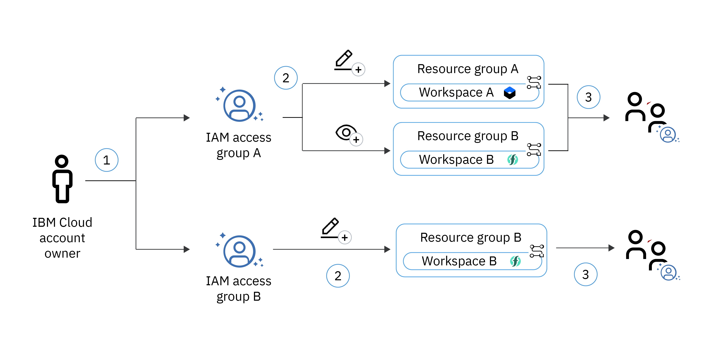

---

copyright:
  years: 2017, 2024
lastupdated: "2024-06-23"

keywords: schematics faqs, infrastructure as code, iac, schematics faq, 

subcollection: schematics

content-type: faq

---

{{site.data.keyword.attribute-definition-list}}

# Common for actions and workspaces 
{: #general-faq}

Answers to common questions about the {{site.data.keyword.bplong_notm}} are classified into following section.
{: shortdesc}

## What is {{site.data.keyword.bplong_notm}} and how does it work? 
{: #what-is-schematics}
{: faq}
{: support}

{{site.data.keyword.bplong_notm}} provides powerful tools to automate your cloud infrastructure provisioning and management process, the configuration and operation of your cloud resources, and the deployment of your app workloads.

To do so, {{site.data.keyword.bpshort}} uses open source projects, such as Terraform, Ansible, Red Hat OpenShift, Operators, and Helm, and delivers these capabilities to you as a managed service. Rather than installing each open source project on your system, and learn the API or CLI. You can declare the tasks that you want to run in {{site.data.keyword.cloud_notm}} and watch {{site.data.keyword.bpshort}} run these tasks for you.

For more information about how {{site.data.keyword.bpshort}} Works, see [About {{site.data.keyword.bplong_notm}}](/docs/schematics?topic=schematics-learn-about-schematics).

## What is Infrastructure as Code?
{: #what-is-iac}
{: faq}

Infrastructure as Code (IaC) helps you codify your cloud environment so that you can automate the provisioning and management of your resources in the cloud. Rather than manually provisioning and configuring infrastructure resources or by using scripts to adjust your cloud environment, you use a high-level scripting language to specify your resource and its configuration. Then, you use tools like Terraform to provision the resource in the cloud by using its API. Your infrastructure code is treated the same way as your app code so that you can apply DevOps core practices such as version control, testing, and continuous monitoring.

## What am I charged for when I use {{site.data.keyword.bpshort}}?
{: #charges}
{: faq}
{: support}

{{site.data.keyword.bplong_notm}} workspaces are provided to you at no cost. However, when you decide to apply your Terraform template in {{site.data.keyword.cloud_notm}} by clicking `Apply plan` from the workspace details page or running the `ibmcloud schematics apply` command, you are charged for the {{site.data.keyword.cloud_notm}} resources that are described in your Terraform template. Review available service plans and pricing information for each resource that you are about to create. Some services come with a limit per {{site.data.keyword.cloud_notm}} account. If you are about to reach the service limit for your account, the resource is not provisioned until you increase the service quota, or remove existing services first.

The {{site.data.keyword.bpshort}} `ibmcloud terraform` command usage displays warning and deprecation message as `Alias Terraform are deprecated. Use schematics or sch` in your command.
{: note}

## How do I save files between operations?
{: #saving-files}
{: faq}
{: support}


{{site.data.keyword.bpshort}} persists files that are written to the path `/tmp/.schematics`, during action and workspace operations. The files are restored to the same path when running the next operation on the workspace. The file limit is 10MB.

## Job failures due to files removed or missing from workspace, or actions (Ansible) template repos
{: #missing-files}
{: faq}
{: support}

Job failures may occur due to files missing from Git template repos after importing or cloning the repo to {{site.data.keyword.bpshort}}. 

Files may be found to be missing at execution time for several reasons:
    - The files were referenced using file system `symlinks` to different files or folders in the repo, or to external file systems
    - The repo contents were uploaded as a TGZ and files referenced by Git submodules or `symlinks` were not included in the TGZ.
    - The files were considered vulnerable or malicious by {{site.data.keyword.bpshort}}.

## Files removed or missing from Terraform, or Ansible template repos
{: #clone-file-extension}
{: faq}
{: support}

To protect our users from malicious actors, {{site.data.keyword.bpshort}} removes files from users cloned Git repositories that might impact the security or integrity of the service. The intent is to protect users from execution of unauthorised modules or executables that could impact the service. Files packaged as zip or tar files are automatically excluded from user repos. The tar file contents are not inspected. Similarly the use of files higher than 500KB is not supported (allowed) in template repos, where typical IaC configuration files are KB.

If it is desired to work with the files, these can be imported into {{site.data.keyword.bpshort}} at run time into `/tmp` or persisted in `/tmp/.schematics`. Only files less than 10MB are persisted between job runs. 

When creating {{site.data.keyword.bpshort}} workspaces or actions {{site.data.keyword.bplong_notm}} clones a copy of the Terraform, or Ansible template from your Git repository and stores in a secured location. Before the template files are saved, {{site.data.keyword.bpshort}} analyses the content and files considered malicious or vulnerable are removed. An allowlist is used to allow only authorised files. File removal is based on the following criteria:

- The allowed file extensions are `.cer, .cfg, .conf, .crt, .der, .gitignore, .html, .j2, .jacl, .js, .json, .key, .md, .netrc, .pem, .properties, .ps1, .pub, .py, .service, .sh, .tf, .tf.json, .tfvars, .tmpl, .tpl, .txt, .yaml, .yml, .zip, _rsa, license`.
- The allowed image extensions are `.bmp, .gif, .jpeg, .jpg, .png, .so .tif, .tiff`.
- The files explicitly removed are `.asa, .asax, .exe, .php5, .pht, .phtml, .shtml, .swf, .tfstate, .tfstate.backup, .xap, .zip, .tar`.
- All files greater than 500 KB are removed. This file limit does not apply to the allowed image file types.
- Where the folder name starts with a (period) `.` it treated as malicious and removed.  

The allowed extension list is continuously monitored and updated in every release. You can raise a [support ticket](/docs/schematics?topic=schematics-schematics-help) with the justification to add a file extension to the list.
{: note}

## Is the use of `symlinks` supported in Git repos?
{: #symlinks-ws}
{: faq}
{: support}

The use of filesystem `symlinks` in Git repos at execution time is not supported. At job execution time, {{site.data.keyword.bpshort}} do not traverse `symlinks` in cloned Git repos. 

During creation of workspaces or actions, the use of `symlinks` to refer to variable files or Ansible playbooks in the cloned repo is permitted. 

## Is the use of Git sub-modules supported in Git repos or TGZ files?
{: #git-submodules-ws}
{: faq}
{: support}

The use of Git submodules is supported only for cloned Git repos. When {{site.data.keyword.bpshort}} clones the Git repo, Git submodules are imported. When repos are uploaded as TGZ files, {{site.data.keyword.bpshort}} does not perform a clone operation and files or folders referenced by Git submodule are not included. When using TGZ files, all required files, referenced by Git submodules or `symlinks` must be included in the TGZ.

## Is there a rate limit?
{: #rate-limit}
{: faq}
{: support}

{{site.data.keyword.bplong_notm}} supports 50 API requests per minute, per region, and per user. The regions are `us-east`, `us-south`, `eu-gb`, or `eu-de`. Wait before calling the command again.

## Why are jobs waiting to be run placed in a queue?
{: #job-queue-faq}
{: faq}
{: support}

{{site.data.keyword.bplong_notm}} queues all the users jobs into a single queue. Depending on the workload generated by the users and the time to run the jobs, the user might experience delays. For more information, see [Job queue status](/docs/schematics?topic=schematics-job-queue-process).


## How do I generate IAM access token, if client ID `bx` is used?
{: #createworkspace-generate-tokens}
{: faq}
{: support}

To create IAM access token, use `export IBMCLOUD_API_KEY=<ibmcloud_api_key>` and run the command.

```sh
curl -X POST "https://iam.cloud.ibm.com/identity/token" -H "Content-Type: application/x-www-form-urlencoded" -d "grant_type=urn:ibm:params:oauth:grant-type:apikey&apikey=$IBMCLOUD_API_KEY" -u bx:bx.
```
{: pre}

For more information, see [IAM access token](/apidocs/iam-identity-token-api#gettoken-password) and [Create API key](/apidocs/iam-identity-token-api#create-api-key). You can set the environment values `export ACCESS_TOKEN=<access_token>`, and `export REFRESH_TOKEN=<refresh_token>`. 

## How to rectify failed to clone Git repository, might not find remote ref refs or heads or master most likely invalid branch name is passed?
{: #template-errors}
{: faq}
{: support}

Usage of the branch `https://github.com/guruprasad0110/tf_cloudless_sleepy_13/` repository, after 1st October 2020, can see this error message. 

If the repository is created after 1 October 2020, the main branch syntax needs to be `https://github.com/username/reponame/tree/main`. For example, `https://github.com/guruprasad0110/tf_cloudless_sleepy_13/tree/main`

## Can I increase the timeout for null-exec and remote-exec resource?
{: #timeout-null-resource}
{: faq}
{: support}

No, the null-exec (`null_resources`) and remote-exec resources has maximum timeout of `60 minutes`. Longer jobs need to be broken into shorter blocks to provision the infrastructure faster. Otherwise, the execution times out automatically after `60 minutes`.

## How can I save user-defined files that are generated by the Terraform modules and use them across multiple Terraform commands?
{: #persist-file}
{: faq}
{: support}

{{site.data.keyword.bplong_notm}} already stores and securely manages the state file generated by the Terraform engine in a {{site.data.keyword.bpshort}} workspace. {{site.data.keyword.bpshort}} periodically saves the state file in the secured location. Further the state file is automatically restored before executing the {{site.data.keyword.bpshort}} job or Terraform plan, apply, destroy, refresh, or import commands.

In the same way {{site.data.keyword.bplong_notm}} supports the ability to store user-defined files that are generated by the Terraform template or modules. {{site.data.keyword.bpshort}} expects the user-defined Terraform template or modules to generate and place the files in a predefined location. {{site.data.keyword.bpshort}} automatically save and restore them before and after running the {{site.data.keyword.bpshort}} jobs or Terraform command.

Your files must be placed in the `/tmp/.schematics` folder and the limit is set to `10 MB`. {{site.data.keyword.bpshort}} backups and restores all the files in the `/tmp/.schematics` folder.

## How do I identify the best way to synchronize a deleted resource with the Terraform state?
{: #sync-delresource-terraform}
{: faq}
{: support}

Currently, the {{site.data.keyword.bplong_notm}} service does not support the ability to import or synchronize the {{site.data.keyword.cloud_notm}} resource state into the {{site.data.keyword.bpshort}} workspace. It is planned in the future roadmap.

## How do I overcome the request exceeds the Cluster resource quota of '100' for the account in any region?
{: #clusterquota-warn-faq}
{: faq}
{: support}

```text
Error: Request failed with status code: 403, ServerErrorResponse: {"incidentID":"706efb2c-3461-4b9d-a52c-038fda3929ea,706efb2c-3461-4b9d-a52c-038fda3929ea","code":"E60b6","description":"This request exceeds the 'Cluster' resource quota of '100' for the account in this region. Your account already has '100' of the resource in the region, and the request would add '1'. Revise your request, remove any unnecessary resources, or contact IBM support to increase your quota.","type":"General"}
```

You see this quota validation error when the `Cluster` resource quota of `100` for the account in this region is exceeded. You can consider deleting the existing resources and try running operation again.

## While creating Red Hat OpenShift or Kubernetes resources, can I tune 90 minutes time out to higher?
{: #resourcetimeout-warn-faq}
{: faq}
{: support}

Yes, you can increase the timeout for Red Hat OpenShift or Kubernetes resources. For more information, see [ibm_container_vpc_cluster](https://registry.terraform.io/providers/IBM-Cloud/ibm/latest/docs/resources/container_vpc_cluster#timeouts) provides the following Timeouts configuration options.

## How can I rectify the 403 Error while validating the location in the global catalog account?
{: #global-setting-location}
{: faq}
{: support}

You can verify the location access to create or view the resource in the catalog settings for your account. For more information, see [Manage location settings in global catalog](/docs/schematics?topic=schematics-access-ibm-cloud-catalog).

## Can I start or stop the {{site.data.keyword.vsi_is_short}} based on tags and through scheduler or cron job?
{: #vm-tags-faq}
{: faq}
{: support}

 Yes, you can use {{site.data.keyword.openwhisk_short}} to set the managed operations such as start, stop query based on tags and also through scheduler or cron job to trigger the {{site.data.keyword.bpshort}} action. For more information, see [VSI operations and schedule solution](https://github.com/Cloud-Schematics/vsi-operations-scheduler-solution){: external} GitHub repository.
 
## Might I create a worker node in an existing worker node pool?
{: #workernode-kubernetes-faq}
{: faq}
{: support}

Yes, you can create or add a worker node inside an existing worker node pool by using {{site.data.keyword.IBM_notm}} container worker pool resource in a Kubernetes cluster through {{site.data.keyword.bpshort}}. Or Terraform by using {{site.data.keyword.IBM_notm}} container worker pool zone attachment resource. For more information, see [`ibm_container_worker_pool_zone_attachment`](https://registry.terraform.io/providers/IBM-Cloud/ibm/latest/docs/resources/container_worker_pool_zone_attachment){: external}.

## Where can I view the list of public and private allowed IP addresses of `us-south`, `us-east`, `eu-gb`, and `eu-de` regions?
{: #privateip-workspace-faq}
{: faq}
{: support}

You can view the list of public and private allowed IP addresses of `us-south`, `us-east`, `eu-gb`, and `eu-de` regions in [{{site.data.keyword.bpshort}} allowed IP addresses](/docs/schematics?topic=schematics-allowed-ipaddresses).

## Can I manually add, or remove a resource from the service dashboard directly?
{: #add-remove-resource-faq}
{: faq}
{: support}

When you provision resources with {{site.data.keyword.bplong_notm}}, the state of your resources is stored in a local {{site.data.keyword.bplong_notm}} state file. This state file is the single source of truth for {{site.data.keyword.bplong_notm}} to determine what resources are provisioned in your {{site.data.keyword.cloud_notm}} account. If you manually add a resource without {{site.data.keyword.bplong_notm}}, this resource is not stored in the {{site.data.keyword.bplong_notm}} state file, and as a consequence cannot be managed with {{site.data.keyword.bplong_notm}}. 

When you manually remove a resource that you provisioned with {{site.data.keyword.bplong_notm}}, the state file is not updated automatically and becomes out of sync. When you create your next Terraform execution plan or apply a new template version, {{site.data.keyword.bpshort}} verifies that the {{site.data.keyword.cloud_notm}} resources in the state file exist in your {{site.data.keyword.cloud_notm}} account with the state that is captured in your state file. If the resource is not found, the state file is updated, and the Terraform execution plan are changed.

To keep your {{site.data.keyword.bplong_notm}} state file and the {{site.data.keyword.cloud_notm}} resources in your account in sync, use {{site.data.keyword.bplong_notm}} to provision, or remove your resources. 
{: important}

## What changes can I make to my resources?
{: #resource-faq}
{: faq}
{: support}

You can choose to add, modify, or remove infrastructure code in your Terraform template through GitHub, or update variable values from the {{site.data.keyword.bpshort}} workspaces dashboard.

## How can I compare the required state of my cloud resources against the actual state of my resources?
{: #required-resource-state-faq}
{: faq}
{: support}

To create a deviation report and view the changes between the infrastructure and platform services that you specified in your Terraform configuration files. You can use Terraform execution plans. A Terraform execution plan summarizes what actions {{site.data.keyword.bpshort}} needs to take to provision the cloud environment that is described in your Terraform configuration files. These actions can include adding, modifying, or removing {{site.data.keyword.cloud_notm}} resources.

## What are the deviations that cannot be detected?
{: #edit-resource-faq}
{: faq}
{: support}

- A Terraform execution plan is based on the [Terraform state file](/docs/schematics?topic=schematics-schematics-cli-reference#state-file-cmds) that is created when you run your first {{site.data.keyword.bpshort}} apply action. 
- Resources that you provisioned in other {{site.data.keyword.bpshort}} workspaces by using automation tools such as `Ansible`, or `Chef` that are added without {{site.data.keyword.bpshort}} are not considered included in the Terraform execution plan.

## How must I remove resources with {{site.data.keyword.bplong_notm}}?
{: #remove-resource-faq}
{: faq}
{: support}

You can use the {{site.data.keyword.bplong_notm}} console or CLI to remove all the resources that you provisioned with {{site.data.keyword.bpshort}}. To stay in synchronize with your Terraform template, make sure to remove the associated infrastructure code from your Terraform template. So that, your resources are not added again when you apply a new version of your Terraform template. 

## What happens if I choose to delete my resource directly from the resource dashboard?
{: #delete-resource-directly-faq}
{: faq}
{: support}

When you manually remove a resource that you provisioned with {{site.data.keyword.bplong_notm}}, the state file is not updated automatically and becomes out of sync. When you create next Terraform execution plan, or apply a new template version. The {{site.data.keyword.bpshort}} verifies that the {{site.data.keyword.cloud_notm}} resources in the state file exist in your {{site.data.keyword.cloud_notm}} account with the state that is captured. If the resource is not found, the state file is updated, and the Terraform execution plan is changed. 

Although the state file is updated before new changes to your {{site.data.keyword.cloud_notm}} resources are applied, do not manually remove resources from the resource dashboard to avoid unexpected results. Instead, use the {{site.data.keyword.bplong_notm}} console or CLI to remove your resources, or remove the associated infrastructure code from your Terraform template. 
{: important}

## Does {{site.data.keyword.bpshort}} supports `ibmcloud terraform` command?
{: #ibmcloud-terraform-cmd-faq}
{: faq}
{: support}

Using `ibmcloud terraform` command from CLI release v1.8.0 displays a warning message as `Alias Terraform are deprecated. Use schematics or sch in your commands`. For more information, see [CLI version history](/docs/schematics?topic=schematics-cli_version-releases).

## Can I access private network through {{site.data.keyword.bpshort}}?
{: #private-endpoint-faq}
{: faq}
{: support}

Yes, from [CLI release v1.8.0](/docs/schematics?topic=schematics-cli_version-releases) {{site.data.keyword.bpshort}} supports private {{site.data.keyword.bpshort}} endpoint to access your private network. For more information, see [private {{site.data.keyword.bpshort}} endpoint](/docs/schematics?topic=schematics-private-endpoints#private-cse).

## How can I resolve the error message when connecting to Bastion host IP addresses through {{site.data.keyword.bplong_notm}}?
{: #bastion-ipaddress-faq}
{: faq}
{: support}

Error

```text
timeout - last error: Error connecting to bastion: dial tcp
 2022/03/02 03:59:37 Terraform apply | 52.118.101.204:22: connect: connection timed out
 2022/03/02 03:59:37 Terraform apply | 
 2022/03/02 03:59:37 Terraform apply | Error: file provisioner error
```
{: screen}

You can access your {{site.data.keyword.bpshort}} workspaces, and connect to Bastion host IP addresses for your region or zone based on the private or public endpoint IP addresses. For more information, see [Opening the IP addresses for the {{site.data.keyword.bplong_notm}} in your firewall](/docs/schematics?topic=schematics-allowed-ipaddresses).

## How do I create a cluster by using Terraform on {{site.data.keyword.cloud_notm}} environment?
{: #newcluster-workspace-faq}
{: faq}
{: support}

You can see create [single and multizone {{site.data.keyword.openshiftshort}}, and {{site.data.keyword.containershort_notm}} cluster](/docs/ibm-cloud-provider-for-terraform?topic=ibm-cloud-provider-for-terraform-tutorial-tf-clusters#create-cluster) tutorial.

## Can I always set Terraform to use the current or default version?
{: #terraform-defaultversion-faq}
{: faq}
{: support}

Yes, in the payload or JSON file, if the value for the `type` and `template_type` parameter is not declared, at runtime, the default Terraform version is considered. For more information, see [specifying version constraints for the Terraform](/docs/schematics?topic=schematics-version-constraints#version-constraints-terraform).
You can specify the Terraform version in the payload by using the `type` or `template_type` parameter. However, check whether the version value for the `type` and `template_type` contains the same version.

## If I set `type: = terraform_v1.4` in the JSON file as shown in the code block, does Terraform version 1.4 continues to use even if Terraform version 2.0 or higher are released?
{: #terraform-type-faq}
{: faq}
{: support}

    ```terraform
    //Sample JSON file
    {
    "name": "<workspace_name>",
    "type": "terraform_v1.4",
    "resource_group": "<resource_group>",
    "location": "",
    "description": "<workspace_description>",
    "template_repo": {
    "url": "http://xxxxx.git",
    "branch": "main"
    },
    "template_data": [{
    "folder": "",
    "type": "terraform_v1.4"
    }]
    }
    ```
    {: codeblock}

No, if the Terraform version is specified in the payload or template, only the version that is specified in `versions.tf` is considered during provisioning. To consider the current Terraform version, you can configure the `required_version` parameter as `required_version = ">=1.4 <2.0"`. For more information, see [Version constraints for the Terraform](/docs/schematics?topic=schematics-version-constraints#tf-version-constraint).

## Can I specify only the provider version in the version parameter? Or is it mandatory to provide the required_version parameter in the versions.tf file?
{: #terraform-reqparam-faq}
{: faq}
{: support}

Yes, you need to specify the `version = "x.x.x"` as it signifies the {{site.data.keyword.cloud_notm}} provider version. Whereas `required_version = ">1.4, <2.0"` signifies the Terraform version to provision. For more information, see [Version constraints for the Terraform](/docs/schematics?topic=schematics-version-constraints#tf-version-constraint).
If the version parameter is not declared in your `versions.tf` file, the current version of the provider plug-in is automatically used in {{site.data.keyword.bpshort}}. For more information, see [Version constraints for the Terraform providers](/docs/schematics?topic=schematics-version-constraints#provider-version-contraint).

## What is the difference between delete, and destroy in {{site.data.keyword.bpshort}}?
{: #faq-delete-destroy}
{: faq}
{: support}

Destroy delete the associated cloud resource from the workspace. Delete workspace is to used to delete the workspace. The recommendation is to destroy the resource first from the workspace, and then set delete workspace. For more information, see [Deleting a workspace](/docs/schematics?topic=schematics-sch-delete-wks)

## Can I delete and destroy operation as one step?
{: #faq-delete-destroy-operation}
{: faq}
{: support}

No, you cannot [delete](/docs/schematics?topic=schematics-sch-delete-wks) and [destroy](/docs/schematics?topic=schematics-sch-destroy-wks) operation in one step. You need to follow the [process](/docs/schematics?topic=schematics-sch-delete-wks) to destroy first and then delete.

## What is a resource group and how does it help me organize my team?
{: #faq-rg-team}
{: faq}
{: support}

Assigning access to a particular {{site.data.keyword.cloud_notm}} service is a good way of allowing a user to work with a specific service in your account. However, when you build production workloads in the cloud, you most likely have multiple {{site.data.keyword.cloud_notm}} services and resources that are used by different teams. With resource groups, you can organize multiple services in your account and bundle them under one common view and billing process. To allow your team to work with these resources, you can assign IAM access policies to a resource group that allows them to view and manage the resources within a resource group. 

For example, you have a team A that is responsible to manage an {{site.data.keyword.containerlong_notm}} cluster, and another team B that develops serverless apps with {{site.data.keyword.openwhisk}}. Both teams use {{site.data.keyword.bplong_notm}} workspaces to manage their {{site.data.keyword.cloud_notm}} resources. To ensure workspace and resource isolation, you create a resource group for each team. Then, you assign the required permissions to each resource group. For example, the **Manager** service access role to all workspaces in resource group A, but **Reader** access to the workspaces in resource group B.

## What is the benefit of using IAM access group?
{: #faq-iam-accessgrp-benefit}
{: faq}
{: support}

To minimize the number of IAM access policies you need to assign to an individual user, you can create an [IAM access group](/docs/account?topic=account-groups) for each team, and assign them all necessary permissions to work with the resources in a resource group.

The following image shows how you can leverage IAM access groups and resource groups to organize permissions in your {{site.data.keyword.cloud_notm}} account.



1. The account owner or an authorized administrator defines a team and creates an IAM access group for each team. 
2. The IAM access group is assigned access to resources within a specific resource group. For example, access group A receives editor permissions for all resources in resource group A, but only viewer permissions for the resources in resource group B.
3. The account owner or an authorized administrator adds users to the IAM access group. All users automatically inherit the permissions of the IAM access group.

## What are the steps to create and restrict the fine-grained and classic personal access tokens (PAT).
{: #faq-pat}
{: faq}
{: support}

To invoke the GitHub API and establish Git connections over HTTPs, and for creating quick scripts and testing integrations PAT are used. For more information, see [about PAT](https://docs.github.com/en/authentication/keeping-your-account-and-data-secure/managing-your-personal-access-tokens#about-personal-access-tokens){: external}.
{: shortdesc}

GitHub currently supports two types of personal access tokens, organization owners can set a policy to restrict the access of personal access tokens to their organization.: 
- fine-grained personal access tokens  
- personal access tokens (classic). GitHub recommends that you use fine-grained personal access tokens instead of personal access tokens (classic) whenever possible.

The following are the steps to create and restrict the PAT tokens.

- [Create fine-grained personal access tokens](https://docs.github.com/en/authentication/keeping-your-account-and-data-secure/managing-your-personal-access-tokens#creating-a-fine-grained-personal-access-token){: external}.
- [Restrict access by fine-grained personal access tokens](https://docs.github.com/en/organizations/managing-programmatic-access-to-your-organization/setting-a-personal-access-token-policy-for-your-organization#restricting-access-by-fine-grained-personal-access-tokens){: external}.
- [Create personal access tokens (classic)](https://docs.github.com/en/authentication/keeping-your-account-and-data-secure/managing-your-personal-access-tokens#creating-a-personal-access-token-classic){: external}.
- [Restrict access by personal access tokens (classic)](https://docs.github.com/en/organizations/managing-programmatic-access-to-your-organization/setting-a-personal-access-token-policy-for-your-organization#restricting-access-by-personal-access-tokens-classic){: external}.

## Can I run the `terraform init -backend-config="KEY=VALUE"` option through CLI?
{: #faq-tf-backend}
{: faq}
{: support}

{{site.data.keyword.bpshort}} does not support you the ability to edit the Terraform [backend configuration](https://developer.hashicorp.com/terraform/language/settings/backends/configuration#partial-configuration). {{site.data.keyword.bpshort}} internally manages the [state-file](/docs/schematics?topic=schematics-schematics-cli-reference#state-file-cmds), in its own COS bucket, that are encrypted by using [envelop encryption](/docs/key-protect?topic=key-protect-envelope-encryption).

## When do you specify the GitHub master or subdirectory branch?
{: #gitbranch-faq}
{: faq}
{: support}

Workspace creation

In the workspace creation page, for the `Repository URL`. The link can point to the `master` branch, any other branch, or a subdirectory. On the workspace **Settings** page, enter the edit icon to edit your `Repository URL`. For more details about workspace create, refer to [Creating a workspace](/docs/schematics?topic=schematics-sch-create-wks&interface=ui#create-wks-ui). The link can point to the `master` branch, any other branch, or a subdirectory. 
    - Example for `master` branch: `https://github.com/myorg/myrepo`
    - Example for other branches: `https://github.com/myorg/myrepo/tree/mybranch`
    - Example for subdirectory: `https://github.com/mnorg/myrepo/tree/mybranch/mysubdirectory` 

Branch names containing `/` (backslash) are not supported.
{: note} 

Action creation

In the action creation page, the URL can point to the master branch, any other branch, or a subdirectory. If your repository stores multiple playbooks. You must select the playbook that you want to run. A {{site.data.keyword.bpshort}} action can point to one playbook at a time. For more details about working with an action, refer to [Creating an action](/docs/schematics?topic=schematics-action-working&interface=ui#create-action-working).To run multiple playbooks, you must create a separate action for each playbook.
        - Example for master branch - `https://github.com/myorg/myrepo`
        - Example for other branches - `https://github.com/myorg/myrepo/tree/mybranch`
        - Example for subdirectory - `https://github.com/mnorg/myrepo/tree/mybranch/mysubdirectory`

Don't have a playbook that you can use? Try out one of your [sample playbooks](https://github.com/Cloud-Schematics?q=topic%3Aansible-playbook){: external}. 
{: tip}

On the workspace **Settings** page, enter the edit icon to edit your `Repository URL`. The link can point to the `master` branch, any other branch, or a subdirectory. 
    - Example for `master` branch: `https://github.com/myorg/myrepo`
    - Example for other branches: `https://github.com/myorg/myrepo/tree/mybranch`
    - Example for subdirectory: `https://github.com/mnorg/myrepo/tree/mybranch/mysubdirectory` 

## Can you configure the activeness of the {{site.data.keyword.bpshort}} API call?
{: #http-api-call}
{: faq}
{: support}

Yes, the [{{site.data.keyword.bpshort}} plugin](/docs/schematics?topic=schematics-setup-cli#install-schematics-cli) allows you to configure the timeout to `30 seconds` for the {{site.data.keyword.bpshort}} API calls through [ibmcloud config --http-timeout](/docs/cli?topic=cli-ibmcloud_cli#ibmcloud_config) flag. For example, `ibmcloud config --http-timeout=30`. The default value of the HTTP requests is `60 seconds`.
