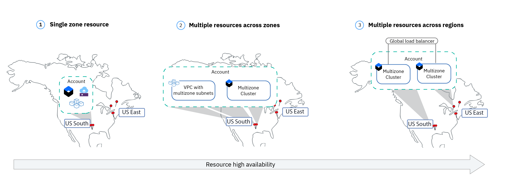

---

copyright:
  years: 2019, 2022
lastupdated: "2022-12-02"

keywords: schematics activity tracker events, schematics events, schematics audit, schematics audit events, schematics audit logs

subcollection: schematics

---

{{site.data.keyword.attribute-definition-list}}

# Understanding high availability and disaster recovery for {{site.data.keyword.bpshort}}
{: #high-availability}
{: help}
{: support}

Understand the high availability features of the {{site.data.keyword.cloud}} resources that you want to provision with {{site.data.keyword.bpfull}} and design your resources to meet the availability requirements that your business and customers need. 
{: shortdesc}

High availability is a core discipline in an IT infrastructure to keep your resources healthy and your app workloads up and running, even after a partial or full site failure. The main purpose of high availability is to eliminate potential points of failure in an IT infrastructure. For example, you can prepare for the failure of one system by adding redundancy and setting up failover mechanisms.

**How is {{site.data.keyword.bplong_notm}} set up to ensure high availability of the service?**

{{site.data.keyword.bpshort}} is deployed as two highly available service instances in two separate geographical locations, the US and Europe. Within each geography, the service is deployed across two multizone regions, such as `us-south` and `us-east` in the US geography, and `eu-de` and `eu-gb` for the Europe geography. This setup ensures that the service is still available, even if one region within a geography fails. Data is not shared across geographical locations. 

**Who is responsible to set up high availability for my resources?**

While {{site.data.keyword.bplong_notm}} is responsible to ensure that your workspace information is available, backed up, and replicated across multiple regions so that information can be recovered after a failure, {{site.data.keyword.bpshort}} does not set up high availability for your {{site.data.keyword.cloud_notm}} resources. Instead, you must understand the features that each resource offering provides to decide what level of availability is the right one for your needs. Then, you use {{site.data.keyword.bplong_notm}} to provision and configure your {{site.data.keyword.cloud_notm}} resources in a highly available setup. 

**How can I implement high availability for my resources?**

Review the following image to find a general approach of how you can make your resource highly available and add resiliency to account for a site or region failure. The level of availability that is right for you depends on several factors, such as the high availability features that are available for your resource, your business requirements, the [Service Level Agreements](/docs/overview?topic=overview-slas) that you have with your customers, and the money that you need to expense. In your Terraform configuration file, you have the option to configure multiple `provider` blocks for the different regions, zones, or locations where you want to provision your resources. For more information, see [Creating multiple `provider` configurations](/docs/ibm-cloud-provider-for-terraform?topic=ibm-cloud-provider-for-terraform-provider-reference#multiple-providers). 

Supported high availability features depend on the type of {{site.data.keyword.cloud_notm}} resource that you choose to provision with {{site.data.keyword.bplong_notm}}. Some high availability scenarios that are shown in this image might not be available for your resource. Make sure to review the resource documentation to find supported high availability features. 
{: note}

{: caption="Figure 1. High availability for {{site.data.keyword.cloud_notm}} resources" caption-side="bottom"}

1. **Single zone resources**: By default, your {{site.data.keyword.cloud_notm}} resource is deployed into one zone. This setup does not protect your workloads or data from a zonal or regional failure. 
2. **Multiple resources across zones**: You can create multiple instances and spread these instances across zones, such as [multizone clusters in {{site.data.keyword.containerlong_notm}}](/docs/containers?topic=containers-ha_clusters#mz-clusters) or a [Virtual Private Cloud with subnets in different zones](/docs/vpc?topic=solution-tutorials-vpc-multi-region#vpc-multi-region). This setup protects your workloads and data in case of a zonal failure. Note that this setup might not be available for your resource. 
3. **Multiple resources across regions**: You can create multiple instances and spread these instances across regions, such as [multiple clusters in {{site.data.keyword.containerlong_notm}}](/docs/containers?topic=containers-ha_clusters#mz-clusters). This setup provides the highest availability for your workloads and data in case of a zonal or regional failure. Note that this setup might not be available for your resource. 

