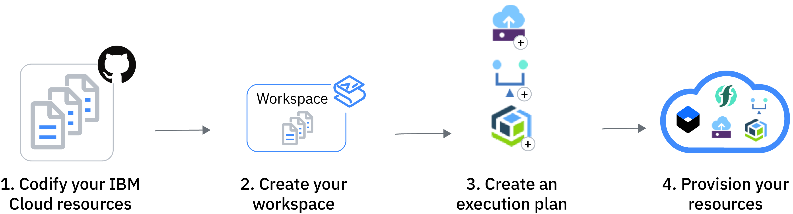
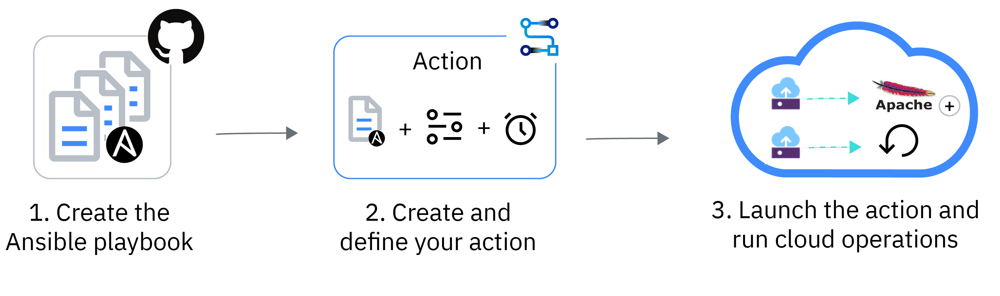
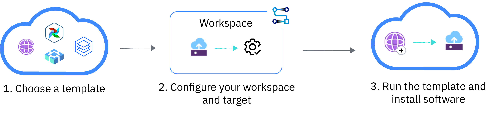

---

copyright:
  years: 2017, 2023
lastupdated: "2023-01-10"

keywords: schematics use cases, how does schematics work, why use schematics, use cases

subcollection: schematics

---

{{site.data.keyword.attribute-definition-list}}

# Understanding {{site.data.keyword.bpshort}} use cases 
{: #how-it-works}
{: help}
{: support}

Choose among the following use cases to learn how {{site.data.keyword.bpshort}} automates your infrastructure, service, and application stacks in {{site.data.keyword.cloud_notm}}.
{: shortdesc}

- [Infrastructure deployments with {{site.data.keyword.bpshort}} Workspaces](#how-to-workspaces)
- [Configuration management with {{site.data.keyword.bpshort}} Actions](#how-to-actions)
- [Software deployments with IBM-provided templates](#how-to-software)
- [large-scale environments with blueprints](/docs/schematics?topic=schematics-get-started-blueprints)

## Infrastructure deployment with {{site.data.keyword.bpshort}} Workspaces
{: #how-to-workspaces}

{{site.data.keyword.bpshort}} Workspaces deliver Terraform-as-a-Service capabilities to you so that you can automate the provisioning and management of your {{site.data.keyword.cloud_notm}} resources, and rapidly build, duplicate, and scale complex, multitiered cloud environments. 
{: shortdesc}

To get started with infrastructure deployment in {{site.data.keyword.bpshort}}, see [Getting started tutorial](/docs/schematics?topic=schematics-get-started-terraform). 
{: tip}

[Terraform](https://www.terraform.io/){: external} is an open source project that lets you specify your cloud infrastructure resources and services by using a high-level scripting language. Your specification is stored in a Terraform configuration file. The complexity of using `APIs`, provisioning, and managing your cloud resources is removed from the user. The cloud providers create a plug-in for Terraform that contains the information for how to connect to the cloud provider. And what `APIs` to invoke with a certain cloud resource? IBM's plug-in is called the [{{site.data.keyword.terraform-provider_full_notm}}](/docs/ibm-cloud-provider-for-terraform?topic=ibm-cloud-provider-for-terraform-setup_cli#install_provider). 

To use the capabilities of the {{site.data.keyword.terraform-provider_full_notm}}, you create a workspace that points to the Terraform configuration files that you want to provision. The plug-in analyzes the resources that you specified and determines the order in which these resources including any dependencies that must be provisioned. Review the following image for the detailed information about how to run Terraform configuration files with {{site.data.keyword.bpshort}} Workspaces. 

{: caption="Figure 1. Provisioning {{site.data.keyword.cloud_notm}} resources with {{site.data.keyword.bplong_notm}} and Terraform" caption-side="bottom"}

1. **Codify your {{site.data.keyword.cloud_notm}} resources**. Use Terraform HashiCorp Configuration Language (HCL) or JSON format to specify the {{site.data.keyword.cloud_notm}} resources that you want to provision in your {{site.data.keyword.cloud_notm}} environment. If you are not familiar with Terraform, you can select one of the default Terraform templates that {{site.data.keyword.bpshort}} provides to provision the {{site.data.keyword.cloud_notm}} resources that you want. Terraform templates can be stored in a GitHub, GitLab, or `Bitbucket` repository to ensure source control and enable collaboration, review, and auditing in your organization. You can save usage information in `readme` files to make the template shareable and usable across multiple teams. You can also upload tape archive files (`.tar`) from your local machine to provide the template to {{site.data.keyword.bpshort}}.
2. **Create your workspace**. You can point your {{site.data.keyword.bpshort}} Workspaces to a GitHub, GitLab, or `Bitbucket` repository where you store your Terraform template, or provide your template by uploading a `.tar` file. Workspaces help to organize resources that belong to one {{site.data.keyword.cloud_notm}} environment. For example, use workspaces to separate your test, staging, and production environment. With {{site.data.keyword.iamlong}}, you can control who has access to your workspaces? and who can run actions on your {{site.data.keyword.cloud_notm}} resources? 
3. **Create an execution plan**. Based on your configuration, Terraform creates an execution plan and describes the actions that need to be run to get to the state that is described in your Terraform configuration files. To determine the actions, {{site.data.keyword.bpshort}} analyzes the resources that are already provisioned in your {{site.data.keyword.cloud_notm}} account to give you a preview of whether resources must be added, modified, or removed. You can review the execution plan, change it, or simply execute the plan. 
4. **Provision your resources**. When you are ready to make changes to your cloud environment, you can apply your Terraform configuration files. To run the actions that are specified in your configuration files, {{site.data.keyword.bpshort}} uses the {{site.data.keyword.terraform-provider_full_notm}}. 

## Configuration management with {{site.data.keyword.bpshort}} Actions
{: #how-to-actions}

{{site.data.keyword.bpshort}} Actions deliver Ansible-as-a-Service capabilities to you so that you can automate the configuration and management of your {{site.data.keyword.cloud_notm}} environment, and deploy complex multitiered apps to your cloud infrastructure. 
{: shortdesc}

To get started with configuration management in {{site.data.keyword.bpshort}}, see [Getting started tutorial](/docs/schematics?topic=schematics-getting-started-ansible). 
{: tip}

[Ansible](https://www.ansible.com/){: external} is a configuration management and provisioning tool, similar to [Chef](https://www.chef.io/products/chef-infra) and [Puppet](https://www.puppet.com/), and is designed to automate the configuration, operation, and management of cloud environments, and to deploy multitiered app workloads in the cloud. Ansible uses YAML syntax to describe the tasks that must be run against a single host or a group of hosts, and stores these tasks in an Ansible playbook. 

Ansible does not use agents or a custom security infrastructure that must be present on a target machine to work properly. Instead, Ansible securely connects to compute hosts over the public network by using SSH keys. To bring a resource to the required state, Ansible pushes modules to the managed host that run the tasks in your Ansible playbook. After the tasks are executed, the result is returned to the Ansible server and the module is removed from the managed host. Ansible modules are idempotent such that executing the same playbook or operation multiple times returns the same result as resources are changed only if required. For more information about Ansible, check out this [video](https://www.youtube.com/watch?v=fHO1X93e4WA){: external}. 

To use Ansible capabilities in {{site.data.keyword.bpshort}}, you create a {{site.data.keyword.bpshort}} Actions that points to the Ansible playbook that you want to run. Review the following image for the detailed information about how to run Ansible playbooks with {{site.data.keyword.bpshort}} Actions. 

{: caption="Figure 2. Configuring {{site.data.keyword.cloud_notm}} resources with {{site.data.keyword.bplong_notm}} and Ansible" caption-side="bottom"}

1. **Add tasks to your playbook**: Use Ansible YAML syntax to describe the configuration tasks that you want to run on your cloud infrastructure, such as installing software or starting, stopping, and rebooting a virtual server. You add these tasks to an Ansible playbook and store the playbook in a GitHub, GitLab, or `Bitbucket` repository to ensure source control and enable collaboration, review, and auditing in your organization. If you are not familiar with Ansible, you can use one of the [{{site.data.keyword.IBM_notm}} provided playbooks](https://github.com/Cloud-Schematics){: external}, or browse the [Ansible Galaxy library](https://galaxy.ansible.com/){: external}.
2. **Create a {{site.data.keyword.bpshort}} action**: When you create a {{site.data.keyword.bpshort}} action, you point your action to the repository that stores your Ansible playbook. Then, you select the cloud resources where you want to run the tasks that are defined in your Ansible playbook. To protect your cloud resources, you can further set up a bastion host in front of your target hosts that proxies all Ansible SSH connections to the target hosts. 
3. **Run your action**: When you are ready to configure your cloud resources, you can run your action. {{site.data.keyword.bpshort}} uses the built-in Ansible capabilities to connect to your target hosts via SSH, and execute the tasks that are defined in your Ansible playbook. You can monitor the progress by reviewing the logs. 

## Software deployments with IBM-provided templates
{: #how-to-software}

Browse the [{{site.data.keyword.IBM_notm}} software solutions catalog](https://cloud.ibm.com/catalog#software){: external} and choose among a wide range of software and infrastructure templates that you can use to set up cloud resources, and to install {{site.data.keyword.IBM_notm}} and Third party software in your {{site.data.keyword.containerlong_notm}} cluster, {{site.data.keyword.openshiftlong_notm}} cluster, or a classic or {{site.data.keyword.vsi_is_short}}. 
{: shortdesc}

Software templates are installed by using the built-in Terraform, Ansible, Helm, {{site.data.keyword.openshiftshort}} Operator, and Cloud Pak capabilities in {{site.data.keyword.bpshort}}. When you choose to install one of the provided templates, you create a {{site.data.keyword.bpshort}} Workspaces and choose the target service or host where you want run the installation. You can review which of the integrated technologies in {{site.data.keyword.bpshort}} is used to install your template. 

You can also create your own software and infrastructure templates and import them in to your own private catalog in {{site.data.keyword.cloud_notm}}. For more information, see [Adding products to a private catalog](/docs/account?topic=account-create-private-catalog)

To get started with software deployment in {{site.data.keyword.bpshort}}, see the [Getting started tutorial](/docs/schematics?topic=schematics-get-started-software). 
{: tip}

{: caption="Figure 3. Software deployments with {{site.data.keyword.bpshort}}" caption-side="bottom"}

1. **Choose a template**: The [{{site.data.keyword.IBM_notm}} software solutions catalog](https://cloud.ibm.com/catalog#software){: external} offers a wide variety of infrastructure and software templates that you can choose from. These templates help to quickly install software, such as {{site.data.keyword.cloud_notm}} Paks, {{site.data.keyword.appserver_full}}, or Kibana and Grafana into the target service of your choice. 
2. **Configure your workspace and target**: When you choose one of the provided templates, you must select the target where you want to install the template. Depending on the template that you choose, the target can be an {{site.data.keyword.containerlong_notm}} cluster, a {{site.data.keyword.openshiftlong_notm}} cluster, or a classic or {{site.data.keyword.vsi_is_short}}. Because {{site.data.keyword.bpshort}} is used to install the software, you must configure the workspace that is automatically created for you. 
3. **Run the template**: When you run the template, {{site.data.keyword.bpshort}} uses the built-in Terraform, Ansible, Helm, OpenShift Operator, or Cloud Pak capabilities to install your software or spin up infrastructure resources. You can use your workspace to monitor the progress of your template execution. 

## Next steps
{: #usecase-nextsteps}

- Explore blueprint samples by using {{site.data.keyword.bpshort}} [tutorials](/docs/schematics?topic=schematics-provisioning-terraform-template).
- Click [here](/docs/schematics?topic=schematics-how-it-works) to revisit the {{site.data.keyword.bpshort}} use cases.
