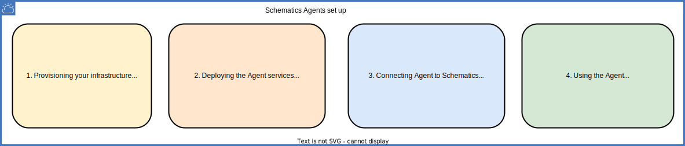

---

copyright:
  years: 2017, 2022
lastupdated: "2022-11-18"

keywords: schematics agents connect, connect agent, register agent

subcollection: schematics

---

{{site.data.keyword.attribute-definition-list}}

{{site.data.keyword.bpshort}} Agents is a [beta feature](/docs/schematics?topic=schematics-agent-beta-limitations) that is available for evaluation and testing purposes. It is not intended for production usage. Refer to the list of [limitations for Agent](/docs/schematics?topic=schematics-agent-beta-limitations) in the beta release.

# Connecting {{site.data.keyword.bpshort}} Agent
{: #register-agent}

You have successfully set up the {{site.data.keyword.bpshort}} Agents infrastructure and Agents services, the next step is to connect or register your Agent. So that, the {{site.data.keyword.bpshort}} knows about Agent and connect the service instance to it. The diagram depicts the complete {{site.data.keyword.bpshort}} Agents set up flow.
{: shortdesc}

{: caption="{{site.data.keyword.bpshort}} Agents set up" caption-side="center"}

## Connecting Agent through UI
{: #register-ui}
{: ui}

1. Log in to your [{{site.data.keyword.cloud_notm}}](https://cloud.ibm.com/){: external} account by using your credentials.
2. Navigate to **{{site.data.keyword.bpshort}}** > **Agents**.
3. Select your **Location** to connect the Agent.
4. Click **Connect Agent**.
5. In the **Connect an Agent to {{site.data.keyword.bpshort}}** page, enter the input value.
    - **Agent name** - Enter the unique name. For example, `myagent-connection`.
    - **IAM Trusted ID** - Link your trusted profile ID. For more information, to view the trusted profile ID, see [Trusted Profile ID](/docs/schematics?topic=schematics-agent-trusted-profile). For example, `Profile-1bd5eala-000-4a6666-00011`.
    - **Resource Group** - Select your resource group and specific resources where you need to connect a Agent. Check you have the right permissions for the resource group.
6. Click **Connect**.
    - The Agent status will change to **Ready to bind** status.
       The **Ready to bind** status signifies that the Agent is ready for the next step to bind the workspace. Wait 15-30 minutes to view the Agent status.
       {: note}

7. Optional: From your Agent instance you can click the `...` dots to perform the following operations.
    - **Edit Agent** to edit the Agent configuration.
    - **Bind Agent** to the {{site.data.keyword.bpshort}} Workspaces.
    - **Pause Agent** to pause the Agent execution.
    - **Delete Agent** to delete an Agent.


## Connecting Agent through API
{: #register-api}
{: api}

1. Follow the [steps](/docs/schematics?topic=schematics-setup-api#cs_api) to retrieve your IAM access token and authenticate with {{site.data.keyword.bplong_notm}} by using the API.
2. You have the right permission to create 
    - [VPC infrastructure](/docs/vpc?topic=vpc-iam-getting-started).
    - [IKS](/docs/containers?topic=containers-access_reference) cluster.
    - [LogDNA](/docs/log-analysis?topic=log-analysis-iam).
    - [Activity tracker](/docs/activity-tracker?topic=activity-tracker-iam) services.

Here are the list of CURL commands use to register and unregister the Agent. For more information about the Agents related `APIs`, see [Agents `APIs`](/apidocs/schematics/schematics#list-agent). 

1. Run post API to [register an Agent](/apidocs/schematics/schematics#register-agent) with the {{site.data.keyword.bpshort}}.
   ```sh
    curl -X POST \
    https://schematics.cloud.ibm.com/v2/settings/agents \
    -H 'authorization: ' \
    -H 'cache-control: no-cache' \
    -H 'content-type: application/json' \
    -H 'github-token: github_token' \
    -d '{
        "name": "devclitestpart",
        "description": "Register agent",
        "resource_group": "Default",
        "tags": [
            "agent"
        ],
        "location": "<Enter your location>",
        "agent_location": "<Enter your agent location>",
        "profile_id": "<Enter you profile_id>",
        "user_state": {
            "state": "enable"
        }
    }'
    ```
    {: pre}

2. Run get all API to [fetch all the registered or unregistered](/apidocs/schematics/schematics#list-agent) Agents from the Account.

   ```sh
    curl -X GET \
    https://schematics.cloud.ibm.com/v2/settings/agents \
    -H 'authorization: ' \
    -H 'cache-control: no-cache' \
    -H 'content-type: application/json' \
    -H 'github-token: github_token' \
    ```
    {: pre}

3. Run get API to fetch a [registered Agent](/apidocs/schematics/schematics#get-agent) details by providing the Agent ID in the path parameter.

    ```sh
    curl -X GET \
    https://schematics.cloud.ibm.com/v2/settings/agents/{agent_id} \
    -H 'authorization: ' \
    -H 'cache-control: no-cache' \
    -H 'content-type: application/json' \
    -H 'github-token: github_token' \
    ```
    {: pre}

4. Optional: [Update the Agent](/apidocs/schematics/schematics#update-agent-registration) registration by providing the Agent ID in path parameter.

   ```sh
    curl -X PUT \
    https://schematics.cloud.ibm.com/v2/settings/agents/{agent_id} \
    -H 'authorization: \
    -H 'cache-control: no-cache' \
    -H 'content-type: application/json' \
    -d '{
        "name": "devclitestpart",
        "description": "Register agent description changet",
        "resource_group": "string",
        "tags": [
            "string"
        ],
        "location": "us-south",
        "agent_location": "us-south",
        "profile_id": "string",
        "user_state": {
            "state": "enable"
        }
    }'
    ```
    {: pre}

5. Optional: [`Deregister the Agent`](/apidocs/schematics/schematics#delete-agent) by providing the Agent ID in path parameter.

   ```sh
    curl -X DELETE \
    https://schematics.cloud.ibm.com/v2/settings/agents/{agent_id} \
    -H 'authorization: ' \
    -H 'cache-control: no-cache' \
    -H 'content-type: application/json' \
    -d ''
    ```
   {: pre}

## Next steps
{: #connect-nextsteps}

You have completed the Agent connection to your {{site.data.keyword.bpshort}} service instance.
- Now, you need to [Use an Agent](/docs/schematics?topic=schematics-using-agent) to bind the Agent to your workspace.
- For any challenges in Agents installation or configuration, see [FAQ about Agent](/docs/schematics?topic=schematics-faqs-agent&interface=cli) and [Troubleshooting guide](/docs/schematics?topic=schematics-agent-crn-not-found&interface=cli).
