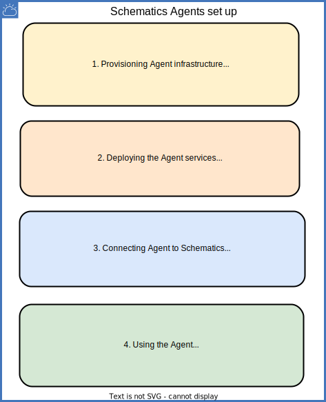

---

copyright:
  years: 2017, 2022
lastupdated: "2022-07-12"

keywords: schematics agents connect, connect agent, register agent

subcollection: schematics

---

{{site.data.keyword.attribute-definition-list}}

{{site.data.keyword.bpshort}} Agents is a [Beta feature](/docs/schematics?topic=schematics-agent-beta-limitations) that is available for evaluation and testing purposes. It is not intended for production usage. Refer to, the list of [limitations for Agent](/docs/schematics?topic=schematics-agent-beta-limitations) in the Beta release.

# Connecting {{site.data.keyword.bpshort}} Agent
{: #register-agent}

You have successfully set up the {{site.data.keyword.bpshort}} Agents infrastructure and Agents services. The next step is to connect or register your Agent to your {{site.data.keyword.bpshort}} service instance. The diagram depicts the complete {{site.data.keyword.bpshort}} Agents set up flow.
{: shortdesc}

{: caption=" " caption-side="center"}

## Connecting Agent through UI
{: #register-ui}
{: ui}

1. Log in to your [{{site.data.keyword.cloud_notm}}](https://cloud.ibm.com/){: external} account by using your credentials.
2. Navigate to **{{site.data.keyword.bpshort}}** > **Agents**.
3. Select **Location** where you want to connect the Agent.
4. Click **Connect Agent**.
5. In the **Connect an Agent to {{site.data.keyword.bpshort}}** page, enter the input value.
    - **Agent name** - Enter the unique name.
    - **IAM Trusted ID** - Create a trusted ID and link the trusted ID. For more information, see [Trusted Profile ID](/docs/schematics?topic=schematics-agent-trusted-profile).
    - **Resource Group** - Select your resource group and specific resources where you need to connect a Agent. **Note** Check you have the right permissions for the resource group.
6. Click **Connect**.
    - The Agent status will change to **Ready to bind** status.
       The **Ready to bind** status signifies that the Agent is ready for the next step to bind the Workspace. Wait 15-30 minutes to view the Agent status.
       {: note}

7. Optional: From your Agent instance you can click the three dots to perform the following operations.
    - **Edit Agent** to edit the Agent configuration.
    - **Bind Agent** to the {{site.data.keyword.bpshort}} Workspaces.
    - **Pause Agent** to pause the Agent execution.
    - **Delete Agent** to delete a Agent.

## Next steps
{: #connect-nextsteps}

You have completed the Agent connection to your {{site.data.keyword.bpshort}} service instance.
- Now, you need to [Use an Agent](/docs/schematics?topic=schematics-register-agent&interface=ui) to bind the Agent to your Workspace, in order to run the IaC automation in your cluster.
- For any challenges in Agents installation or configuration, refer to, [FAQ about Agent](/docs/schematics?topic=schematics-faqs-agent&interface=cli) and [Troubleshooting guide](/docs/schematics?topic=schematics-agent-crn-not-found&interface=cli).
