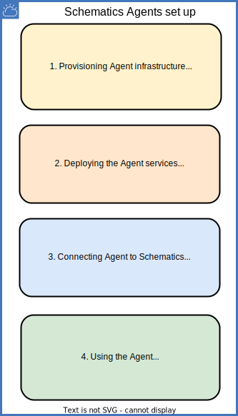

---

copyright:
  years: 2017, 2022
lastupdated: "2022-07-04"

keywords: schematics agents connect, connect agent, register agent

subcollection: schematics

---

{{site.data.keyword.attribute-definition-list}}

{{site.data.keyword.bpshort}} Agents is a [Beta feature](/docs/schematics?topic=schematics-agent-beta-limitations) that is available for evaluation and testing purposes. It is not intended for production usage. Refer to, the list of [limitations for Agents](/docs/schematics?topic=schematics-agent-beta-limitations) in the Beta release.
{: beta}

# Using {{site.data.keyword.bpshort}} Agent
{: #using-agent}

You have successfully connected the Agent to {{site.data.keyword.bpshort}} service instance. The next step is to bind your Agent Workspaces to the Agent. The diagram depicts the complete {{site.data.keyword.bpshort}} Agents set up flow.
{: shortdesc}

{: caption=" " caption-side="left"}

Once you bind the Workspace to the Agent, then the corresponding Workspace Jobs such as `terraform plan`, `terraform apply`, `terraform destroy`, etc. will be automatically routed to the Agent. 

In other words, the Terraform automation will run in your provisioned Agent infrastructure (cluster). The {{site.data.keyword.bpshort}} Workspace can be bound to the Agent in the following ways:
- Bind an new workspace to the Agent
   When you bind the new workspace to the Agent, the Terraform templates are downloaded from the Git repositories by using Sandbox jobs that run in your Agent infrastructure (cluster). Further, the Terraform jobs are also run in your cluster.

- Bind the existing workspace to the Agent
   When you bind an existing workspace to the Agent, the Terraform templates may be downloaded by the shared {{site.data.keyword.bpshort}} service instance. However, the subsequent template operations such as, update the terraform template from the Git repositories will be done by using the Sandbox jobs that run in your Agent infrastructure (cluster). Further, the Terraform jobs are also run in your Cluster.

## Steps to bind an existing workspace to the Agent
{: #steps-bind-exist-wks}

1. Login to your [{{site.data.keyword.cloud_notm}}](https://test.cloud.ibm.com/){: external} account by using your credentials.
2. Navigate to **{{site.data.keyword.bpshort}}** > **Agents**.
3. Select your Agent from the list, and use the `...` dots to perform **Bind Agent** operation.
4. In the side navigation pane, select **Workspaces** to be bound statically to the Agent.
5. Select your bounded Agent Workspaces to view the status of your Agent execution to monitor.

## Steps to Bind a new workspace to the Agent
{: #steps-bind-new-wks}

1. Login to your [{{site.data.keyword.cloud_notm}}](https://test.cloud.ibm.com/){: external} account by using your credentials.
2. Navigate to **Schematics** > **Workspaces** > **Create Workspace**.
3. In the Workspaces details page, use the Bind Agent to select the **Bind Agent** that must be used to run the Jobs.

**Validate the Job execution by the Agent**
{: #validate-agent-job}

Once the Workspace is bound to an Agent, you can validate whether the Jobs are being run by the Agent, by viewing the job logs.  You will see the following messages in the job logs which signifies that the Sandbox job or the Terraform jobs are being run by the Agent.

## Next steps
{: #connect-nextsteps}

You have completed the entire {{site.data.keyword.bpshort}} Agent set up and working flow.
- Looking for more samples? Check out the [{{site.data.keyword.bplong_notm}} GitHub repository](https://github.com/Cloud-Schematics?q=Agent&type=all&language=&sort=){: external}.
- For any challenges in Agents set up, refer to, [FAQ about Agent](/docs/schematics?topic=schematics-faqs-agent) and [Troubleshooting guide](/docs/schematics?topic=schematics-agent-crn-not-found).
