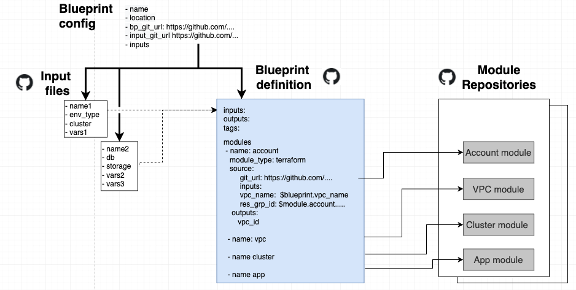

---

copyright:
  years: 2017, 2022
lastupdated: "2022-09-12"

keywords: schematics blueprints infrastructure, blueprints schema, schema definitions, definitions, yaml

subcollection: schematics

---

{{site.data.keyword.attribute-definition-list}}

{{site.data.keyword.bpshort}} Blueprints is a [Beta feature](/docs/schematics?topic=schematics-bp-beta-limitations) that is available for evaluation and testing purposes. It is not intended for production usage. Refer to the list of [limitations](/docs/schematics?topic=schematics-bp-beta-limitations) for the Beta release.
{: beta}

# Understanding Blueprint definitions and configuration
{: #blueprint-definitions}

{{site.data.keyword.bplong}} Blueprints is a pattern based deployment service for large scale cloud environments. Blueprints managed cloud environments are created from a user supplied Blueprint configuration that identifies the solution pattern (Blueprint defintion) and a set of input values that are used to customise the pattern. 
{: shortdesc}

A {{site.data.keyword.bpshort}} Blueprint environment is specified by three versioned elements:
1. A Blueprint definition file specifying the resource topology, infrastructure architecture, IaC automation modules and dependencies.
2. Input variables to configure and customize the Blueprints defintion at deployment time.
3. Automation modules written in Terraform to deploy the desired cloud resources. 

These elements and their relationships are shown in the diagram.  

{: caption="Understanding Blueprints definitions" caption-side="bottom"}

A Blueprint configuration is the initial settings the user must provide to create a Blueprint in {{site.data.keyword.bpshort}}. The configuration defines the Blueprint definition YAML file to be used, its Git source location, input value files, document version information and any additional inputs.

The configuration specifies the:
1. A Blueprint definition file specifying the resource topology, infrastructure architecture, IaC automation modules and dependencies.
2. Input variables used to configure and customize the Blueprints deployment.
3. Automation modules written in Terraform.


## Blueprint definition overview
{: #definition-overview}

Central to deploying a solution pattern as a Blueprint environment is the Blueprint definition. 
- Blueprint definitions are written in YAML with a minimum of syntax that specifies the automation modules to be used, their versions, source libraries, and relationships for passing resource dependency data between modules. 
- The resource management and provisioning functionality of the Blueprints service is implemented by the automation modules by using the familiar open source Terraform automation tool. 
- Input variable files customize the reusable Blueprints definition to create cloud environments.
{: shortdesc}

Input files, Blueprint defintions, and modules are all maintained in Git source control. These version controlled components are specified at Create time by a Blueprint configuration. The configuration defines the source of the version Blueprint definition in source control and the input files to customize the Blueprint. Also additional parameters for naming the Blueprint, access control and additional inputs. 

## Blueprints YAML file
{: #blueprint-yaml-file}

The diagram shows a simplified view of a Blueprint definition YAML file. It identifies the definitions inputs and outputs, the choice of modules, and the dependencies and variable linkage between modules. Definitions follow standard YAML syntax. For more details, see the [Blueprints schema reference](/docs/schematics?topic=schematics-blueprint-definitions).
{: shortdesc} 


```yaml
name: "basic"
description: "Basic 2 component blueprint, RG & COS, no API key"
inputs:
  - name: resource_group_name
outputs:
  - name: cos_id
    value: $module.basic-cos-storage.outputs.cos_id
modules:
  - name: basic-resource-group
  - module_type: terraform
    source:
      source_type: github
      git: 
        git_repo_url: "https://github.ibm.com/steve-strutt/blueprint-examples-modules/tree/master/IBM-ResourceGroup"
        git_branch: master
    inputs:
      - name: provision
        value: $blueprint.provision_rg
      - name: name
        value: $blueprint.resource_group_name
    outputs:
      - name: resource_group_name
      - name: resource_group_id
- name: basic-cos-storage
    source:
      source_type: github
      git:
        git_repo_url: "https://github.ibm.com/steve-strutt/blueprint-examples-modules/tree/master/IBM-Storage"
        git_branch: master
        git_release: latest
    inputs:
      - name: cos_instance_name
        value: $blueprint.cos_instance_name
      - name: cos_single_site_loc
        value: "ams03"
      - name: resource_group_id
        value: $module.basic-resource-group.outputs.resource_group_id
    outputs:
      - name: cos_id
      - name: cos_crn
```
{: codeblock}

A Blueprint definition consists of a number of sections. An initial settings section contains a default name and description for the Blueprint, and related settings. Also it defines the inputs the definition requires and any outputs it generates and returns to the user through {{site.data.keyword.bpshort}}. This is followed by a `modules` section containing the module definitions. 

Dependencies are created between modules by interpolation of module input and output values. In the `basic-cos-storage` module definition above, the input `resource_group_id` specifies the interpolated value `$module.basic-resource-group.outputs.resource_group_id` which creates a dependency on the `resource_group_id` output value from the module `basic-resource-group`.

## Input statements
{: #blueprint-input-statements}

All variables required by a Blueprint must be defined in the inputs section. Values can be statically defined in the Blueprint definition. If the value is omitted, it is assumed that the input is satisfied by a user defined input value at Blueprint creation time.
{: shortdesc}  

```yaml
inputs:
  - name: resource_group_name
  - name: region
    value: us-south
```
{: codeblock}

## Module statements
{: #blueprint-module}

Module statements define the modules utilized by the Blueprint. Each statement defines the source repository for the IaC automation modules, the inputs and outputs for passing of resource information between dependent modules. Typically they contain 3 statement blocks:
1. source
2. inputs
3. outputs
{: shortdesc} 

### Module Source
{: #blueprint-module-source}

Blueprints modules are sourced from version controlled Git source repositories. Following IaC principles, version modules can be explicitly selected by release tags, or by a relaxed branch, latest commit approach. See, schema reference `git` example.
{: shortdesc} 

```yaml
git:
        source_type: github
        git_repo_url: "https://github.ibm.com/steve-strutt/blueprint-examples-modules/tree/master/IBM-Storage"
        git_branch: master
```
{: codeblock}

### Module inputs
{: #blueprint-module-inputs}

Module inputs are defined in the input block of a module and follow the same type convention as Terraform HCL. The supported types are the same as the [Terraform variable types](https://www.terraform.io/language/expressions/types). If the type is omitted the default is `string`. For more details, about the example data types represented in YAML, see [Blueprints complex inputs](https://github.com/Cloud-Schematics/blueprint-complex-inputs){: external} and the code snippet.
{: shortdesc} 

```yaml
inputs: 
  - name: list_any_flow_scalar
    value: $blueprint.list_any_flow_scalar
    type: list(any)
    secure: false
  - name: docker_ports
    value: $module.terraform_module1.outputs.nested_complex
    type: |
          list(object({
             internal = number
             external = number
             protocol = string
           })
    secure: false
```
{: codeblock}

Four keywords define the variable attributes: `name`, `value`, `type`, and `secure`. These correspond with the [Terraform variable definitions](https://www.terraform.io/language/values/variables#arguments){: external}

Similar to Terraform, values can be specified as static values or interpolated references to Blueprint inputs or other modules by using the `$` symbol as shown in the sample snippet. 

Two input variable reference types are supported. Inter-module references, mapping module inputs to the outputs of other modules using the `$module` token. Additionally, Blueprints input references can be defined using the `$blueprint` token. Check the readme and metadata for the automation modules to determine the supported inputs and variable types. 

To reference the output value of another module, the format is `$module` followed by the dependent module name, the token `outputs`, followed by referenced output name.

```yaml
name: res_grp_id            
value: $module.accounts.outputs.res_grp_id
```
{: codeblock}

To reference an input value from the Blueprint inputs, the name of the input variable must be defined in the Blueprint inputs block. The reference takes the format `$blueprint` followed by the referenced input variable name.
{: shortdesc} 

```yaml
inputs:
    -name: region


modules:
  - name: account 
inputs:
  - name: logdna_sts_region
    value: $blueprint.region
```
{: codeblock}

### Module outputs
{: #blueprint-module-outputs}

{{site.data.keyword.cloud_notm}} automation modules implemented in Terraform must contain HCL output statements to pass data and resource information to dependent modules. Check the readme and metadata for the module to determine the supported outputs and data types.
{: shortdesc} 

```yaml
outputs:
 - name: resource_group_name
 - name: resource_group_id

```
{: codeblock}


## Output statements
{: #blueprint-output}

Values to be returned from a Blueprint are defined by output statements and use the same interpolation syntax as module inputs.
{: shortdesc}  

```yaml
outputs:
  - name: cos_id
    value: $module.basic-cos-storage.outputs.cos_id
```
{: codeblock}

## Blueprints inputs
{: #blueprint-inputs}

The inputs required by a Blueprints are defined in the inputs section. Where no value is specified in the input section, a Blueprint accepts input values from two sources specified by the Blueprints configuration at create time:
{: shortdesc} 

- Version controlled input variable YAML files
- The *ad hoc* dynamic input variables, which are not version controlled 

### Input files
{: #blueprint-input-file}

Input files define the version controlled input values used for Blueprint customization. The variable type must match the module input type in the Blueprint definition. For more information, see the Blueprints [input file schema reference](/docs/schematics?topic=schematics-blueprint-definitions#blueprint-inputs).
{: shortdesc} 

```yaml
resource_group: default
region: us-south
docker_ports: | 
  [
    {
      internal = 9900
      external = 9900
      protocol = "tcp"
    },
    {
      internal = 9901
      external = 9901
      protocol = "ldp"
    }
  ]
```
{: codeblock}

## Configuration of dynamic inputs
{: #blueprint-dynamic-input}

Dynamic inputs are used at Blueprint create time to pass inputs to dynamically customize the Blueprint and over ride inputs from an a version controlled input file sourced from a Git repo. They can be used to pass input values that would be a security exposure if written to a Git repository. API keys and SSH keys would typically be passed as dynamic inputs at creation time. See the [Blueprint FAQ](/docs/schematics?topic=schematics-blueprints-faq#faqs-bp-secure-inputs) for using dynamic inputs to pass sensitive variables. 
{: shortdesc} 

Blueprints only supports input variables of type `string` as dynamic inputs. 

Example of passing dynamic inputs at creation time. 

```sh
ibmcloud schematics blueprint create -name <name> -resource_group <resource_group> -bp_git_url <blueprint_url> -input_git_url <input_url> -inputs provision_rg=<value>,resource_group_name=<value>
```
{: pre} 

## What's next
{: #bp-def-whatsnext}

In this section you have learned about {{site.data.keyword.bpshort}} Blueprint definitions and configuration. Now you can 
- Explore [deploying {{site.data.keyword.bpshort}} Blueprints using the command line](/docs/schematics?topic=schematics-deploy-schematics-blueprint-cli) tutorial to create cloud resources with a Blueprints managed cloud environment.
- Refer to, [Blueprints definition YAML](/docs/schematics?topic=schematics-bp-definition-schema-yaml) and [Blueprints input YAML](/docs/schematics?topic=schematics-bp-input-schema-yaml) for more information about the parameters used in the YAML files.

