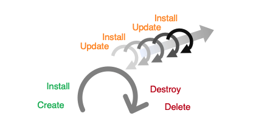

---

copyright:
  years: 2017, 2022
lastupdated: "2022-08-03"

keywords: schematics blueprints infrastructure, blueprints lifecycle commands, lifecycle commands

subcollection: schematics

---

{{site.data.keyword.attribute-definition-list}}

{{site.data.keyword.bpshort}} Blueprints is a [Beta feature](/docs/schematics?topic=schematics-bp-beta-limitations) that is available for evaluation and testing purposes. It is not intended for production usage. Refer to the list of [limitations](/docs/schematics?topic=schematics-bp-beta-limitations) for the Beta release.
{: beta}

# Infrastructure lifecycle commands
{: #blueprint-lifecycle-cmds}

{{site.data.keyword.bpshort}} Blueprints follow a lifecycle approach to deploy and manage application environments on {{site.data.keyword.cloud}}. 

Blueprints follow a cycle of create, update and delete. Cloud environments are created and resources are deployed as specified by the Blueprint definition. The deployed configuration is updated as required through the life of the environment, to maintain platform currency and compliance as security policies evolve. Finally, when the application is retired or rehosted into a new environment, the cloud infrastructure is retired by destroying any associated resources and deleting the Blueprint.
{: shortdesc}

## Lifecycle commands
{: #lifecycle-cmds}

{: caption="Blueprints lifecycle commands" caption-side="bottom"}

The Blueprints commands implement a full lifecycle for managing cloud resources are create, update, install, delete, and destroy. Blueprints operations are performed in pairs. One acts on the stored Blueprints config in {{site.data.keyword.bpshort}} and the second on the cloud resources, applies the requested configuration.
{: shortdesc}  

### Create and install
{: #lifecycle-create-install}

- Create

Creates a new Blueprints instance in {{site.data.keyword.bpshort}} from a user supplied Blueprints definition and input variables. A Workspace is created for each Blueprints module. For more information, refer to, [Creating Blueprint](/docs/schematics?topic=schematics-create-blueprint&interface=cli). 
{: shortdesc} 

- Install 

Runs the Infrastructure as code (IaC) automation code modules associated with the Workspaces by using the initial input configuration. For each module it performs a Terraform apply or Ansible playbook run to create or configure the specified cloud resources. For more information, refer to, [Installing Blueprint](/docs/schematics?topic=schematics-install-blueprint&interface=cli).
{: shortdesc} 

### Update and Install
{: #lifecycle-update-install}

- Update 

Updates the stored Blueprints definition with versioned changes to the source definition and inputs. Changes to the module versions and inputs are propagated to the Workspaces. For more information, refer to, [Updating Blueprint](/docs/schematics?topic=schematics-update-blueprint&interface=cli).
{: shortdesc} 

- Install

Reruns the install of the IaC modules based on the updated configuration. For each module this performs a Terraform Apply or Ansible playbook tun to create, modify, or delete cloud resources as determined by the configuration changes from the update. For more information, refer to, [Installing Blueprint](/docs/schematics?topic=schematics-install-blueprint&interface=cli).
{: shortdesc} 

### Destroy and Delete
{: #lifecycle-destroy-delete}

- Destroy

Removes or destroys the deployed cloud resources associated with each Workspace. For Terraform Workspaces, {{site.data.keyword.bpshort}} runs a Terraform destroy operation on each workspace. For more information, refer to, [Destroying Blueprint](/docs/schematics?topic=schematics-destroy-blueprint&interface=cli).
{: shortdesc} 

- Delete

Deletes the Blueprints and all attached Workspaces from {{site.data.keyword.bpshort}}. For more information, refer to, [Deleting Blueprint](/docs/schematics?topic=schematics-delete-blueprint&interface=cli).
{: shortdesc} 

These form a lifecycle of operations from environment creation to retirement. During the useful operational life of a cloud environment the `update and install` cycle are performed many times to apply updates and configuration changes.

## Next steps
{: #lifecyle-nextstep}

Now you learned about the {{site.data.keyword.bpshort}} Blueprints lifecycle and its importance. 
- You can explore how to [deploy {{site.data.keyword.bpshort}} Blueprints by using CLI](/docs/schematics?topic=schematics-deploy-schematics-blueprint-cli)?
{: shortdesc} 
