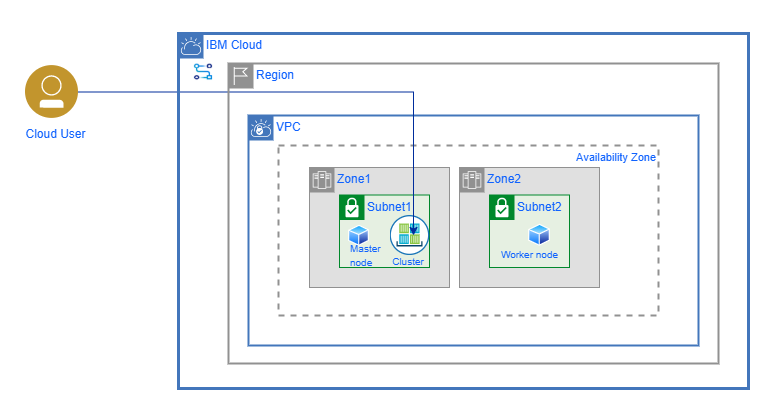

---

copyright:
  years: 2017, 2022
lastupdated: "2022-11-25"

keywords: provisioning terraform template, provision terraform template using Schematics, terraform template with {{site.data.keyword.bpfull_notm}}, provisioning terraform template using CLI

subcollection: schematics

content-type: tutorial
services: schematics, containers, key-protect
account-plan:
completion-time: 60m

---

{{site.data.keyword.attribute-definition-list}}

# Creating an {{site.data.keyword.containerlong_notm}} cluster on VPC infrastructure
{: #provisioning-terraform-template}
{: toc-content-type="tutorial"}
{: toc-services="schematics, containers, key-protect"}
{: toc-completion-time="60m"}

Use one of the {{site.data.keyword.IBM}} provided templates to create an {{site.data.keyword.containerlong}} cluster in a Virtual Private Cloud (VPC). Then, you bind the cluster to an {{site.data.keyword.cos_full}} service instance. 
{: shortdesc}

## Description
{: #provisioning-desc}

In this tutorial, you use the {{site.data.keyword.IBM}} provided [`vpc-gen2-cluster` Terraform template](https://github.com/IBM-Cloud/terraform-provider-ibm/tree/master/examples/ibm-cluster/vpc-gen2-cluster){: external} to create a Virtual Private Cloud (VPC) and to provision an {{site.data.keyword.containerlong_notm}} cluster on {{site.data.keyword.vsi_is_short}}. Then, you add the service credentials of an {{site.data.keyword.cos_full_notm}} service instance as a Kubernetes secret in your cluster. You can change the default values in this template to spread your cluster across multiple subnets and zones. However, the steps in this tutorial use the default values that are provided in the template. 

The following image shows the cloud architecture components that you provision as part of this tutorial. 

{: caption="Provisioning Terraform templates by using {{site.data.keyword.bplong_notm}}" caption-side="bottom"}

| Component | Description |
| -------- | -------- |
| `Region` | Region increases the availability of cluster's master node and its nodes by replicating across multiple zones of a region. |
| `VPC` | VPC provides you the security of a private cloud environment with the dynamic scalability of a public cloud. |
| `zones` | You must have one VPC subnet for each zone in your cluster. The available zones depend on the metro location that you created in the VPC. |
| `subnet` | VPC subnets is used to provide private IP addresses for your worker nodes and load balancer services in your cluster. You cannot change the number of IP addresses that a VPC subnet has. |
| `master node` | Controls and manages a set of worker nodes (workloads runtime) and resembles a cluster in Kubernetes.
| `cluster` |A cluster contains a control plane and one or more compute machines, or nodes. Nodes run the applications and workloads. |
| `worker node` | Add the zone to your worker pool. When you add a zone to a worker pool, the worker nodes that are defined in your worker pool are provisioned in the zone and considered for future workload scheduling. |
{: caption="Cloud architecture components" caption-side="bottom"}

You can add worker nodes and pool to your VPC cluster by using a  `ibm_container_vpc_worker_pool` provider resource.
{: note} 

The costs are incurred based on your resource usage. For more information about the VPC pricing, see [VPC pricing](https://www.ibm.com/cloud/virtual-servers/pricing){: external}.
{: important}

## Objectives
{: #provisioning-tut-obj}

In this tutorial, you will do the following: 
- Learn how to use an IBM-provided Terraform template to create a Virtual Private Cloud (VPC) and provision an {{site.data.keyword.containerlong_notm}} cluster that runs on {{site.data.keyword.vsi_is_short}}. 
- Create an {{site.data.keyword.cos_full_notm}} service instance and bind the service to your {{site.data.keyword.containerlong_notm}} cluster. 
- Explore how to create an {{site.data.keyword.bplong_notm}} Workspace.
- Create a Terraform execution plan and apply your Terraform template in {{site.data.keyword.cloud_notm}}.
- Review the {{site.data.keyword.cloud}} resources that you create.

## Time required
{: #provisioning-timereq}

1 hour

## Audience
{: #provisioning-tut-audience}

This tutorial is intended for developers and system administrators who want to learn how to use Terraform templates to create and manage cloud infrastructure services by using {{site.data.keyword.bplong_notm}}.

## Prerequisites
{: #provisioning-tut-prereq}

Before you begin, complete the following prerequisites. 
{: shortdesc}

- [Create the {{site.data.keyword.cloud_notm}} Pay-As-You-Go or Subscription {{site.data.keyword.cloud_notm}} account](https://cloud.ibm.com/registration){: external}. 
- [Install the {{site.data.keyword.cloud_notm}} CLI and the {{site.data.keyword.bpshort}} CLI plug-in](/docs/schematics?topic=schematics-setup-cli). 
- Make sure you set environment variables for [`IBMCLOUD_API_KEY`](/docs/cli?topic=cli-ibmcloud_env_var).
- Make sure that you are assigned the **Manager** service access role in {{site.data.keyword.iamshort}} for {{site.data.keyword.bpshort}} to create and work with a {{site.data.keyword.bpshort}} Workspace. 
- Make sure that you are assigned the required [permissions](/docs/vpc?topic=vpc-iam-getting-started) to create VPC infrastructure resources. 
- Follow the [steps](/docs/containers?topic=containers-clusters#cluster_prepare) to get the required permissions to create an {{site.data.keyword.containerlong_notm}} cluster and to prepare your account for your cluster setup. 
- Make sure that you have the required permissions to create an instance of [{{site.data.keyword.keymanagementservicelong}}](/docs/key-protect?topic=key-protect-manage-access) and [{{site.data.keyword.cos_full_notm}}](/docs/cloud-object-storage?topic=cloud-object-storage-iam). 

## Creating your {{site.data.keyword.bpshort}} Workspace
{: #create-wkspace-for-cluster}
{: step}

Use the IBM-provided Terraform template to create and configure your {{site.data.keyword.bpshort}} Workspace. 
{: shortdesc}

1. Review the [IBM-provided template](https://github.com/IBM-Cloud/terraform-provider-ibm/tree/master/examples/ibm-cluster/vpc-gen2-cluster){: external} to create an {{site.data.keyword.containerlong_notm}} cluster on VPC infrastructure. 
    - **main.tf**: This file includes the Terraform code that you run in {{site.data.keyword.bpshort}}. Your Terraform code includes data sources and resources to create a VPC with subnets in two different zones, create an {{site.data.keyword.containerlong_notm}} cluster, and configure the cluster to bind an {{site.data.keyword.cos_full_notm}} service instance. 
    - **output.tf**: This file includes the content that you want to return after {{site.data.keyword.bpshort}} applied your Terraform template. In this case, you get the file path on your local machine where the cluster configuration and certificates are stored. You use these files to access your cluster later. 
    - **variables.tf**: This file includes all the variables that you need to specify to run your Terraform template. You can use the default values that are provided, or override them when you create the {{site.data.keyword.bpshort}} Workspace. 
    - **versions.tf**: This file includes the Terraform version that this template requires. 
2. Create a JSON file where you store the configuration of your {{site.data.keyword.bpshort}} Workspace. 


## Creating your {{site.data.keyword.bplong_notm}} Workspace
{: #create-tut-wks}
{: step}

1. Specify your {{site.data.keyword.bpshort}} Workspaces setting by copying the following workspace JSON file and saving it as `cluster_payload.json` on your local machine. For more information about the payload parameters, see [{{site.data.keyword.bpshort}} Workspaces new](/docs/schematics?topic=schematics-schematics-cli-reference#schematics-workspace-new) command.

    **Example of the cluster_payload.json:**

    ```json
    {
        "name": "mytest1_cluster",
        "type": [
            "terraform_v1.0"
        ],
        "description": "",
        "template_repo": {
          "url":"https://github.com/IBM-Cloud/terraform-provider-ibm/tree/master/examples/ibm-cluster/vpc-gen2-cluster"
        },
        "template_data": [
            {
            "folder": ".",
            "type": "terraform_v1.0",
            "variablestore": [
            {
              "name": "worker_pool_name",
              "value": "workerpool",
              "type": "string"
            },
            {
              "name": "service_instance_name",
              "value": "myservice",
              "type": "string"
            },
            {
              "name": "flavor",
              "value": "cx2.2x4",
              "type": "string"
            },
            {
              "name": "cluster_name",
              "value": "cluster",
              "type": "string"
            },
            {
              "name": "region",
              "value": "us-south",
              "type": "string"
            },
            {
              "name": "worker_count",
              "value": "1",
              "type": "string"
            },
            {
              "name": "resource_group",
              "value": "Default",
              "type": "string"
            }
            ]
        }
        ],
        "githubtoken": "<provide your githubtoken>"
    }
    ```
    {: codeblock}

    You can edit the payload values for the variable as stated in the table:

    | Variable | Value |
    |-------|------|
    | `name` | Specify your unique name. |
    | `type` | Terraform v1.0 |
    | `githubtoken` | Specify your GitHub token. |
    | `variablestore` | Specify the resource group and its details. Enter the input variable such as name, type, and value that you declared in Terraform configuration file. For more information about variable store, see [Variable store parameter](/docs/schematics?topic=schematics-schematics-cli-reference#schematics-workspace-update).|
    {: caption="Payload details" caption-side="bottom"}

2. Create the workspace by using the JSON file from command-line interface.

    ```sh
    ibmcloud schematics workspace new --file <fully qualified path of cluster_payload.JSON file>
    ```
    {: pre}

    For more information about workspace creation, see [command-line commands and syntax](/docs/schematics?topic=schematics-schematics-cli-reference). 
    {: note}

    **Sample example output**

    ```text
    Creation Time   Mon Feb 15 19:18:55
    Description
    Frozen          false
    ID              mytest1_cluster-62183a6b-fbed-43
    Name            mytest1_cluster
    Status          DRAFT

    Template Variables for: examples-d3d10ae5-76ef-47
    Name                    Value
    worker_pool_name        workerpool
    service_instance_name   myservice
    flavor                  cx2.2x4
    cluster_name            cluster
    region                  us-south
    worker_count            1
    resource_group          Default

    OK
    ```
    {: codeblock}

    You can also view the new workspace `mytest1_cluster` in {{site.data.keyword.cloud_notm}} dashboard.
    {: note}

3. Verify that your workspace is created by using `list` command.

    ```sh
    ibmcloud schematics workspace list
    ```
    {: pre}

    **Sample example output**

    ```text
    Name               ID                              Description     Status      Frozen
    mytest1_cluster  mytest1_cluster-62183a6b-fbed-43                  ACTIVE       False

    OK
    ```
    {: codeblock}

## Planning and applying the Terraform template
{: #tut-plan-wks}
{: step}

Create a {{site.data.keyword.bpshort}} execution plan. The execution plan shows the {{site.data.keyword.cloud_notm}} resources that must be added, modified, or removed to achieve the state that is described in your Terraform template.

Your workspace must be in an `Active` state to perform a {{site.data.keyword.bpshort}} plan action. For more information about the workspace state, see [workspace states](/docs/schematics?topic=schematics-workspace-setup#wks-state).
{: note}

During the creation of the Terraform execution plan, you are not allowed to make any changes to your workspace.
{: note}

1. Execute the {{site.data.keyword.bpshort}} plan command. This command prompts for `kube_version`, run `ibmcloud ks versions` command to list the supported Kubernetes version to provision. The plan command gives back an activity ID. 

    ```sh
    ibmcloud schematics plan --id mytest1_cluster-62183a6b-fbed-43
    ```
    {: pre}

    **Sample example output**

    ```text
    Activity ID 3886e3752a0a83b04732b6666533b464

    OK
    ```
    {: codeblock}

    The activity ID is used to retrieve the logs of the execution plan.
    {: note}

2. Review the execution plan to view the {{site.data.keyword.cloud_notm}} resources. To retrieve the logs with the activity ID use the generated activity ID from step 1.

    ```sh
    ibmcloud schematics logs --id mytest1_cluster-62183a6b-fbed-4
    ```
    {: pre}

    You can view the output from your working directory, or from the {{site.data.keyword.cloud_notm}} dashboard to view the workspace status.
    {: note}

3.	Apply your Terraform template in {{site.data.keyword.cloud_notm}}. When you apply your Terraform template, all the {{site.data.keyword.cloud_notm}} resources that are specified in the template are created in your {{site.data.keyword.cloud_notm}} account. 

    This process takes a minute to complete. During this process, you cannot make any changes to your workspace. 
    {: important}

    ```sh
    ibmcloud schematics apply --id <workspace_ID>
    ```
    {: pre}

    **Sample example output**
    ```text
    Do you really want to perform this action? [y/N]> y

    Activity ID 5676e3752a0a84565667666533b4345

    OK
    ```

4. Review the logs of your workspace. See step 2 to view the logs with the workspace ID or  activity ID.

5. Verify that the {{site.data.keyword.cloud_notm}} resources are successfully created in your {{site.data.keyword.cloud_notm}}.

    ```sh
    ibmcloud schematics workspace get --id <WORKSPACE_ID>
    ```
    {: pre}

    Alternatively, through the {{site.data.keyword.cloud_notm}} dashboard, you can view the status of the workspace. From the {{site.data.keyword.cloud_notm}}, select **Navigation Menu -> {{site.data.keyword.bpshort}} -> workspaces -> Resources** to observe the apply state of the resources in your workspace.
    {: note}

6. Command to view the logs, and analyze the state of the workspace and resources creation.

    ```sh
    ibmcloud schematics logs --id mytest1_cluster-62183a6b-fbed-43
    ```
    {: pre}

    You can view the output from your working directory, or from the {{site.data.keyword.cloud_notm}} dashboard workspace jobs status.
    {: note}

    


## What's next?
{: #tut_whats_next}

Great job! You successfully provisioned a VPC cluster by using {{site.data.keyword.bplong_notm}}. You can now learn how to configure the cluster parameters to attach the key management services and load balancer. For more information about key management services and {{site.data.keyword.cloud_notm}} Kubernetes worker pool, see [Key Management services](/docs/containers?topic=containers-kubernetes-service-cli#ks_kms_enable) and [{{site.data.keyword.cloud_notm}} Kubernetes worker pool](/docs/containers?topic=containers-kubernetes-service-cli#cs_alb_create).


