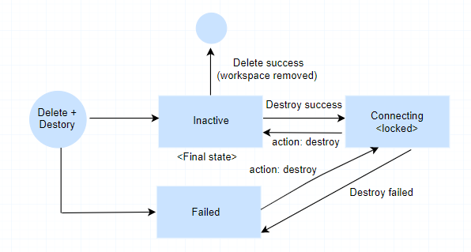

---

copyright:
  years: 2017, 2021
lastupdated: "2021-05-20"

keywords: schematics workspaces, schematics workspace vs github repo, schematics workspace access, schematics freeze workspace

subcollection: schematics

---
{:new_window: target="_blank"}
{:shortdesc: .shortdesc}
{:screen: .screen}
{:pre: .pre}
{:table: .aria-labeledby="caption"}
{:codeblock: .codeblock}
{:tip: .tip}
{:note: .note}
{:important: .important}
{:deprecated: .deprecated}
{:download: .download}
{:preview: .preview}
{:external: target="_blank" .external}
{:support: data-reuse='support'}
{:help: data-hd-content-type='help'}

# Setting up workspaces
{: #workspace-setup}

With {{site.data.keyword.bplong}} workspaces, you can organize your Terraform templates and control the access to run infrastructure code in your {{site.data.keyword.cloud}} account. Before you create a workspace, make sure that you design the organizational structure of your Git repository, and workspaces so that you can replicate and manage your configurations across multiple environments. 
{: shortdesc} 

If you plan to store your Terraform templates on your local machine and upload them as a tape archive file (`.tar`) to {{site.data.keyword.bplong_notm}}, make sure that the file structure on your local machine matches the suggested Git repository structure.  
{: note}

## Creating workspaces
{: #create-workspace}

Create workspace for your Terraform template by using the {{site.data.keyword.bplong_notm}} console. The workspace settings can be configured to use the Terraform template that are hosted and managed in a Git repository. Your workspace is used to manage the state of the cloud resources, provisioned using the Terraform template.
{: shortdesc} 

**Before you begin**
- [Create a Terraform configuration](/docs/schematics?topic=schematics-create-tf-config), and store the configuration in a `GitHub`, `GitLab`, or `Bitbucket` repository. You can also upload a tape archive file (`.tar`) from your local machine to provide your template to {{site.data.keyword.bplong_notm}}. For more information, see the [`ibmcloud schematics workspace upload`](/docs/schematics?topic=schematics-schematics-cli-reference#schematics-workspace-upload) command and see the [upload a tar file to your workspace](/apidocs/schematics#upload-template-tar) API. 
- Make sure that you have the [required permissions](/docs/schematics?topic=schematics-access) to create a workspace. 

**To create a workspace**:
1. From the {{site.data.keyword.cloud_notm}} menu, select [**{{site.data.keyword.bpshort}}**](https://cloud.ibm.com/schematics/overview){: external}. 
2. Click **Create a workspace**. 
3. Configure your workspace.
    1. Decide where you want to create your workspace. The location determines where your {{site.data.keyword.bpshort}} jobs run and your workspace data is stored. You can choose between a geography, such as North America, or a metro city, such as Frankfurt or London. If you select a geography, {{site.data.keyword.bpshort}} determines the location based on availability. If you select a metro city, your workspace is created in this location. For more information about where your data is stored, see [Where is my information stored?](/docs/schematics?topic=schematics-secure-data#pi-location). The location that you choose is independent from the region or regions where you want to provision your {{site.data.keyword.cloud_notm}} resources. Note that the console does not support all available locations. To create the workspace in a different location, use the [CLI](/docs/schematics?topic=schematics-schematics-cli-reference#schematics-workspace-new) or [API](/apidocs/schematics#create-a-workspace) instead.
    2. Enter a descriptive name for your workspace. The name can be up to 128 characters long and can include alphanumeric characters, spaces, dashes, and underscores. When you create a workspace for your own Terraform template, consider including the microservice component that you set up with your Terraform template and the {{site.data.keyword.cloud_notm}} environment where you want to deploy your resources in your name. For more information about how to structure your workspaces, see [Designing your workspace structure](/docs/schematics?topic=schematics-workspace-setup#structure-workspace).
    3. Optional: Enter tags for your workspace. You can use the tags later to find workspaces that are related to each other.
    4. Select the resource group where you want to create the workspace.
    5. Optional: Enter a description for your workspace.
    6. Click **Create** to create your workspace. Your workspace is created with a **Draft** state and the workspace **Settings** page opens.
4. Connect your workspace to the `GitHub`, `GitLab`, or `Bitbucket` repository where your Terraform configuration files are stored.

   If you want to upload a tape archive file (`.tar`) instead of pointing your workspace to a Git repository, you must use the [`ibmcloud schematics workspace upload`](/docs/schematics?topic=schematics-schematics-cli-reference#schematics-workspace-upload) command and see the [upload a tar file to your workspace](/apidocs/schematics#upload-template-tar) API.  
   {: tip}
   
    1. On the workspace **Settings** page, enter the link to your `GitHub`, `GitLab`, or `Bitbucket` repository. The link can point to the `master` branch, any other branch, or a subdirectory. 
      - Example for `master` branch: `https://github.com/myorg/myrepo`
      - Example for other branches: `https://github.com/myorg/myrepo/tree/mybranch`
      - Example for subdirectory: `https://github.com/mnorg/myrepo/tree/mybranch/mysubdirectory`      
    2. If you want to use a private Git repository, enter your personal access token. The personal access token is used to authenticate with your Git repository to access your Terraform template. For more information, see [Creating a personal access token for the command line](https://docs.github.com/en/github/authenticating-to-github/keeping-your-account-and-data-secure/creating-a-personal-access-token). If you want to clone from the Git repository see the [allowed and blocked file extensions](/docs/schematics?topic=schematics-faqs#clone-file-extension) for cloning.
    3. Select the Terraform v0.12, v0.13, or v0.14 that your Terraform configuration files are written in. {{site.data.keyword.bpshort}} supports Terraform version 0.11 till version 0.14. 
    4. Click **Save template information**. {{site.data.keyword.bplong_notm}} automatically downloads the configuration files, scans them for syntax errors, and retrieves all the workspace input parameters.
    5. You can manually enter the workspace input parameters.
          
   6. Click **Save changes**.
   7. Wait for your workspace to reach an **Inactive** state. This state is reached when {{site.data.keyword.bpshort}} successfully downloads your configuration files and no syntax errors are found. 
   8. [Create an execution plan for your workspace](/docs/schematics?topic=schematics-manage-lifecycle#deploy-resources). 

When you add a repository to the {{site.data.keyword.bplong_notm}} for the first time. The {{site.data.keyword.bpshort}} engine scans the files in your template for potential vulnerabilities. This check returns the scanned, discarded files.
* The total number of files scanned in the repository is named as scanned.
* The total number of files that are vulnerable, such as unsupported file extensions is named as discarded. You can find the details of the files in the logs of the create or update job.

## Freezing and unfreezing workspaces 
{: #lock-workspace}

As the {{site.data.keyword.cloud_notm}} account owner or an {{site.data.keyword.bplong_notm}} user who is assigned the **Manager** IAM service access role for {{site.data.keyword.bpshort}}, you can disable changes to a workspace (freeze) so that you cannot create a Terraform execution plan or run your infrastructure code to provision or modify your {{site.data.keyword.cloud_notm}} resources. 
{: shortdesc}

Before you begin, make sure that you are assigned the [**Manager** IAM service access role](/docs/schematics?topic=schematics-access) for {{site.data.keyword.bplong_notm}}. 

**To freeze a workspace**: 
1. From the [workspace dashboard](https://cloud.ibm.com/schematics/workspaces){: external}, select the workspace that you want to freeze. 
2. Select the **Settings** tab. 
3. In the **State** section on the workspace settings page, set the toggle to **Frozen** to disable changes to your workspace. The ID of the user who freezes the workspace and a timestamp are automatically logged. After you freeze a workspace, no user can generate a Terraform execution plan, or apply the plan in {{site.data.keyword.cloud_notm}}. 

**To unfreeze a workspace**: 
1. From the [workspace dashboard](https://cloud.ibm.com/schematics/workspaces){: external}, select the workspace that you want to unfreeze. 
2. Select the **Settings** tab. 
3. In the **State** section on the workspace settings page, set the toggle to **Unfrozen**. The ID of the user who unfreezes the workspace and a timestamp are automatically logged. After you unfreeze a workspace, you can generate new Terraform execution plans or run your infrastructure code by applying the plan in {{site.data.keyword.cloud_notm}}.

## Deleting a workspace
{: #del-workspace}

You can use the {{site.data.keyword.bplong_notm}} to delete your workspace. While deleting the workspace, you can optionally choose to destroy the cloud resources provisioned by the workspace. 

1. From the [workspace dashboard](https://cloud.ibm.com/schematics/workspaces){: external}, select the workspace that you want to delete. The table describes the delete workspace and destroy the cloud resources with various job.

    Decide if you want to delete the workspace and destroy the associated cloud resources, or both. This job cannot be undone. If you remove the workspace and keep the  cloud resources, you need to manage the resources with the resource list or command line.
    {: note}

    <table>
      <tr>
        <th>Job</th><th>Delete workspace</th><th>Destroy the associated cloud resources</th></tr>
       <tr>
         <td>Delete workspace   **Note** use this option, if you have already destroyed the cloud resources, or intend to destroy them later by using the command-line or user interface.</td><td>True</td><td>False</td></tr>
       <tr>
         <td>Destroy only resources</td><td>False</td><td>True</td></tr>
       <tr>
          <td>Delete workspace and destroy the resources provisioned by workspace</td><td>True</td><td>True</td></tr>
        <tr>
          <td>Resources destroyed using command-line or resource list, and want to delete workspace</td><td>True</td><td>False</td></tr>
        </table>
2. Select the workspace that you want to delete.
3. Click **Delete** button.
4. Select the **Delete workspace** option.
5. Type the workspace name in the **Type workspace name to confirm** text box.
6. Click the **Delete** button.

## Planning your workspace
{: #workspaces-plan}

You can plan and design your workspace by following queries.
- How to map workspace resource with the Git repository structure?
- How many number of workspaces that you need?
- How to reuse the configuration files across environments and workspaces?
- How to control access and manage your workspaces?

### Designing your workspace and Git repository structure
{: #structure-workspace}
{: help}
{: support}

Plan out the organizational structure of your workspace to match the microservice and permission structure of your organization. These workspaces uses Terraform templates from private or public Git repositories such as `GitHub`, `GitLab`, `Bitbucket`, and Azure DevOps. The table provides the format of the repositories source.
{: shortdesc} 

|Git repositories| URL|
|-------------|-----|
|`GitHub`| `https://github.com/<your_user_name>/<repo_name>/tree/<branch_name>/<folder_name>`|
|`GitLab`| `https://gitlab.com/<your_user_name>/<project_name>/tree/<branch_name>/<folder_name>` |
|`Bitbucket`|`https://bitbucket.org/<your_user_name>/<repo_name>/src/<branch_name>/<folder_name>`   `https://<username>@bitbucket.org/<workspace_name>/tf_cloudless_sleepy/src/master` |
|`Azure DevOps`|`https://azure.com/<your_user_name>/<repo_name>/src/<branch_name>/<folder_name>`   `https://visualstudio.com/<your_user_name>/<repo_name>/src/<branch_name>/<folder_name>`|

### How many workspaces do I need?
{: #plan-number-of-workspaces}

To find out how many workspaces you need in {{site.data.keyword.bplong_notm}}, look at the microservices that build your app and the environments that you need to develop, test, and publish your microservice. 
{: shortdesc}

As a rule of thumb, consider creating separate workspaces for each of your microservices and the environment that you use. For example, if you have a product app that consists of a search, payment, and review microservice component, consider creating a separate workspace for each microservice component and development, staging, and production environment. With separate workspaces for each microservice component and environment, you can develop, deploy, and manage the Terraform configuration files and associated {{site.data.keyword.cloud_notm}} resources without affecting the resources of other microservices.

Review the following image to see the number of workspaces in {{site.data.keyword.bplong_notm}} for an app that consists of three microservices.

Do not use one workspace to manage an entire staging or production environment. When you deploy all of your {{site.data.keyword.cloud_notm}} resources into a single workspace, it can become difficult for various teams to coordinate updates and manage access for these resources.
{: important}

### How do I structure my Git repository to map my workspaces?
{: #plan-github-structure}

Structure your Git repository so that you have one repository for all your Terraform configuration files that build your microservice, and use input variables in {{site.data.keyword.bpshort}}, or GitHub branches or directories to differentiate between your development, staging, and production environment. 
{: shortdesc}

Review the following table to find a list of options for how to structure your Git repository to map the different workspace environments. 
{: shortdesc}

| Option | Description | 
| ------- | ---------------------------- | 
| One Git repo, use variables to distinguish between environments | Create one Git repository where you store the Terraform configuration files that make up your microservice component. Make your Terraform configuration files as general as possible so that you can reuse the same configuration across your environments. To configure the specifics of your development, staging, and production environment, use [Terraform input variables](/docs/schematics?topic=schematics-create-tf-config#configure-variables) in your configuration files. Input variables are automatically loaded into {{site.data.keyword.bplong_notm}} when you create your workspace. To customize your workspace, you enter the environment-specific values for your variables. This setup is useful if you have one team that manages the lifecycle of the microservice component and where the configuration of your environments does not differ drastically. |
|One Git repo, use branches to distinguish between environments | Create one Git repository for your microservice component, and use different Git branches to store the Terraform configuration files for each of your environments. With this setup, you have a clear distinction between your environments and more control over who can access and change a particular configuration. Make sure to set up a process for how changes in one configuration file are populated across branches to avoid that you have different configurations in each environment. |
| One Git repo, use directories to distinguish between environments | For organizations that prefer short-lived branches, and where configurations differ drastically across environments, consider creating directories that represent the different configurations of your environments. With this setup, all your directories listen for changes that are committed to the `master` branch. Make sure to set up a process for how changes in one configuration file are populated across directories to avoid having different configurations in each environment. |
| Use one Git repo per environment | Use one Git repository for each of your environments. With this setup, you have a 1:1 relationship between your workspace and Git repository and you can apply separate permissions for each of your Git repositories. Make sure that your team can manage multiple Git repositories and keep them in sync. | 

### How can I reuse configuration files across environments and workspaces?
{: #plan-reuse}

Try to minimize the number of Terraform configuration files that you need to manage by creating standardized Terraform templates and by using variables to customize the template to your needs. 
{: shortdesc}

Now, you can use Terraform modules from the Terraform module registry for IBM Cloud.
{: important}

With standardized Terraform templates or Terraform modules, you can ensure that development best practices are followed within your organization and that all Terraform configuration files have the same structure. Knowing the structure of a Terraform configuration file makes it easier for your developers to understand a file, declare variables, contribute to the code, and troubleshoot the errors. 

### How do I control access to my workspaces? 
{: #plan-workspace-access}

{{site.data.keyword.bplong_notm}} is fully integrated with {{site.data.keyword.cloud_notm}} Identity and Access Management. To control access to a workspace, and who can execute your infrastructure code with {{site.data.keyword.bplong_notm}}, see [Managing user access](/docs/schematics?topic=schematics-access). 

### What do I need to be aware of when I have a repository that I managed with native Terraform?
{: #plan-terraform-migration}

Because {{site.data.keyword.bplong_notm}} delivers Terraform-as-a-Service, you can import your existing Terraform templates into {{site.data.keyword.bpshort}} workspaces. Depending on how your Terraform templates and Git repositories are structured, you might need to make changes so that you can successfully use {{site.data.keyword.bplong_notm}}. 
{: shortdesc}

- **Provider block declaration**: Because {{site.data.keyword.bplong_notm}} is integrated with {{site.data.keyword.cloud_notm}} Identity and Access Management, your {{site.data.keyword.cloud_notm}} API key is automatically retrieved for all IAM-enabled resources and you don't have to provide this information in the `provider` block. However, the API key is not retrieved for classic infrastructure and Cloud Foundry resources. For more information, see [Configuring the `provider` block](/docs/schematics?topic=schematics-create-tf-config#configure-provider). 
- **Terraform command-line and {{site.data.keyword.cloud_notm}} provider plug-in:** To use {{site.data.keyword.bplong_notm}}, you don't need to install the Terraform command-line or the {{site.data.keyword.cloud_notm}} Provider plug-in for Terraform. If you want to automate the provisioning of resources, try out the [{{site.data.keyword.bplong_notm}} command-line plug-in](/docs/schematics?topic=schematics-setup-cli) instead.

### Setting up a continuous delivery toolchain for your workspace
{: #continuous-delivery}
  
Connect your source repository to a continuous delivery pipeline in {{site.data.keyword.cloud_notm}} to automatically generate a Terraform execution plan and run your Terraform code in {{site.data.keyword.cloud_notm}} whenever you update your Terraform configuration files. 
{: shortdesc}
  
1. If you do not have a {{site.data.keyword.contdelivery_short}} service instance in your account yet, create one.
   1. From the {{site.data.keyword.cloud_notm}} catalog, open the [{{site.data.keyword.contdelivery_short}} service](https://cloud.ibm.com/catalog/services/continuous-delivery).
   2. Select the {{site.data.keyword.cloud_notm}} region where you want to create the service.
   3. Select a pricing plan.
   4. Enter a name for your service instance, select a resource group, and enter any tags that you want to associate with your service instance.
   5. Click **Create** to create the service instance in your account.  
2. From the [workspace dashboard](https://cloud.ibm.com/schematics/workspaces){: external}, select a workspace. 
3. Select the **Settings** tab. 
4. In the **Summary** section, click **Enable continuous delivery**. 
5. Configure your toolchain. 
   1. Enter a name for your toolchain, and select the region and resource group where you want to deploy this toolchain. The region and resource group can be different from the region and resource group that you used for your {{site.data.keyword.bpshort}} workspace.
   2. Select the type of source repository where your Terraform configuration files are stored. For Example GitHub. 
   3. Review the information for your source repository. For example, if your Terraform files are stored in GitHub, review the GitHub server and the repository for which you want to create a continuous delivery toolchain. These fields are pre-populated based on your workspace configuration.
   4. Optional: Choose if you want to enable Git issues and code change tracking for your toolchain. 
6. Select the **Delivery Pipeline** icon to configure your Delivery Pipeline. 
   1. Verify that the workspace ID that is displayed to you is correct.
   2. Enter an {{site.data.keyword.cloud_notm}} API key. If you do not have an API key, click **New +** to create one. 
7. Click **Create** to finish the setup of your toolchain. You see an overview of tools that were configured for your toolchain. 
8. Open the **Delivery Pipeline**. The Delivery Pipeline includes stages to retrieve updates from your source repository, create a Terraform execution plan, apply this plan, and to run a health check against your workspace.
9. Update the Terraform file in your source repository and review how this change is processed in your Delivery Pipeline. If one of the stages fails, click **View logs and history** to start troubleshooting errors.

## Workspace states
{: #wks-state}

### Workspace state overview
{: #states-overview}

Review the states that a workspace can have in the following table. You might not see all states in the {{site.data.keyword.cloud_notm}} console. Some states are only visible when using the command-line or API.
{: shortdesc} 

| State | Description | 
| ------- | ---------------------------- | 
| Active | After you successfully ran your infrastructure code with {{site.data.keyword.bplong_notm}} by applying your Terraform execution plan, the state of your workspace changes to **Active**. |
| Connecting | {{site.data.keyword.bpshort}} tries to connect to the template in your source repo. If successfully connected, the template is downloaded and metadata, such as input parameters, is extracted. After the template is downloaded, the state of the workspace changes to **Scanning**. |
| Draft | The workspace is created without a reference to a `GitHub`, `GitLab`, or `Bitbucket` repository.   |
| Failed | If errors occur during the execution of your infrastructure code in {{site.data.keyword.bplong_notm}}, your workspace state is set to **Failed**. To troubleshoot errors, open the logs on the workspace **Activity** page. |
| Inactive | The {{site.data.keyword.bpshort}} template was scanned successfully and the workspace creation is complete. You can now start running {{site.data.keyword.bpshort}} plan and apply job to provision the {{site.data.keyword.cloud_notm}} resources that you specified in your template. If you have an **Active** workspace and decide to remove all your resources, your workspace is set to **Inactive** after all your resources are removed.  |
| In progress | When you instruct {{site.data.keyword.bplong_notm}} to run your infrastructure code by applying your Terraform execution plan, the state of your workspace changes to **In progress**. |
| Scanning | The download of the {{site.data.keyword.bpshort}} template is complete and vulnerability scanning started. If the scan is successful, the workspace state changes to **Inactive**. If errors in your template are found, the state changes to **Template Error**. |
| Stopped | The {{site.data.keyword.bpshort}} plan, apply, or destroy job are stopped manually. |
| Template Error | The {{site.data.keyword.bpshort}} template contains errors and cannot be processed.|

### Workspace state diagram and manipulative job
{: #workspace-state-diagram}

The state of a workspace indicates if you have successfully created a Terraform execution plan and applied to provision your resources in the {{site.data.keyword.cloud_notm}} account. The table represents the state and the workspace job.
{: shortdesc}

<table>
   <thead>
    <th style="width:50px">Workspace / Job</th>
    <th style="width:200px">State diagram</th>
    <th style="width:250px">Description</th>
  </thead>
  <tbody>
    <tr>
      <td><code>Create workspace</code></td>
      <td></td>
      <td>The workspace is created without a reference to `GitHub`, `GitLab`, or `Bitbucket` to the draft state. From the draft state you can connect to the infrastructure template in your source repository. From connecting state, the template is processed successfully to reach Inactive state (Final state) or template parsing may fail and reach failed state. From inactive state, when you do an apply, and if it results in one resource then, state enters active state and if they destroy, state enters destroy state. you can maintain at least one resource in the state file by apply job, to move the workspace into active state. The {{site.data.keyword.bpshort}} [persists](/docs/schematics?topic=schematics-faqs#persist-file) the user-defined file for running the subsequent Terraform commands. Then, you can destroy all the resources to make your workspace in an inactive state.
 </td>
   </tr>
     <tr>
      <td><code>Delete workspace</code></td>
      <td></td>
      <td>When you perform delete workspace on an inactive, active or failed state. From these state, the template is parsed successfully to reach an inactive state or template parsed can fail and reach failed state. If you delete at least one resource, the plan and apply job executes to destroy the resource from the active state.</td>
   </tr>
    <tr>
      <td><code>Plan and apply job</code></td>
      <td></td>
      <td>When you perform the plan or apply job on active, inactive, and failed state. Your workspace is in in progress and locked state. And the job is performed, if it is success, your workspace is in active state, if it contains at least one resource, your workspace is in an inactive state, on failure workspace is in failed state. The {{site.data.keyword.bpshort}} [persists](/docs/schematics?topic=schematics-faqs#persist-file) the user-defined file for running the subsequent Terraform commands.
      </td>
   </tr>
    <tr>
      <td><code>Destroy job</code></td>
      <td></td>
      <td>The destroy job performs when your workspace is in an inactive, active or failed state. From these state, the destroy job connects to parse the template from your source repository and workspace gets into in progress unlocked state. From   state if you destroy, resource reaches failed state.</td>
   </tr>
    <tr>
      <td><code>Delete and destroy job</code></td>
      <td></td>
      <td>When you perform delete and destroy job from active, inactive and failed state. The delete job will delete the workspace from all these state, but the resource is still in active state. Destroy will destroy the resources, and moves your workspace in active state. Whenever your apply, plan destroy the workspace, it reaches in progress locked state. Based on success and failure, the workspace is unlocked. </td>
   </tr>
  </tbody>
  </table>

## Creating an auto deployment to the {{site.data.keyword.bplong_notm}}
{: #create-deploy-to-schematics}

{{site.data.keyword.bplong_notm}} now supports an efficient way to share your Git repository in a cloned copy of the code in a new Git repository to deploy to {{site.data.keyword.cloud_notm}} without affecting your original code. For more information, about deploy to {{site.data.keyword.cloud_notm}}, see [automating the deployment to the Schematics](/docs/ibm-cloud-provider-for-terraform?topic=ibm-cloud-provider-for-terraform-create_deploy_to_schematics).
