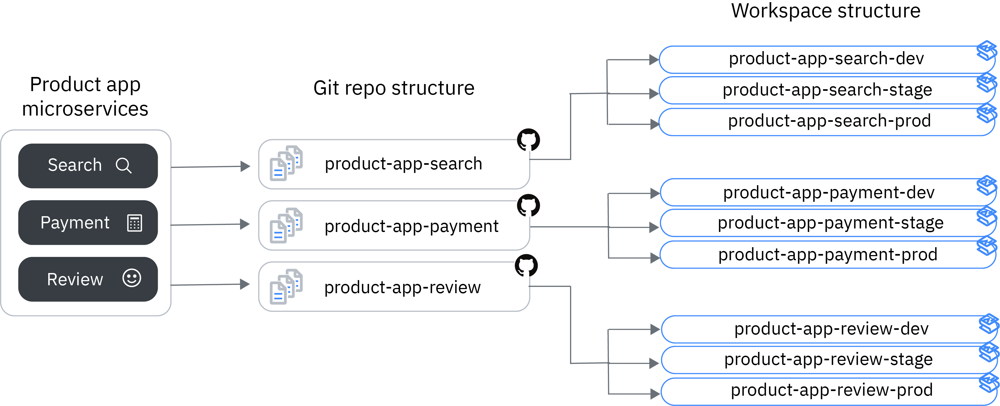

---

copyright:
  years: 2017, 2023
lastupdated: "2023-12-13"

keywords: schematics workspaces planning, planning workspace, planning schematics workspace, setting up schematics workspace

subcollection: schematics

---

{{site.data.keyword.attribute-definition-list}}

# Planning for using workspaces
{: #workspaces-plan}

Plan and design your workspaces using the following questions as prompts:

- How do I relate workspaces to Git repositories?
- How many workspaces does my application environment need?
- How do I reuse Terraform configuration files across environments and workspaces?
- How do I control access to and manage my workspaces?

## Workspaces and Git repositories
{: #structure-workspace}
{: help}
{: support}

Workspaces use Terraform templates from private or public Git repositories such as `GitHub`, `GitLab`, `Bitbucket`, and Azure DevOps. The table provides the format of the repositories source.
{: shortdesc}

|Git repositories| URL|
|-------------|-----|
|`GitHub`| `https://github.com/<your_user_name>/<repo_name>/tree/<branch_name>/<folder_name>`|
|`GitLab`| `https://gitlab.com/<your_user_name>/<project_name>/tree/<branch_name>/<folder_name>` |
|`Bitbucket`|`https://bitbucket.org/<your_user_name>/<repo_name>/src/<branch_name>/<folder_name>`  \n `https://<username>@bitbucket.org/<workspace_name>/tf_cloudless_sleepy/src/master` |
|`Azure DevOps`|`https://azure.com/<your_user_name>/<repo_name>/src/<branch_name>/<folder_name>`  \n `https://visualstudio.com/<your_user_name>/<repo_name>/src/<branch_name>/<folder_name>`|
{: caption="Git repositories" caption-side="bottom"}

### How many workspaces does my application environment need?
{: #plan-number-of-workspaces}

The number of workspaces you need in {{site.data.keyword.bplong_notm}} are determined by the structure of your application and the environments that you need to develop, test, and publish your application or micro-service.
{: shortdesc}

As a rule of thumb, consider separate workspaces for each microservice and the environments that you use. For example, if you have a product app that consists of a search, payment, and review microservice components, consider creating separate workspaces for each microservice component and their development, staging, and production environments. With separate workspaces for each component and environment, you can develop, deploy, and update your Terraform configuration files and associated {{site.data.keyword.cloud_notm}} resources without affecting other components.

Review the following image, observing the workspace structure {{site.data.keyword.bplong_notm}} for an app that consists of three microservices.

{: caption="workspace structure for {{site.data.keyword.bplong_notm}}" caption-side="bottom"}

In organizations where infrastructure responsibilities are spread across multiple teams, it is not recommended to use one workspace to manage entire staging or production environments. When you deploy all your {{site.data.keyword.cloud_notm}} resources using a single workspace, it can become difficult for various teams to coordinate updates and manage access for these resources. Separate workspaces, sharing infrastructure definitions using remote-state data sources provides a mechanism to create separate out areas of responsibility.
{: important}

### How do I structure my Git repositories to map my workspaces?
{: #plan-github-structure}

Structure your Git repository so that you have one repository for all your Terraform configuration files that build your microservice, and use input variables in {{site.data.keyword.bpshort}}, or GitHub branches or directories to differentiate between your development, staging, and production environments.
{: shortdesc}

Review the following table to find a list of options for how to structure your Git repository to map the different workspace environments.
{: shortdesc}

| Option | Description |
| ------- | ----------------------------  |
| One Git repo, use variables to distinguish between environments | Create one Git repository where you store the Terraform configuration files that make up your microservice component. Make your Terraform configuration files as general as possible so that you can reuse the same configuration across your environments. To configure the specifics of your development, staging, and production environment, use [Terraform input variables](/docs/schematics?topic=schematics-create-tf-config#configure-variables) in your configuration files. Input variables are automatically loaded into {{site.data.keyword.bplong_notm}} when you create your workspace. To customize your workspace, you enter the environment-specific values for your variables. This setup is useful if you have one team that manages the lifecycle of the microservice component and where the configuration of your environments does not differ drastically. |
|One Git repo, use branches to distinguish between environments | Create one Git repository for your microservice component, and use different Git branches to store the Terraform configuration files for each of your environments. With this setup, you have a clear distinction between your environments and more control over who can access and change a particular configuration. Make sure to set up how changes in one configuration file are populated across branches to avoid that you have different configurations in each environment. |
| One Git repo, use directories to distinguish between environments | For organizations that prefer short-lived branches, and where configurations differ drastically across environments, consider creating directories that represent the different configurations of your environments. With this setup, all your directories listen for changes that are committed to the `master` branch. Make sure to set up how changes in one configuration file are populated across directories to avoid having different configurations in each environment. |
| Use one Git repo per environment | Use one Git repository for each of your environments. With this setup, you have a 1:1 relationship between your workspace and Git repository and you can apply separate permissions for each of your Git repositories. Make sure that your team can manage multiple Git repositories and keep them in sync. |
{: caption="Structure of the Git repository" caption-side="bottom"}

### How can I reuse configuration files across environments and workspaces?
{: #plan-reuse}

Try to minimize the number of Terraform configuration files that you need to manage by creating standardized Terraform templates and by using variables to customize the use of a template to your needs.
{: shortdesc}

Now, you can use Terraform modules from the Terraform module registry for IBM Cloud.
{: important}

With standardized Terraform templates or Terraform modules, you can ensure that development best practices are followed within your organization and that all Terraform configuration files have the same structure. Knowing the structure of a Terraform configuration file makes it easier for your developers to understand a file, declare variables, contribute to the code, and troubleshoot the errors.

### How do I control access to my workspaces?
{: #plan-workspace-access}

{{site.data.keyword.bplong_notm}} is fully integrated with {{site.data.keyword.iamlong}}. To control access to a workspace, and who can execute your infrastructure code with {{site.data.keyword.bplong_notm}}, see [Managing user access](/docs/schematics?topic=schematics-access).

### What do I need to be aware of when I have a repository that has been previously used with Terraform standalone?
{: #plan-terraform-migration}

Because {{site.data.keyword.bplong_notm}} delivers Terraform-as-a-Service, you can reuse your existing Terraform templates with workspaces. Depending on how your Terraform templates are written and Git repositories structured, you might need to make changes to successfully use {{site.data.keyword.bplong_notm}}.
{: shortdesc}

- **Provider block declaration**: Because {{site.data.keyword.bplong_notm}} is integrated with {{site.data.keyword.iamlong}}, your {{site.data.keyword.cloud_notm}} API key is automatically retrieved for all IAM-enabled resources and you don't have to provide this information in the `provider` block. However, the API key is not retrieved for classic infrastructure resources. For more information, see [Configuring the `provider` block](/docs/schematics?topic=schematics-create-tf-config#configure-provider).
- **Terraform command-line and {{site.data.keyword.cloud_notm}} provider plug-in:** To use {{site.data.keyword.bplong_notm}}, you don't need to install the Terraform command-line or the {{site.data.keyword.terraform-provider_full_notm}}. If you want to automate the provisioning of resources, try out the [{{site.data.keyword.bplong_notm}} command-line plug-in](/docs/schematics?topic=schematics-setup-cli) instead.

## Setting up a continuous delivery toolchain for your workspace
{: #continuous-delivery}

Connect your source repository to a continuous delivery pipeline in {{site.data.keyword.cloud_notm}} to automatically generate a Terraform execution plan and run your Terraform code in {{site.data.keyword.cloud_notm}} whenever you update your Terraform configuration files.
{: shortdesc}

1. If you do not have a {{site.data.keyword.contdelivery_short}} service instance in your account yet, create one.
    1. From the {{site.data.keyword.cloud_notm}} catalog, open the [{{site.data.keyword.contdelivery_short}} service](https://cloud.ibm.com/catalog/services/continuous-delivery).
    2. Select the {{site.data.keyword.cloud_notm}} region where you want to create the service.
    3. Select a pricing plan.
    4. Enter a name for your service instance, select a resource group, and enter any tags that you want to associate with your service instance.
    5. Click **Create** to create the service instance in your account.
2. From the [workspace dashboard](https://cloud.ibm.com/automation/schematics/terraform){: external}, select a workspace.
3. Select the **Settings** tab.
4. In the **Summary** section, click **Enable continuous delivery**.
5. Configure your toolchain.
    1. Enter a name for your toolchain, and select the region and resource group where you want to deploy this toolchain. The region and resource group can be different from the region and resource group that you used for your {{site.data.keyword.bpshort}} workspace.
    2. Select the type of source repository where your Terraform configuration files are stored. For Example GitHub.
    3. Review the information for your source repository. For example, if your Terraform files are stored in GitHub, review the GitHub server and the repository for which you want to create a continuous delivery toolchain. These fields are pre-populated based on your workspace configuration.
    4. Optional: Choose if you want to enable Git issues and code change tracking for your toolchain.
6. Select the **Delivery Pipeline** icon to configure your Delivery Pipeline.
    1. Verify that the workspace ID that is displayed to you is correct.
    2. Enter an {{site.data.keyword.cloud_notm}} API key. If you do not have an API key, click **New +** to create one.
7. Click **Create** to finish the setup of your toolchain. You see an overview of tools that were configured for your toolchain.
8. Open the **Delivery Pipeline**. The Delivery Pipeline includes stages to retrieve updates from your source repository, create a Terraform execution plan, apply this plan, and to run a health check against your workspace.
9. Update the Terraform file in your source repository and review how this change is processed in your Delivery Pipeline. If one of the stages fails, click **View logs and history** to start troubleshooting errors. For more information about viewing logs and history, see [Reviewing the {{site.data.keyword.bpshort}} job details](/docs/schematics?topic=schematics-interrupt-job#sch-job-logs).
